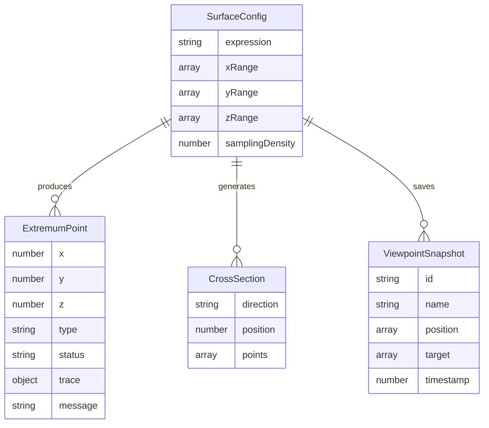

## 1. 架构设计

```mermaid
graph TB
    subgraph "前端层"
        A["React UI 层"]
        B["3D 渲染层<br/>@react-three/fiber"]
        C["Zustand 状态管理"]
    end
    subgraph "计算层"
        D["数学引擎<br/>mathjs + 自定义求解器"]
        E["采样器<br/>网格采样 + 自适应加密"]
        F["极值检测器<br/>梯度分析 + Hessian 判别"]
    end
    subgraph "数据层"]
        G["表达式存储"]
        H["视角快照存储"]
        I["结论溯源记录"]
    end

    A --> C
    B --> C
    C --> D
    C --> E
    C --> F
    D --> G
    D --> I
    E --> I
    F --> I
    C --> H
```

## 2. 技术说明

- **前端框架**：React 18 + TypeScript + Vite
- **3D 渲染**：Three.js + @react-three/fiber + @react-three/drei + @react-three/postprocessing
- **数学计算**：mathjs（表达式解析与求值）+ 自定义数值分析（梯度、Hessian、极值判别）
- **状态管理**：Zustand
- **样式方案**：Tailwind CSS 3
- **图表**：自绘 Canvas 2D（剖面曲线）
- **初始化工具**：vite-init (react-ts 模板)
- **后端**：无（纯前端，所有计算在浏览器内完成）
- **数据持久化**：localStorage（视角快照、预设函数）

## 3. 路由定义

| 路由 | 用途 |
|------|------|
| / | 探索主页面，包含 3D 视口、参数控制、剖面联动、结论溯源 |

## 4. API 定义

无后端 API。所有数学计算在前端完成。

### 4.1 核心数据类型

```typescript
interface SurfaceConfig {
  expression: string;
  xRange: [number, number];
  yRange: [number, number];
  zRange: [number, number];
  samplingDensity: number;
}

type ExtremumType = 'maximum' | 'minimum' | 'saddle';

type ResultStatus = 'confirmed' | 'needs_review' | 'error';

interface ExtremumPoint {
  x: number;
  y: number;
  z: number;
  type: ExtremumType;
  status: ResultStatus;
  trace: {
    expression: string;
    xRange: [number, number];
    yRange: [number, number];
    samplingDensity: number;
    gradientMagnitude: number;
    hessianEigenvalues: [number, number];
  };
  message?: string;
}

interface ViewpointSnapshot {
  id: string;
  name: string;
  position: [number, number, number];
  target: [number, number, number];
  up: [number, number, number];
  zoom: number;
  timestamp: number;
  config: SurfaceConfig;
}

interface CrossSection {
  direction: 'xy' | 'xz' | 'yz';
  position: number;
  points: [number, number][];
}
```

## 5. 服务器架构图

无后端服务。

## 6. 数据模型

### 6.1 数据模型定义



### 6.2 数据存储

使用 localStorage 存储以下数据：
- `surface-explorer-viewpoints`：视角快照列表
- `surface-explorer-presets`：自定义预设函数
- `surface-explorer-last-config`：上次使用的配置

## 7. 核心算法说明

### 7.1 曲面采样

- 在 x-y 参数平面上均匀网格采样（密度由用户控制）
- 采样密度范围：10×10 ~ 200×200
- 当检测到极值附近梯度变化剧烈时，自动提示"建议提高采样密度"

### 7.2 极值检测

1. **候选点筛选**：在采样网格上寻找梯度接近零的点
2. **Hessian 判别**：计算候选点处的 Hessian 矩阵特征值
   - 两个正特征值 → 极小值
   - 两个负特征值 → 极大值
   - 一正一负 → 鞍点
3. **结果分类**：
   - ✅ confirmed：Hessian 特征值符号明确，梯度模 < 阈值
   - ⚠️ needs_review：采样过粗（相邻采样点函数值变化>阈值）、梯度模接近阈值边界、Hessian 接近退化
   - ❌ error：表达式解析失败、求值溢出(NaN/Infinity)

### 7.3 剖面计算

- 固定一个变量值，计算另一变量方向的函数值序列
- 支持 XY（固定 z）、XZ（固定 y）、YZ（固定 x）三个方向
- 剖面位置可通过滑块调整
