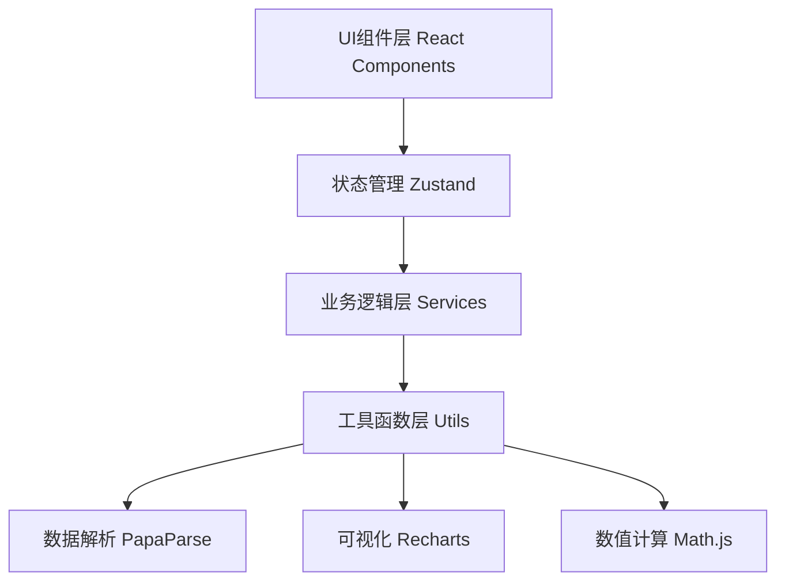

## 1. 架构设计

纯前端应用，所有计算在浏览器端完成，无需后端服务。采用分层架构：UI组件层 → 状态管理层 → 业务逻辑层 → 工具函数层。



## 2. 技术描述

- **前端框架**：React@18 + TypeScript + Vite@5
- **样式方案**：TailwindCSS@3 + CSS变量主题
- **状态管理**：Zustand@4（轻量、无需Provider）
- **路由**：React Router@6
- **文件解析**：PapaParse@5（CSV）、SheetJS/xlsx@0.18（Excel）
- **数据可视化**：Recharts@2（React图表库）
- **数值计算**：mathjs@11（统计计算、分位数）
- **文件导出**：file-saver@2 + jspdf@2（报告导出）
- **图标**：Lucide React@0.294
- **初始化工具**：npm create vite@latest

## 3. 路由定义

| 路由 | 页面组件 | 功能 |
|------|----------|------|
| / | UploadPage | 数据上传、预览、字段映射配置 |
| /analysis | AnalysisPage | 覆盖率主线、分组校准、异常标注 |
| /export | ExportPage | 结果导出、错误行列表、报告生成 |

## 4. 核心数据结构

### 4.1 原始数据行类型

```typescript
interface RawDataRow {
  id: string;
  category: string;
  date: string;
  forecast: number | null;
  lowerBound: number | null;
  upperBound: number | null;
  actual: number | null;
  isPromotion: boolean;
  remark: string;
  _raw: Record<string, any>;
  _errors: FieldError[];
  _isDirty: boolean;
}

interface FieldError {
  field: string;
  type: 'empty' | 'format' | 'out_of_range' | 'logic';
  message: string;
}
```

### 4.2 分析结果类型

```typescript
interface AnalysisResult {
  overallCoverage: number;
  targetCoverage: number;
  categoryResults: CategoryResult[];
  groupResults: GroupResult[];
  anomalies: AnomalyItem[];
  badExamples: BadExample[];
  dirtyRows: RawDataRow[];
  validRows: RawDataRow[];
  calibrationCoefficients: CalibrationCoeff;
}

interface CategoryResult {
  category: string;
  coverage: number;
  sampleSize: number;
  avgForecast: number;
  avgActual: number;
  avgIntervalWidth: number;
  underCoverageCount: number;
  overCoverageCount: number;
}

interface GroupResult {
  group: 'hot' | 'normal' | 'cold';
  coverage: number;
  sampleSize: number;
  threshold: number;
  originalCoverage: number;
  calibratedCoverage: number;
  calibrationFactor: number;
}

interface AnomalyItem {
  id: string;
  type: 'promotion' | 'low_sample' | 'under_coverage' | 'bad_forecast' | 'logic_error';
  severity: 'high' | 'medium' | 'low';
  category: string;
  description: string;
  rowData: RawDataRow;
}

interface BadExample {
  id: string;
  category: string;
  forecast: number;
  actual: number;
  lowerBound: number;
  upperBound: number;
  deviationPercent: number;
  reason: string;
}

interface CalibrationCoeff {
  hotShrinkFactor: number;
  coldExpandFactor: number;
  normalAdjustFactor: number;
}
```

### 4.3 字段映射配置

```typescript
interface FieldMapping {
  forecast: string;
  actual: string;
  lowerBound: string;
  upperBound: string;
  category: string;
  date: string;
  isPromotion: string;
  remark: string;
}
```

## 5. 核心算法说明

### 5.1 覆盖率计算

```
覆盖率 = （真实值落在[预测下限, 预测上限]区间内的样本数） / 有效样本总数
有效样本 = 排除脏行、排除促销异常标记行
```

### 5.2 热门/冷门分组算法

```
1. 计算所有品类的平均销量
2. 按平均销量排序，取前20%为热门品类，后20%为冷门品类，中间为普通品类
3. 阈值可配置，默认P20/P80分位数
```

### 5.3 区间校准算法

```
热门品类（系统低估）：
  校准后上限 = 原始上限 × (1 + 低估比例 × 收缩系数)
  校准后下限 = 原始下限 × (1 - 高估比例 × 收缩系数)

冷门品类（区间过宽）：
  校准后上限 = 预测值 + (原始上限 - 预测值) × 扩展系数
  校准后下限 = 预测值 - (预测值 - 原始下限) × 扩展系数

校准系数根据历史覆盖率偏差动态调整
```

### 5.4 异常检测规则

| 异常类型 | 检测规则 |
|----------|----------|
| 促销异常 | isPromotion=true 或 remark包含"促销"/"活动"/"大促" |
| 样本过少 | 单品类样本数 < 30 或 分组样本数 < 50 |
| 覆盖不足 | 单品类覆盖率 < 目标覆盖率的80% |
| 明显坏值 | 预测值=0但真实值>0、上限<下限、真实值超出区间50%以上 |
| 逻辑错误 | 下限>上限、预测值为负、区间宽度为0 |

## 6. 状态管理切片

```typescript
interface AppState {
  // 数据状态
  rawData: RawDataRow[];
  fieldMapping: FieldMapping;
  analysisResult: AnalysisResult | null;
  
  // UI状态
  currentPage: 'upload' | 'analysis' | 'export';
  selectedCategory: string | null;
  anomalyFilters: Set<AnomalyType>;
  isAnalyzing: boolean;
  uploadProgress: number;
  
  // 配置
  config: {
    targetCoverage: number;
    hotThreshold: number;
    coldThreshold: number;
    minSampleSize: number;
  };
}
```
