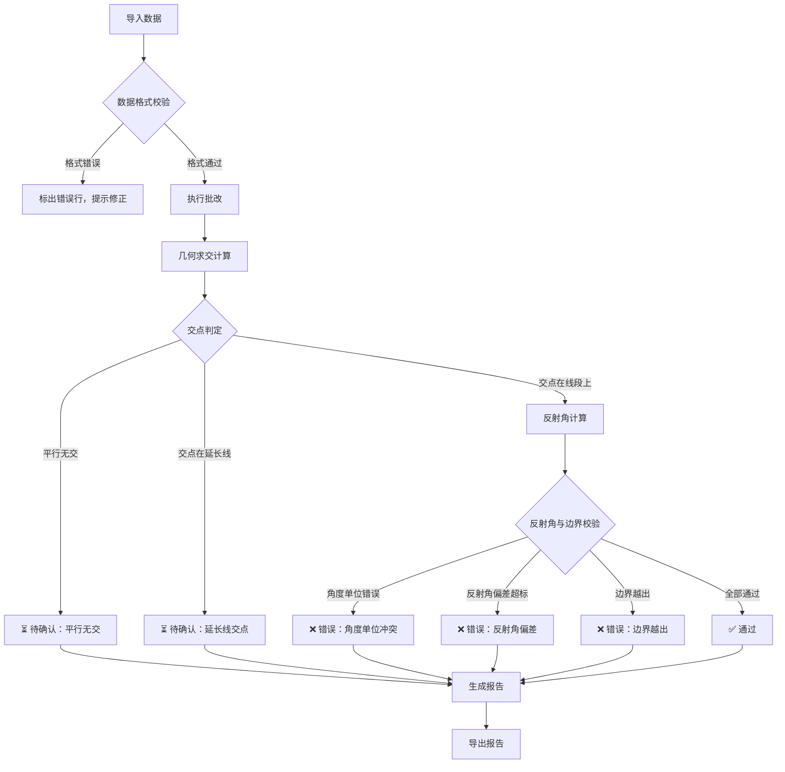

## 1. 产品概述

几何光路批改器——面向物理助教的批量光学作业批改工具。自动计算入射光线与镜面线段的交点、反射角，判定交点是否在线段边界内，将错误、冲突、待确认条目分类标记并生成可追溯的批改报告。

- 目标用户：物理课程助教，需批量检查镜面反射题的交点、反射角与边界合理性
- 核心价值：消除人工逐题核对的高耗时与漏判风险，将"平行无交""延长线交点""角度单位错"等场景自动分流到待确认/修复分支

## 2. 核心功能

### 2.1 用户角色

| 角色 | 使用方式 | 核心权限 |
|------|----------|----------|
| 物理助教 | 打开即用，无需注册 | 导入数据、执行批改、查看报告、导出报告 |

### 2.2 功能模块

1. **数据导入页**：批量输入镜面线段与入射光线数据，支持文本粘贴与JSON导入
2. **批改主页**：一键批改、结果分类展示（通过/错误/待确认）、冲突来源标记
3. **报告与明细页**：批改报告总览、单条明细可回溯至原始输入与计算过程、报告导出

### 2.3 页面明细

| 页面名称 | 模块名称 | 功能描述 |
|----------|----------|----------|
| 数据导入页 | 镜面线段输入区 | 文本框批量粘贴镜面线段（起点x,y / 终点x,y / 法线方向），支持JSON格式导入 |
| 数据导入页 | 入射光线输入区 | 文本框批量粘贴入射光线（起点x,y / 方向角），支持JSON格式导入 |
| 数据导入页 | 样例数据加载 | 一键加载内置镜面线段样例数据，供首次试跑 |
| 数据导入页 | 输入校验预览 | 导入前即时校验数据格式，标出格式错误行 |
| 批改主页 | 批改执行 | 点击"开始批改"，对所有光线-镜面对执行几何计算 |
| 批改主页 | 结果分类列表 | 三栏分类：✅通过 / ❌错误 / ⏳待确认，每条显示交点、反射角、边界状态 |
| 批改主页 | 冲突来源标记 | 错误条目中用标签标明冲突来源：交点计算冲突 / 反射角偏差 / 边界越出 / 角度单位疑似错误 |
| 批改主页 | 待确认分支 | 平行无交、交点在延长线上的条目归入待确认，提供明确的后续动作建议 |
| 批改主页 | 光路可视化 | Canvas绘制当前选中条目的入射光线、镜面线段、交点、反射光线 |
| 报告与明细页 | 报告总览 | 统计通过/错误/待确认数量、错误类型分布 |
| 报告与明细页 | 明细列表 | 每条记录可展开查看：原始输入、计算中间过程、判定依据，点击可跳转至可视化 |
| 报告与明细页 | 导出功能 | 导出为JSON/CSV格式报告，包含完整明细 |

## 3. 核心流程

助教打开工具 → 导入镜面线段与入射光线数据（或加载样例）→ 预览校验 → 点击批改 → 系统逐对执行几何求交、反射角计算、边界判定 → 结果按通过/错误/待确认分类展示 → 助教查看冲突来源与后续动作建议 → 导出批改报告

## 4. 用户界面设计

### 4.1 设计风格

- **主色调**：深靛蓝(#1a1a2e)为底色，明黄(#f0c040)为强调色——呼应光学/射线主题
- **辅色调**：冷灰(#2d2d44)用于面板背景，翠绿(#4ade80)用于通过状态，珊瑚红(#f87171)用于错误状态，琥珀(#fbbf24)用于待确认状态
- **按钮风格**：微圆角(6px)，实心填充，hover时轻微发光效果
- **字体**：JetBrains Mono 用于数据/坐标显示，Noto Sans SC 用于中文正文
- **布局风格**：左侧导航栏 + 右侧内容区，数据表格为主，卡片式详情
- **图标风格**：线性图标(lucide-react)，2px描边

### 4.2 页面设计概览

| 页面名称 | 模块名称 | UI要素 |
|----------|----------|--------|
| 数据导入页 | 镜面线段输入区 | 深色代码编辑器风格文本框，行号显示，格式错误行红色高亮 |
| 数据导入页 | 入射光线输入区 | 同上，与镜面输入区左右并排 |
| 数据导入页 | 样例数据按钮 | 金色描边按钮，点击后文本框填充样例数据 |
| 数据导入页 | 校验预览 | 顶部状态栏：✅格式正确N条 / ❌格式错误N条 |
| 批改主页 | 分类标签栏 | 三个Tab：通过(绿)、错误(红)、待确认(琥珀) |
| 批改主页 | 结果列表 | 表格：序号、光线→镜面、交点坐标、反射角、边界状态、冲突标签 |
| 批改主页 | 光路可视化 | 右侧Canvas面板，暗底网格背景，射线用黄色、镜面用白色、交点用红色圆点 |
| 报告与明细页 | 报告总览 | 顶部三个统计卡片 + 环形图 |
| 报告与明细页 | 明细列表 | 可展开行，展开后显示计算过程与判定依据 |
| 报告与明细页 | 导出按钮 | 右上角下拉按钮：导出JSON / 导出CSV |

### 4.3 响应式策略

桌面优先设计，最小支持1024px宽度。数据导入页在窄屏时上下堆叠输入区。

### 4.4 光路可视化指引

- 暗色背景(近黑) + 淡灰网格线，模拟光学实验台
- 入射光线：金黄色实线 + 箭头方向
- 镜面线段：白色实线，端点用菱形标记
- 交点：红色发光圆点
- 反射光线：青色虚线 + 箭头方向
- 法线：灰色点线
- 延长线交点：用空心圆标记，与实心交点区分
