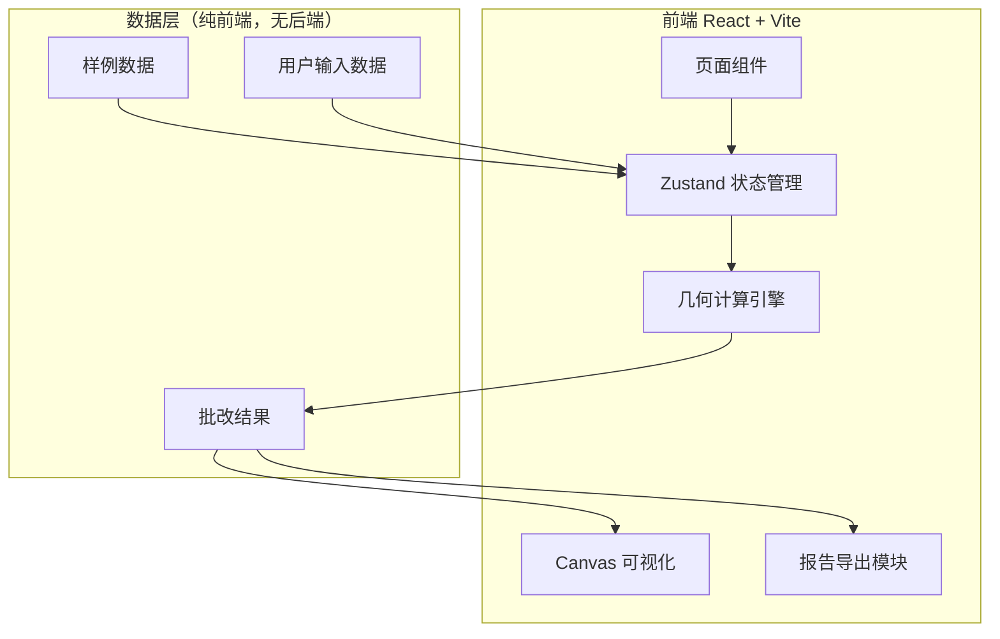
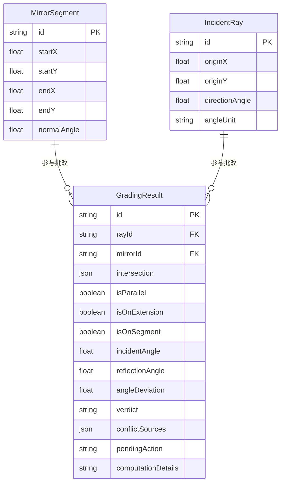

## 1. 架构设计



纯前端架构，无需后端服务。所有几何计算在浏览器端完成，数据存储于Zustand状态管理中。

## 2. 技术选型

- 前端框架：React@18 + TypeScript + Vite
- 样式方案：Tailwind CSS@3
- 状态管理：Zustand
- 路由：react-router-dom
- 图标：lucide-react
- 可视化：Canvas 2D API（原生）
- 导出：原生Blob下载（JSON/CSV）
- 初始化工具：vite-init，模板 react-ts

## 3. 路由定义

| 路由 | 用途 |
|------|------|
| `/` | 重定向至 `/import` |
| `/import` | 数据导入页：镜面线段与入射光线批量输入 |
| `/grading` | 批改主页：执行批改、结果分类展示、光路可视化 |
| `/report` | 报告与明细页：报告总览、明细追溯、导出 |

## 4. 数据模型

### 4.1 核心类型定义

```typescript
interface MirrorSegment {
  id: string;
  startX: number;
  startY: number;
  endX: number;
  endY: number;
  normalAngle?: number; // 法线方向角（度），可选
}

interface IncidentRay {
  id: string;
  originX: number;
  originY: number;
  directionAngle: number; // 入射方向角（度）
  angleUnit: 'deg' | 'rad'; // 角度单位标记
}

type Verdict = 'pass' | 'error' | 'pending';

type ConflictSource =
  | 'intersection_mismatch'
  | 'reflection_angle_deviation'
  | 'boundary_exceeded'
  | 'angle_unit_conflict'
  | 'parallel_no_intersection'
  | 'extension_line_intersection';

type PendingAction =
  | 'verify_parallel_intent'
  | 'check_extension_validity'
  | 'confirm_angle_unit';

interface GradingResult {
  id: string;
  rayId: string;
  mirrorId: string;
  intersection: { x: number; y: number } | null;
  isParallel: boolean;
  isOnExtension: boolean;
  isOnSegment: boolean;
  incidentAngle: number | null;
  reflectionAngle: number | null;
  angleDeviation: number | null;
  verdict: Verdict;
  conflictSources: ConflictSource[];
  pendingAction: PendingAction | null;
  computationDetails: string;
}
```

### 4.2 实体关系



## 5. 几何计算引擎设计

### 5.1 求交算法

使用参数化射线-线段求交：
- 射线 P = O + t·D (t ≥ 0)
- 线段 Q = A + s·(B-A) (0 ≤ s ≤ 1)
- 解线性方程组得 t, s
- t < 0：交点在射线反方向（不合法）
- s < 0 或 s > 1：交点在线段延长线上
- s ∈ [0,1]：交点在线段上

### 5.2 反射角计算

- 入射角 = arccos(|入射方向 · 法线方向| / (|入射方向| × |法线方向|))
- 反射角应等于入射角（反射定律）
- 偏差 > 阈值（默认1°）标记为错误

### 5.3 边界判定

- s ∈ [0, 1]：交点在镜面线段上 → 正常
- s < 0 或 s > 1：交点在延长线上 → 待确认
- 射线与线段平行（行列式≈0）：无交点 → 待确认

### 5.4 角度单位检测

- 若输入角度绝对值 > 2π 且标记为rad，判定为疑似角度单位错误
- 若输入角度绝对值 < π/180 且标记为deg，判定为疑似角度单位错误

## 6. 项目目录结构

```
src/
├── components/
│   ├── Layout.tsx              # 全局布局（侧边栏+内容区）
│   ├── Sidebar.tsx             # 左侧导航
│   ├── MirrorInput.tsx         # 镜面线段输入组件
│   ├── RayInput.tsx            # 入射光线输入组件
│   ├── ValidationBar.tsx       # 校验状态栏
│   ├── GradingTable.tsx        # 批改结果表格
│   ├── CategoryTabs.tsx        # 分类标签栏
│   ├── ConflictBadge.tsx       # 冲突来源标签
│   ├── PendingActionCard.tsx   # 待确认动作卡片
│   ├── LightPathCanvas.tsx     # 光路Canvas可视化
│   ├── ReportSummary.tsx       # 报告总览统计
│   ├── DetailExpandable.tsx    # 可展开明细行
│   └── ExportButton.tsx        # 导出按钮
├── hooks/
│   └── useGrading.ts           # 批改流程Hook
├── pages/
│   ├── ImportPage.tsx          # 数据导入页
│   ├── GradingPage.tsx         # 批改主页
│   └── ReportPage.tsx          # 报告与明细页
├── utils/
│   ├── geometry.ts             # 几何计算引擎（求交、反射角、边界）
│   ├── parser.ts               # 数据解析与格式校验
│   ├── exporter.ts             # 报告导出（JSON/CSV）
│   └── sampleData.ts           # 内置样例数据
├── store/
│   └── useAppStore.ts          # Zustand全局状态
├── App.tsx
├── main.tsx
└── index.css
```
