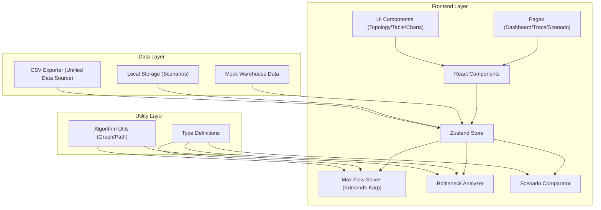

## 1. 架构设计



## 2. 技术描述

- **前端框架**: React@18 + TypeScript@5
- **构建工具**: Vite@5
- **样式方案**: TailwindCSS@3.4
- **状态管理**: Zustand@4
- **图标库**: lucide-react@0.344
- **图表可视化**: SVG原生实现（拓扑图）+ 自定义进度条组件
- **算法实现**: 前端原生实现Edmonds-Karp最大流算法
- **数据持久化**: LocalStorage存储用户情景方案
- **数据导出**: 前端原生CSV导出，统一使用Store中同一数据源

## 3. 路由定义

| 路由 | 页面用途 |
|------|----------|
| / | 分析看板 - 网络流总览、拓扑图、线路列表、待确认区 |
| /trace/:routeId | 瓶颈追溯 - 求解过程、约束分析、依赖关系 |
| /scenario | 情景对比 - 多方案并排对比、容量调整滑块 |

## 4. 数据模型

### 4.1 核心类型定义

```typescript
// 节点类型
interface Node {
  id: string;
  name: string;
  type: 'warehouse' | 'distribution' | 'demand';
  x: number;
  y: number;
  capacity: number;
  demand?: number;
  isIsolated: boolean;
}

// 线路类型
interface Route {
  id: string;
  from: string;
  to: string;
  capacity: number;
  flow: number;
  isDisabled: boolean;
  disableNotEffective: boolean;
  utilization: number;
  isBottleneck: boolean;
}

// 最大流求解步骤
interface SolverStep {
  step: number;
  augmentingPath: string[];
  flowAdded: number;
  residualNetwork: Route[];
  bottleneckRouteId: string;
}

// 分析结果
interface AnalysisResult {
  maxFlow: number;
  totalCapacity: number;
  bottleneckRoutes: Route[];
  isolatedNodes: Node[];
  zeroCapacityRoutes: Route[];
  disabledNotEffective: Route[];
  solverSteps: SolverStep[];
}

// 情景方案
interface Scenario {
  id: string;
  name: string;
  createdAt: number;
  nodes: Node[];
  routes: Route[];
  result: AnalysisResult;
}
```

### 4.2 数据流设计

1. **单一数据源原则**: 所有图表、列表、导出功能均从Zustand Store的`analysisResult`获取数据，确保一致性
2. **状态更新流程**:
   - 用户加载数据 → Store更新`nodes`和`routes`
   - 触发`runAnalysis()` → 调用Edmonds-Karp算法 → 更新`analysisResult`
   - 所有UI组件订阅Store状态自动刷新
   - 导出功能直接读取Store当前状态生成CSV

## 5. 核心算法模块

### 5.1 Edmonds-Karp 最大流算法

```typescript
function edmondsKarp(
  nodes: Node[],
  routes: Route[],
  sourceId: string,
  sinkId: string
): { maxFlow: number; solverSteps: SolverStep[]; finalFlows: Map<string, number> }
```

- 使用BFS寻找增广路径
- 记录每一步的增广路径和流量分配
- 构建残量网络支持回溯
- 输出完整求解步骤用于追溯面板

### 5.2 瓶颈识别算法

```typescript
function identifyBottlenecks(
  routes: Route[],
  threshold: number = 0.9
): Route[]
```

- 容量利用率 > 90% 标记为瓶颈
- 同时检测上游节点容量约束
- 标记孤立节点（无入边且无出边）
- 标记容量为0的线路
- 标记禁用但仍有流量的线路（禁用未生效）

### 5.3 情景对比计算

```typescript
function compareScenarios(
  base: Scenario,
  modified: Scenario
): {
  flowDiff: number;
  bottleneckChanges: { routeId: string; before: number; after: number }[];
  improvedRoutes: string[];
  newBottlenecks: string[];
}
```

## 6. 项目结构

```
src/
├── components/
│   ├── layout/
│   │   ├── Header.tsx
│   │   └── Sidebar.tsx
│   ├── dashboard/
│   │   ├── StatsCard.tsx
│   │   ├── PendingArea.tsx
│   │   ├── TopologyGraph.tsx
│   │   └── RouteTable.tsx
│   ├── trace/
│   │   ├── SolverTimeline.tsx
│   │   └── ConstraintAnalysis.tsx
│   ├── scenario/
│   │   ├── ScenarioCard.tsx
│   │   └── CapacitySlider.tsx
│   └── common/
│       ├── Button.tsx
│       └── ExportButton.tsx
├── pages/
│   ├── Dashboard.tsx
│   ├── Trace.tsx
│   └── Scenario.tsx
├── store/
│   └── useNetworkStore.ts
├── types/
│   └── index.ts
├── utils/
│   ├── maxFlow.ts
│   ├── bottleneck.ts
│   ├── compare.ts
│   ├── export.ts
│   └── sampleData.ts
├── App.tsx
├── main.tsx
└── index.css
```

## 7. 关键实现约束

1. **单一数据源**: 所有显示和导出必须使用`useNetworkStore`中的同一`analysisResult`对象，禁止组件内部重复计算
2. **待确认区置顶**: `PendingArea`组件必须在Dashboard最顶部渲染，z-index高于其他内容
3. **异常检测前置**: 调用最大流算法前必须先检测并标记孤立节点、零容量、禁用未生效
4. **追溯链路完整**: 每条线路必须能关联到对应的`solverSteps`条目，显示其在算法中的作用
5. **导出一致性**: CSV导出包含三部分（统计摘要、线路明细、瓶颈分析），均来自当前Store状态
