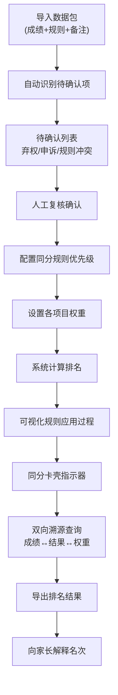

## 1. 产品概述

"赛事同分排名器"是一款面向中小学体育组的赛事排名分析工具，解决校赛项目多、同分规则年年变、名次解释难的痛点。系统以排序规则为主线，通过可视化方式展示每一次同分排序的决策过程，让体育老师能够清晰地向家长解释名次由来。

### 核心价值
- 可配置的同分规则引擎，适配每年变化的规则
- 完整的排序追踪链路，支持成绩→结果→权重的双向溯源
- 智能识别需人工确认的内容（弃权、申诉、同分卡壳）
- 图表、明细、导出共享同一数据源，确保一致性

## 2. 核心功能

### 2.1 用户角色
| 角色 | 登录方式 | 核心权限 |
|------|----------|----------|
| 体育老师 | 本地使用无需登录 | 数据导入、规则配置、排名计算、复核确认、导出分享 |

### 2.2 功能模块
1. **数据导入与预处理**：批量导入选手成绩，自动识别需人工确认项
2. **规则配置引擎**：可视化配置各项目权重、同分规则优先级
3. **排名计算与追踪**：实时计算排名，可视化展示同分决策过程
4. **复核工作台**：弃权计分、申诉重排的人工确认
5. **排名分析看板**：图表展示、明细查询、双向溯源
6. **结果导出**：支持多格式导出排名结果和规则说明

### 2.3 页面详情
| 页面名称 | 模块名称 | 功能描述 |
|-----------|-------------|---------------------|
| 主分析看板 | 规则主线视图 | 以时间线/流程线展示排序规则优先级，权重计算和名次解释作为辅助卡片 |
| 主分析看板 | 排名结果区 | 展示最终排名，支持点击查看单个选手的完整排序路径 |
| 主分析看板 | 同分卡壳指示器 | 高亮显示同分排序卡在哪一步规则上 |
| 数据导入页 | 文件上传区 | 拖拽上传包含成绩、规则、备注的数据包 |
| 数据导入页 | 待确认列表 | 自动筛选出弃权、申诉、规则冲突等需人工确认的内容 |
| 规则配置页 | 规则优先级排序 | 拖拽调整同分规则的应用顺序 |
| 规则配置页 | 项目权重设置 | 为每个比赛项目设置权重分值 |
| 复核工作台 | 弃权计分确认 | 逐条确认弃权选手的计分方式 |
| 复核工作台 | 申诉重排处理 | 处理申诉后重新计算排名并标记 |
| 溯源查询页 | 正向查询 | 输入选手姓名/项目，查看从原始成绩到最终名次的完整计算过程 |
| 溯源查询页 | 反向查询 | 点击某一名次，反查该名次涉及的项目权重和规则应用 |

## 3. 核心流程

### 主要用户流程
体育老师导入混合数据包 → 系统自动识别需人工确认项 → 老师处理弃权/申诉 → 配置当年同分规则和项目权重 → 系统计算排名并可视化展示规则应用过程 → 老师检查同分卡壳点 → 确认后导出排名结果 → 家长询问时通过溯源功能展示完整排序路径

## 4. 用户界面设计

### 4.1 设计风格
- **设计基调**：专业运动风 + 数据可视化感，采用深蓝底色配合亮橙金色点缀，体现竞技体育的精准与活力
- **主色调**：深蓝 #0F172A（数据可信度），亮橙 #F59E0B（竞技活力），金 #EAB308（奖牌荣誉）
- **辅助色**：翠绿 #10B981（确认通过），珊瑚红 #EF4444（待处理/卡壳），浅灰 #64748B（辅助信息）
- **字体**：标题使用 "Chakra Petch"（ monospace 风格，体现数据精准感），正文使用 "Noto Sans SC"（清晰易读）
- **按钮风格**：轻微 3D 效果，悬停时有上浮动画，圆角 6px
- **布局风格**：非对称三栏布局，中间为规则主线（占50%宽度），左右为辅（各25%），采用卡片叠加和深度阴影
- **图标风格**：线性图标配合轻微渐变填充，使用运动相关符号（跑道、奖牌、秒表、天平）

### 4.2 页面设计概述
| 页面名称 | 模块名称 | UI 元素 |
|-----------|-------------|----------|
| 主分析看板 | 规则主线视图 | 垂直时间线贯穿页面中央，每条规则为一个节点，节点颜色表示应用状态（绿=已区分，橙=同分继续，红=卡壳），节点连接线显示规则流转 |
| 主分析看板 | 排名结果区 | 右侧卡片式排名列表，前三名有特殊奖牌样式，每行可展开查看详细排序路径 |
| 主分析看板 | 权重计算辅助卡 | 左侧悬浮卡片，显示当前选中项目/选手的权重构成，饼图展示各项目占比 |
| 主分析看板 | 同分卡壳指示器 | 红色脉冲动画标记卡壳位置，点击展开显示同分选手和当前规则详情 |
| 数据导入页 | 待确认列表 | 卡片式列表，每条待确认项有明确的类型标签（弃权/申诉/规则冲突）和操作按钮 |
| 规则配置页 | 规则优先级排序 | 拖拽排序的卡片列表，每张规则卡片可展开查看规则详情和示例 |
| 溯源查询页 | 溯源路径可视化 | 桑基图/流程图展示从原始成绩→各项目得分→加权总分→同分规则应用→最终名次的完整路径 |

### 4.3 响应式
- 桌面端优先设计（1280px+），三栏布局
- 平板端（768-1279px）：规则主线居中，辅助卡片改为上下堆叠
- 移动端（<768px）：单栏垂直布局，规则主线改为横向时间线，支持左右滑动查看
- 所有交互元素保证 44px 最小触控区域

## 5. 数据一致性保障

### 单一数据源原则
- 所有展示（图表、排名表、规则解释）均来自同一计算结果对象
- 导出功能直接使用计算结果，不做二次加工
- 溯源查询直接引用计算过程中保存的每一步中间结果
- 修改规则或权重后立即失效缓存，强制重新计算

### 审计追踪
- 记录每一次排名计算的参数（规则版本、权重配置、复核结果）
- 支持回滚到历史任意一次计算结果
- 申诉处理全程留痕，记录处理人、时间、原因
