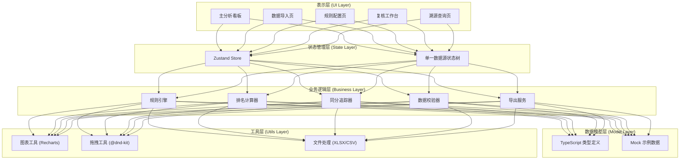
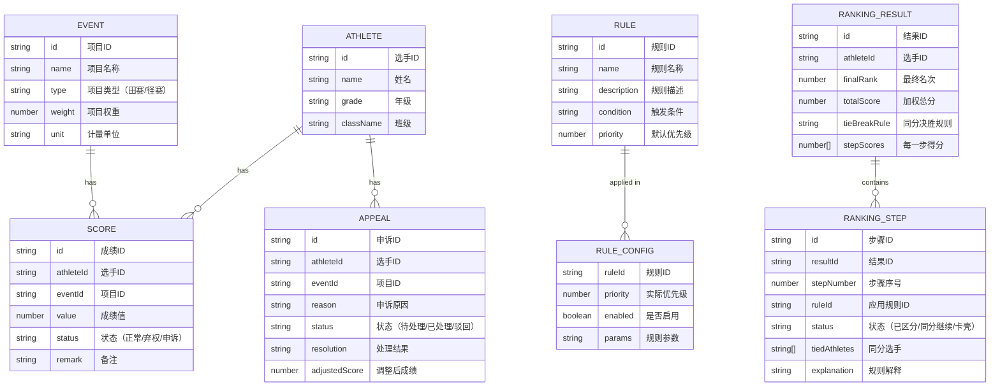

## 1. 架构设计

本系统为纯前端单页应用（SPA），无需后端服务，所有数据处理和计算均在浏览器端完成，适合体育老师本地使用。采用分层架构设计，确保数据一致性和可维护性。



## 2. 技术描述

- **前端框架**：React 18 + TypeScript 5
- **构建工具**：Vite 5
- **样式方案**：TailwindCSS 3.4 + CSS Variables（主题系统）
- **状态管理**：Zustand 4（轻量级，单一数据源）
- **路由方案**：React Router DOM 6
- **图表库**：Recharts 2（桑基图、饼图、柱状图）
- **拖拽库**：@dnd-kit/core + @dnd-kit/sortable（规则优先级排序）
- **文件处理**：xlsx + file-saver（导入导出 Excel/CSV）
- **UI 组件**：Headless UI + 自定义组件（避免臃肿的组件库）
- **动画**：Framer Motion（页面切换、微交互）
- **字体**：Google Fonts（Chakra Petch + Noto Sans SC）
- **后端**：无，纯前端应用
- **数据库**：LocalStorage（持久化配置和历史记录）+ 内存计算

### 技术选型理由
1. **纯前端架构**：体育老师无需部署服务器，本地打开即可使用
2. **Zustand**：轻量级状态管理，天然支持单一数据源原则
3. **TypeScript**：复杂排序逻辑需要类型安全保障
4. **Recharts**：原生 React 图表库，支持桑基图展示溯源路径
5. **@dnd-kit**：现代拖拽库，支持规则优先级的直观调整

## 3. 路由定义

| Route | 页面 | 用途 |
|-------|------|------|
| / | 主分析看板 | 规则主线视图、排名结果、权重分析 |
| /import | 数据导入 | 文件上传、待确认项列表 |
| /rules | 规则配置 | 同分规则排序、项目权重设置 |
| /review | 复核工作台 | 弃权确认、申诉处理 |
| /trace | 溯源查询 | 双向溯源（成绩↔结果↔权重） |

## 4. 数据模型

### 4.1 数据模型定义



### 4.2 核心数据结构（TypeScript）

```typescript
// 选手
interface Athlete {
  id: string;
  name: string;
  grade: string;
  className: string;
}

// 比赛项目
interface Event {
  id: string;
  name: string;
  type: 'field' | 'track';
  weight: number;
  unit: string;
}

// 单项成绩
interface Score {
  id: string;
  athleteId: string;
  eventId: string;
  value: number;
  status: 'normal' | 'forfeit' | 'appeal';
  remark?: string;
}

// 同分规则
interface TieBreakRule {
  id: string;
  name: string;
  description: string;
  type: 'highest_single' | 'most_first' | 'head_to_head' | 'best_second' | 'custom';
  priority: number;
  enabled: boolean;
  params?: Record<string, any>;
}

// 申诉记录
interface Appeal {
  id: string;
  athleteId: string;
  eventId: string;
  reason: string;
  status: 'pending' | 'resolved' | 'rejected';
  resolution?: string;
  adjustedScore?: number;
}

// 排名计算步骤（用于追踪和解释）
interface RankingStep {
  stepNumber: number;
  ruleId: string;
  ruleName: string;
  status: 'resolved' | 'tied' | 'stuck';
  tiedAthletes: string[];
  explanation: string;
  scores: Record<string, number>;
}

// 最终排名结果
interface RankingResult {
  athleteId: string;
  rank: number;
  totalScore: number;
  weightedScores: Record<string, number>;
  tieBreakRule?: string;
  steps: RankingStep[];
}

// 计算快照（用于审计和回滚）
interface CalculationSnapshot {
  id: string;
  timestamp: number;
  rules: TieBreakRule[];
  events: Event[];
  results: RankingResult[];
  reviewResults: Record<string, boolean>;
}
```

## 5. 核心算法设计

### 5.1 排名计算流程

1. **加权得分计算**：`weightedScore = rawScore * eventWeight`
2. **总分计算**：`totalScore = sum(weightedScores)`
3. **初步排序**：按总分降序排列
4. **同分检测**：识别总分相同的选手组
5. **同分规则应用**：按优先级顺序应用同分规则
   - 每步规则应用后检测是否仍有同分
   - 记录每步应用结果（用于解释）
   - 若所有规则用完仍有同分，标记为"卡壳"
6. **结果输出**：生成包含完整追踪信息的排名结果

### 5.2 同分规则引擎设计

```typescript
interface RuleApplicationResult {
  resolved: boolean;
  rankedAthletes: string[];
  remainingTies: string[][];
  explanation: string;
}

type RuleHandler = (
  tiedAthletes: string[],
  scores: Record<string, Record<string, number>>,
  params?: Record<string, any>
) => RuleApplicationResult;

const ruleHandlers: Record<string, RuleHandler> = {
  // 单项目最高分
  highest_single: (tiedAthletes, scores) => {
    const maxScores = tiedAthletes.map(id => ({
      id,
      max: Math.max(...Object.values(scores[id]))
    }));
    maxScores.sort((a, b) => b.max - a.max);
    return {
      resolved: new Set(maxScores.map(s => s.max)).size === maxScores.length,
      rankedAthletes: maxScores.map(s => s.id),
      remainingTies: [],
      explanation: '按所有项目中的最高单项成绩排序'
    };
  },
  // 获第一名次数
  most_first: (tiedAthletes, scores) => {
    // 实现逻辑...
  },
  // 胜负关系
  head_to_head: (tiedAthletes, scores, params) => {
    // 实现逻辑...
  }
};
```

## 6. 单一数据源实现

### 状态结构设计

```typescript
interface AppState {
  // 基础数据
  athletes: Athlete[];
  events: Event[];
  scores: Score[];
  appeals: Appeal[];
  
  // 规则配置
  rules: TieBreakRule[];
  
  // 复核状态
  reviewedItems: Record<string, boolean>;
  
  // 计算结果（单一数据源）
  calculationResult: {
    results: RankingResult[];
    timestamp: number;
    isStale: boolean;
  } | null;
  
  // UI 状态
  selectedAthleteId: string | null;
  selectedRank: number | null;
  
  // 历史快照
  snapshots: CalculationSnapshot[];
}
```

### 数据一致性保障

1. **计算触发**：修改基础数据、规则或复核状态后，标记 `isStale: true`
2. **懒计算**：UI 访问结果时检测 `isStale`，自动触发重新计算
3. **计算锁**：防止重复计算，计算过程中阻塞新的修改
4. **不可变更新**：所有状态更新使用不可变方式，确保时间旅行可回溯
5. **导出直连**：导出功能直接从 `calculationResult` 读取，不做二次处理

## 7. 性能优化策略

1. **计算缓存**：使用 reselect 或 zustand 中间件缓存派生数据
2. **虚拟滚动**：排名列表使用虚拟滚动（react-window），支持千量级选手
3. **懒加载图表**：图表组件按需加载，减少首屏体积
4. **Web Worker**：复杂排名计算移至 Web Worker，避免阻塞 UI
5. **防抖更新**：规则调整时防抖 300ms 后再重新计算
