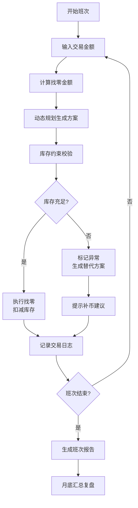

## 1. 产品概述
现金找零库存优化系统是专为便利店店长设计的智能库存管理工具，通过动态规划算法和实时库存监控，解决夜班找零零钱不足的核心痛点。系统提供补币建议、异常预警和可追溯报告，确保日常操作与月底复盘数据口径一致。

- 核心目的：提前预测零钱库存缺口，避免因找零不足影响营业
- 目标用户：便利店店长、夜班店员、运营管理人员
- 市场价值：减少营业损失，提升库存管理效率，降低人工盘点成本

## 2. 核心功能

### 2.1 用户角色
| 角色 | 使用场景 | 核心权限 |
|------|----------|----------|
| 便利店店长 | 日常库存监控、月底复盘 | 完整功能访问、报告导出、参数配置 |
| 夜班店员 | 班次开始前检查、实时找零 | 库存查询、找零计算、异常上报 |

### 2.2 功能模块
1. **主控制台**：库存概览、实时预警、快捷操作
2. **找零计算**：动态规划算法、库存约束校验、多方案对比
3. **班次管理**：班次配置、交接班记录、历史数据追溯
4. **库存分析**：面额趋势图表、缺口预测、补币建议
5. **报告中心**：数据导出、审计追踪、异常说明

### 2.3 页面详情
| 页面名称 | 模块名称 | 功能描述 |
|---------|---------|----------|
| 主控制台 | 库存仪表盘 | 各面额库存实时展示、预警标识、库存健康度评分 |
| 主控制台 | 快捷操作区 | 快速找零计算、一键补币建议、班次切换 |
| 找零计算 | 金额输入 | 应收金额、实收金额、自动计算找零 |
| 找零计算 | 方案展示 | 最优解并列展示、面额重要性标注、可追溯来源 |
| 找零计算 | 异常处理 | 库存不足预警、替代方案、下一步操作指引 |
| 班次管理 | 班次列表 | 班次时间配置、交接记录、操作人员信息 |
| 库存分析 | 趋势图表 | 各面额库存变化曲线、预测线、预警阈值线 |
| 库存分析 | 补币建议 | 智能推荐补币数量、优先级排序、成本优化 |
| 报告中心 | 导出功能 | CSV/Excel导出、PDF报告、自定义时间范围 |
| 报告中心 | 审计追踪 | 每条结论数据源追溯、操作日志、异常标记 |

## 3. 核心流程

### 3.1 日常找零流程
1. 店员选择当前班次
2. 输入应收金额和实收金额
3. 系统自动计算找零金额
4. 应用动态规划算法生成最优找零方案
5. 校验库存约束，检查各面额是否充足
6. 若库存充足：展示方案并扣减库存
7. 若库存不足：标记异常、展示替代方案、提示补币

### 3.2 月底复盘流程
1. 选择复盘时间范围
2. 系统汇总所有班次数据
3. 生成库存趋势分析报告
4. 识别高频缺口面额
5. 输出优化后的补币策略
6. 导出完整报告供管理层审阅

## 4. 用户界面设计

### 4.1 设计风格
- **主色调**：深蓝色(#1e3a5f) - 专业、可信赖
- **辅助色**：
  - 成功绿(#10b981) - 库存充足
  - 警告橙(#f59e0b) - 库存预警
  - 危险红(#ef4444) - 库存不足
  - 信息蓝(#3b82f6) - 操作指引
- **按钮风格**：圆角矩形(8px)，悬停有微妙阴影和颜色变化
- **字体**：
  - 标题：Noto Sans SC Bold - 清晰有力
  - 正文：Noto Sans SC Regular - 易读性强
  - 数字：Roboto Mono - 等宽对齐
- **布局风格**：卡片式布局，清晰分区，信息层级明确
- **图标风格**：线性图标，简洁现代，统一24px尺寸

### 4.2 页面设计概述
| 页面名称 | 模块名称 | UI元素 |
|---------|---------|--------|
| 主控制台 | 库存仪表盘 | 彩色卡片网格、进度条、状态徽章、数字动效 |
| 主控制台 | 快捷操作区 | 大按钮卡片、图标+文字、hover放大效果 |
| 找零计算 | 金额输入 | 大号数字输入框、计算器样式键盘、实时计算 |
| 找零计算 | 方案展示 | 面额卡片、数量标签、最优标识、来源追溯链接 |
| 库存分析 | 趋势图表 | 多折线图、交互式tooltip、可拖拽时间轴 |
| 报告中心 | 导出功能 | 文件格式选择器、日期范围选择器、预览按钮 |

### 4.3 响应式设计
- **桌面优先**：1280px以上为主要设计尺寸
- **平板适配**：1024px - 两列布局调整
- **手机适配**：768px以下 - 单列布局，触控优化
- **触控优化**：按钮最小44x44px，输入框足够间距

### 4.4 交互动效
- 页面加载：卡片交错淡入(animation-delay)
- 数据更新：数字滚动动画
- 预警提示：脉冲闪烁效果
- 按钮点击：缩放+波纹反馈
- 图表交互：悬停高亮、平滑过渡
