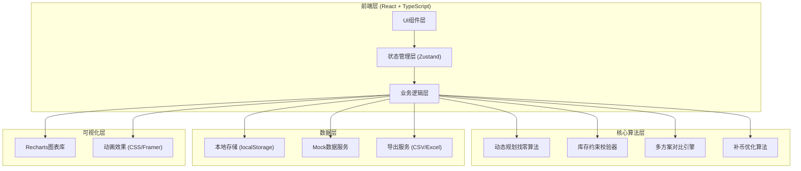
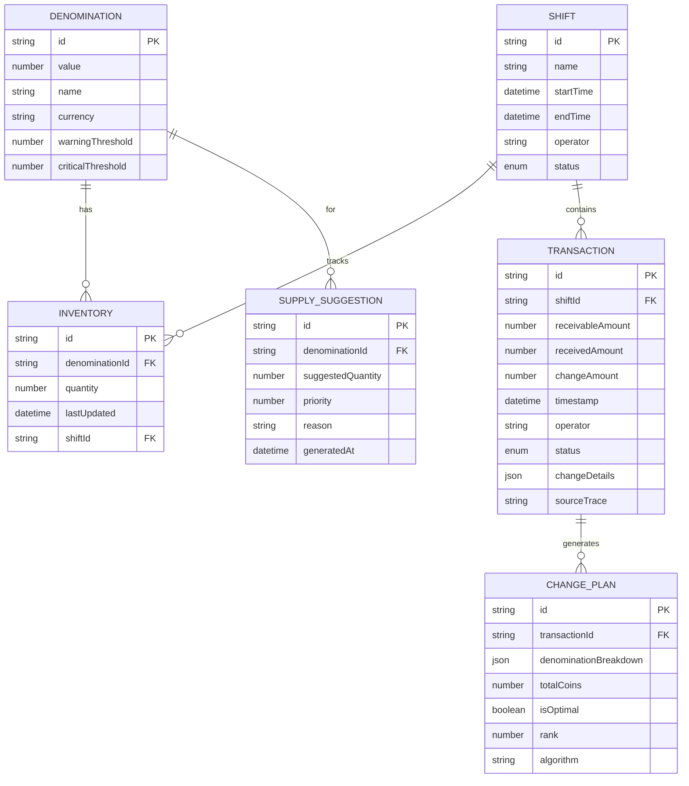

## 1. 架构设计



## 2. 技术栈说明

- **前端框架**：React@18 + TypeScript@5
- **构建工具**：Vite@5
- **样式方案**：TailwindCSS@3 + PostCSS
- **状态管理**：Zustand (轻量级、高性能)
- **图表库**：Recharts@2 (React生态、交互式)
- **动画库**：Framer Motion (流畅交互动效)
- **图标库**：Lucide React (线性风格、统一)
- **数据持久化**：localStorage + 自定义序列化
- **导出功能**：SheetJS (xlsx) + 原生CSV生成

## 3. 路由定义

| 路由路径 | 页面名称 | 主要功能 |
|---------|---------|----------|
| `/` | 主控制台 | 库存概览、快捷操作、预警展示 |
| `/calculator` | 找零计算 | 金额输入、方案生成、异常处理 |
| `/shift` | 班次管理 | 班次配置、交接班记录 |
| `/analytics` | 库存分析 | 趋势图表、补币建议、预测分析 |
| `/reports` | 报告中心 | 数据导出、审计追踪、异常汇总 |

## 4. 核心数据模型

### 4.1 ER图



### 4.2 TypeScript 类型定义

```typescript
// 面额定义
interface Denomination {
  id: string;
  value: number;
  name: string;
  currency: string;
  warningThreshold: number;
  criticalThreshold: number;
}

// 库存记录
interface Inventory {
  id: string;
  denominationId: string;
  quantity: number;
  lastUpdated: Date;
  shiftId: string;
}

// 班次
interface Shift {
  id: string;
  name: string;
  startTime: Date;
  endTime?: Date;
  operator: string;
  status: 'active' | 'completed' | 'scheduled';
}

// 交易记录
interface Transaction {
  id: string;
  shiftId: string;
  receivableAmount: number;
  receivedAmount: number;
  changeAmount: number;
  timestamp: Date;
  operator: string;
  status: 'success' | 'warning' | 'failed';
  changeDetails: ChangeDetail[];
  sourceTrace: SourceTrace;
}

// 找零明细
interface ChangeDetail {
  denominationId: string;
  quantity: number;
  value: number;
}

// 来源追溯
interface SourceTrace {
  algorithm: string;
  inventorySnapshot: Record<string, number>;
  timestamp: Date;
  operator: string;
}

// 找零方案
interface ChangePlan {
  id: string;
  transactionId: string;
  denominationBreakdown: ChangeDetail[];
  totalCoins: number;
  isOptimal: boolean;
  rank: number;
  algorithm: string;
}

// 补币建议
interface SupplySuggestion {
  id: string;
  denominationId: string;
  suggestedQuantity: number;
  priority: 'high' | 'medium' | 'low';
  reason: string;
  generatedAt: Date;
}

// 算法结果
interface ChangeResult {
  success: boolean;
  plans: ChangePlan[];
  warnings: string[];
  errors: string[];
  nextActions: NextAction[];
}

// 下一步操作
interface NextAction {
  action: string;
  target: string;
  description: string;
  priority: number;
}
```

## 5. 核心算法设计

### 5.1 动态规划找零算法

```typescript
// 带库存约束的动态规划找零
function dpChangeWithInventory(
  amount: number,
  denominations: Denomination[],
  inventory: Record<string, number>
): ChangeResult {
  // 1. 初始化DP数组
  // 2. 记录路径
  // 3. 考虑库存约束
  // 4. 生成多组最优解
  // 5. 计算面额重要性
}
```

### 5.2 库存约束校验器

```typescript
// 校验库存是否满足方案
function validateInventory(
  plan: ChangePlan,
  inventory: Record<string, number>
): {
  valid: boolean;
  shortages: { denominationId: string; needed: number; available: number }[];
}
```

### 5.3 补币优化算法

```typescript
// 基于历史数据预测补币需求
function generateSupplySuggestions(
  currentInventory: Inventory[],
  history: Transaction[],
  denominations: Denomination[]
): SupplySuggestion[]
```

## 6. 目录结构

```
src/
├── assets/              # 静态资源
├── components/          # 可复用组件
│   ├── ui/             # 基础UI组件
│   ├── inventory/      # 库存相关组件
│   ├── calculator/     # 计算器组件
│   └── charts/         # 图表组件
├── hooks/              # 自定义Hooks
├── store/              # Zustand状态管理
├── utils/              # 工具函数
│   ├── algorithm.ts    # 核心算法
│   ├── validation.ts   # 校验逻辑
│   ├── export.ts       # 导出功能
│   └── trace.ts        # 追溯功能
├── types/              # TypeScript类型定义
├── data/               # Mock数据
├── pages/              # 页面组件
├── App.tsx             # 根组件
└── main.tsx            # 入口文件
```

## 7. 关键技术决策

1. **前端纯静态架构**：无需后端，所有数据本地存储，适合单机使用
2. **Zustand状态管理**：比Redux轻量，API简洁，适合中小型应用
3. **localStorage持久化**：数据自动保存，刷新不丢失
4. **Recharts图表**：React原生，交互性好，文档完善
5. **Framer Motion动画**：声明式动画，性能优秀
6. **多方案并列展示**：不强制单一最优解，让店长有选择空间
7. **全程可追溯**：每条记录保存算法版本、库存快照、操作人
