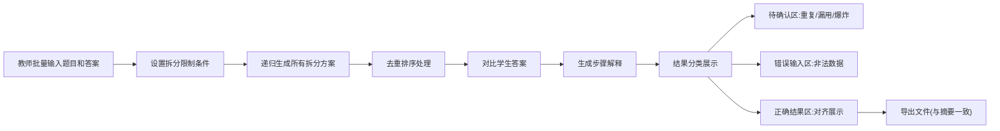

## 1. 产品概述

整数拆分课堂板是面向奥数教师的教学辅助工具，解决学生在整数拆分练习中重复排列、去重理解困难的核心痛点。通过递归算法生成、实时去重解释和批量数据处理，帮助教师高效批改作业、讲解去重原理，避免课后返工。

## 2. 核心特性

### 2.1 用户角色

| 角色 | 注册方式 | 核心权限 |
|------|----------|----------|
| 奥数教师 | 无需注册 | 批量导入题目、生成拆分方案、查看去重解释、导出结果 |
| 学生 | 无需注册 | 输入答案、查看分步讲解、理解去重逻辑 |

### 2.2 功能模块

1. **主操作面板**：批量数据录入、限制条件设置、生成控制
2. **拆分结果展示区**：递归生成过程、去重排序对比、步骤解释
3. **待确认区**：重复排列预警、条件漏用提示、方案爆炸警告
4. **错误输入区**：非法输入单独列出、格式错误提示
5. **结果导出区**：CSV/JSON文件下载、摘要信息对齐

### 2.3 页面详情

| 页面名称 | 模块名称 | 功能描述 |
|---------|----------|----------|
| 主页面 | 批量录入区 | 支持多行批量输入目标整数和学生答案，每行一题 |
| 主页面 | 限制条件设置 | 可设置拆分数上限、下限、是否允许重复、特定数字包含/排除 |
| 主页面 | 生成控制区 | 一键生成所有题目的拆分方案，显示进度 |
| 主页面 | 拆分结果展示 | 树形展示递归过程，高亮去重步骤，对比学生答案 |
| 主页面 | 待确认区 | 醒目显示可能漏掉的重复排列、未使用的条件、方案数量异常 |
| 主页面 | 错误输入区 | 单独列出格式错误的输入行，标注错误原因 |
| 主页面 | 导出区 | 导出完整结果，限制条件结论与界面一致 |

## 3. 核心流程

**流程说明：**
1. 教师在批量录入区输入多行数据，每行包含目标整数、限制条件、学生答案
2. 系统逐行验证，错误输入进入错误区，正确数据进入处理流程
3. 递归生成所有可能的拆分方案，同步展示生成过程
4. 应用去重排序算法，高亮标注哪些排列是重复的、如何去重
5. 对比学生答案，标记正确/错误/遗漏的拆分
6. 检测异常情况：可能的重复排列遗漏、限制条件未生效、方案数量异常
7. 生成可导出的结果文件，确保限制条件结论与界面展示一致

## 4. 用户界面设计

### 4.1 设计风格

- **主色调**：深靛蓝 (#1E3A5F) - 体现数学的严谨与深度
- **辅助色**：琥珀橙 (#F59E0B) - 用于待确认区预警，薄荷绿 (#10B981) - 用于正确结果，玫瑰红 (#EF4444) - 用于错误提示
- **按钮风格**：圆角方形 (8px)，微悬浮阴影，点击下沉效果
- **字体**：标题使用 Noto Serif SC（衬线体体现学术感），正文使用 Noto Sans SC
- **布局风格**：三栏式卡片布局，左侧输入、中间结果、右侧预警，支持拖拽调整
- **图标风格**：数学符号风格的线性图标，使用Σ、∪、∩等数学符号作为装饰

### 4.2 页面设计概览

| 页面名称 | 模块名称 | UI元素 |
|---------|----------|--------|
| 主页面 | 顶部标题区 | 大标题"整数拆分课堂板"，副标题"递归生成 · 去重解释 · 批量处理"，数学公式装饰 |
| 主页面 | 批量录入区 | 大文本框，行号显示，语法高亮，实时输入验证 |
| 主页面 | 条件设置区 | 折叠面板，滑块+数字输入，开关按钮，预设条件快捷选择 |
| 主页面 | 生成按钮 | 大号渐变按钮，加载动画，进度条 |
| 主页面 | 结果展示区 | 可折叠卡片组，每道题独立卡片，树形递归展开，去重步骤时间线 |
| 主页面 | 待确认区 | 黄色背景警示卡片，感叹号图标，可勾选确认，计数徽章 |
| 主页面 | 错误输入区 | 红色边框卡片，错误原因标签，一键修正建议 |
| 主页面 | 导出区 | 文件格式选择，下载按钮，摘要预览 |

### 4.3 响应式设计

- **桌面端优先**：1200px以上显示完整三栏布局
- **平板端**：768-1200px采用上下布局，上半部分输入+条件，下半部分结果+预警
- **移动端**：768px以下单栏滚动布局，折叠面板节省空间
- **触摸优化**：按钮最小高度44px，拖拽区域加大，支持捏合缩放查看公式

### 4.4 动效设计

- **页面加载**：标题从顶部滑入，卡片依次淡入出现（staggered animation）
- **生成过程**：递归树节点逐个点亮，去重步骤逐条推进，进度条平滑增长
- **交互反馈**：按钮hover时轻微放大+阴影加深，click时0.1s下沉效果
- **预警动画**：待确认项首次出现时有轻微震动效果，吸引注意
- **折叠展开**：平滑的高度过渡动画，箭头旋转指示
