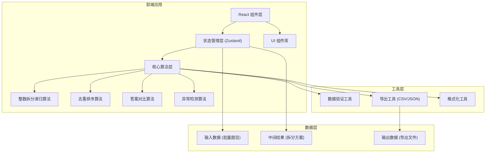

## 1. 架构设计



## 2. 技术选型说明

- **前端框架**: React@18 + TypeScript - 确保类型安全，便于复杂算法的实现和维护
- **构建工具**: Vite@5 - 快速开发体验，热更新支持
- **样式方案**: TailwindCSS@3 - 快速构建响应式界面，自定义主题配置
- **状态管理**: Zustand - 轻量级状态管理，适合单页应用的复杂状态
- **图标库**: Lucide React - 清晰的线性图标，配合数学符号装饰
- **动画库**: Framer Motion - 实现流畅的交互动画和过渡效果

## 3. 目录结构

```
src/
├── components/
│   ├── layout/
│   │   ├── Header.tsx          # 顶部标题区
│   │   └── MainLayout.tsx      # 主布局容器
│   ├── input/
│   │   ├── BatchInput.tsx      # 批量录入区
│   │   ├── ConditionPanel.tsx  # 限制条件设置
│   │   └── GenerateButton.tsx  # 生成控制按钮
│   ├── result/
│   │   ├── ResultCard.tsx      # 结果卡片
│   │   ├── RecursionTree.tsx   # 递归树展示
│   │   ├── DedupSteps.tsx      # 去重步骤时间线
│   │   └── AnswerCompare.tsx   # 学生答案对比
│   ├── warning/
│   │   ├── PendingArea.tsx     # 待确认区
│   │   └── WarningItem.tsx     # 预警项组件
│   ├── error/
│   │   ├── ErrorArea.tsx       # 错误输入区
│   │   └── ErrorItem.tsx       # 错误项组件
│   └── export/
│       └── ExportPanel.tsx     # 导出面板
├── store/
│   └── usePartitionStore.ts    # 全局状态管理
├── algorithms/
│   ├── partition.ts            # 整数拆分递归算法
│   ├── deduplication.ts        # 去重排序算法
│   ├── compare.ts              # 答案对比算法
│   └── detection.ts            # 异常检测算法
├── utils/
│   ├── validator.ts            # 数据验证工具
│   ├── exporter.ts             # 文件导出工具
│   └── formatter.ts            # 格式化工具
├── types/
│   └── index.ts                # TypeScript 类型定义
├── App.tsx                     # 主应用组件
├── main.tsx                    # 入口文件
└── index.css                   # 全局样式与主题
```

## 4. 核心数据模型

### 4.1 类型定义

```typescript
// 单道题目的输入数据
interface ProblemInput {
  id: string;
  lineNumber: number;
  targetNumber: number;
  conditions: PartitionConditions;
  studentAnswer: string[];
  rawInput: string;
}

// 拆分限制条件
interface PartitionConditions {
  maxParts?: number;        // 最大拆分数
  minParts?: number;        // 最小拆分数
  allowDuplicate: boolean;  // 是否允许重复数字
  maxValue?: number;        // 拆分数字最大值
  minValue?: number;        // 拆分数字最小值
  includeNumbers?: number[]; // 必须包含的数字
  excludeNumbers?: number[]; // 必须排除的数字
}

// 拆分方案
interface Partition {
  id: string;
  numbers: number[];
  sum: number;
  isDuplicate: boolean;
  duplicateOf?: string;     // 重复来源ID
  orderIndex: number;       // 排序索引
}

// 递归生成步骤
interface RecursionStep {
  depth: number;
  currentSum: number;
  currentNumbers: number[];
  remaining: number;
  action: 'add' | 'backtrack' | 'complete';
}

// 去重步骤
interface DedupStep {
  stepIndex: number;
  description: string;
  before: number[];
  after: number[];
  removedPartitions: string[];
}

// 异常预警
interface WarningItem {
  id: string;
  type: 'duplicate_miss' | 'condition_unused' | 'explosion';
  problemId: string;
  message: string;
  details: any;
  confirmed: boolean;
}

// 输入错误
interface InputError {
  id: string;
  lineNumber: number;
  rawInput: string;
  errorType: 'format' | 'invalid_number' | 'condition_conflict';
  message: string;
  suggestion?: string;
}

// 单道题目的完整结果
interface ProblemResult {
  problemId: string;
  input: ProblemInput;
  partitions: Partition[];
  rawPartitions: Partition[];  // 去重前的原始结果
  recursionSteps: RecursionStep[];
  dedupSteps: DedupStep[];
  answerComparison: AnswerComparison;
  warnings: WarningItem[];
}

// 答案对比结果
interface AnswerComparison {
  correctAnswers: string[];
  wrongAnswers: string[];
  missedAnswers: string[];
  duplicateAnswers: string[];
}
```

## 5. 核心算法设计

### 5.1 整数拆分递归算法

```typescript
function generatePartitions(
  n: number,
  conditions: PartitionConditions,
  onStep?: (step: RecursionStep) => void
): Partition[] {
  const result: Partition[] = [];
  
  function backtrack(
    remaining: number,
    current: number[],
    start: number,
    depth: number
  ) {
    if (remaining === 0) {
      // 检查是否满足拆分数量限制
      if (conditions.minParts && current.length < conditions.minParts) return;
      if (conditions.maxParts && current.length > conditions.maxParts) return;
      
      result.push({
        id: generateId(),
        numbers: [...current],
        sum: n,
        isDuplicate: false,
        orderIndex: result.length
      });
      
      onStep?.({
        depth,
        currentSum: current.reduce((a, b) => a + b, 0),
        currentNumbers: [...current],
        remaining: 0,
        action: 'complete'
      });
      return;
    }
    
    for (let i = start; i <= remaining; i++) {
      // 应用限制条件
      if (conditions.minValue && i < conditions.minValue) continue;
      if (conditions.maxValue && i > conditions.maxValue) continue;
      if (conditions.excludeNumbers?.includes(i)) continue;
      if (!conditions.allowDuplicate && current.includes(i)) continue;
      
      current.push(i);
      
      onStep?.({
        depth,
        currentSum: current.reduce((a, b) => a + b, 0),
        currentNumbers: [...current],
        remaining: remaining - i,
        action: 'add'
      });
      
      // 不允许重复时，下一个数字从 i+1 开始
      const nextStart = conditions.allowDuplicate ? i : i + 1;
      backtrack(remaining - i, current, nextStart, depth + 1);
      
      current.pop();
      
      onStep?.({
        depth,
        currentSum: current.reduce((a, b) => a + b, 0),
        currentNumbers: [...current],
        remaining: remaining,
        action: 'backtrack'
      });
    }
  }
  
  const start = conditions.minValue || 1;
  backtrack(n, [], start, 0);
  
  return result;
}
```

### 5.2 去重排序算法

```typescript
function deduplicateAndSort(
  partitions: Partition[],
  onStep?: (step: DedupStep) => void
): { partitions: Partition[]; steps: DedupStep[] } {
  const steps: DedupStep[] = [];
  let current = [...partitions];
  
  // 步骤1: 对每个拆分内部进行排序（非降序）
  const sortedPartitions = current.map(p => ({
    ...p,
    numbers: [...p.numbers].sort((a, b) => a - b)
  }));
  steps.push({
    stepIndex: 1,
    description: '对每个拆分内部进行非降序排序，消除顺序差异',
    before: current.map(p => [...p.numbers]),
    after: sortedPartitions.map(p => [...p.numbers]),
    removedPartitions: []
  });
  current = sortedPartitions;
  
  // 步骤2: 标记重复项
  const seen = new Map<string, string>();
  const deduplicated: Partition[] = [];
  const removedIds: string[] = [];
  
  for (const p of current) {
    const key = p.numbers.join(',');
    if (seen.has(key)) {
      p.isDuplicate = true;
      p.duplicateOf = seen.get(key);
      removedIds.push(p.id);
    } else {
      seen.set(key, p.id);
      deduplicated.push(p);
    }
  }
  steps.push({
    stepIndex: 2,
    description: '去除重复的拆分（数字完全相同的视为同一种拆分）',
    before: current.map(p => [...p.numbers]),
    after: deduplicated.map(p => [...p.numbers]),
    removedPartitions: removedIds
  });
  current = deduplicated;
  
  // 步骤3: 按拆分数量排序，数量相同则按字典序
  current.sort((a, b) => {
    if (a.numbers.length !== b.numbers.length) {
      return a.numbers.length - b.numbers.length;
    }
    for (let i = 0; i < a.numbers.length; i++) {
      if (a.numbers[i] !== b.numbers[i]) {
        return a.numbers[i] - b.numbers[i];
      }
    }
    return 0;
  });
  steps.push({
    stepIndex: 3,
    description: '按拆分数量升序排列，数量相同则按字典序排列',
    before: steps[1].after,
    after: current.map(p => [...p.numbers]),
    removedPartitions: []
  });
  
  // 更新排序索引
  current.forEach((p, i) => {
    p.orderIndex = i;
  });
  
  return { partitions: current, steps };
}
```

### 5.3 异常检测算法

```typescript
function detectAnomalies(
  result: ProblemResult
): WarningItem[] {
  const warnings: WarningItem[] = [];
  const { input, rawPartitions, partitions } = result;
  
  // 检测1: 可能的重复排列遗漏
  if (!input.conditions.allowDuplicate && rawPartitions.length > partitions.length * 2) {
    const ratio = rawPartitions.length / partitions.length;
    warnings.push({
      id: generateId(),
      type: 'duplicate_miss',
      problemId: input.id,
      message: `去重比例较高 (${ratio.toFixed(1)}:1)，请确认学生是否遗漏了重复排列`,
      details: {
        rawCount: rawPartitions.length,
        finalCount: partitions.length,
        ratio
      },
      confirmed: false
    });
  }
  
  // 检测2: 限制条件是否生效
  const hasConditions = 
    input.conditions.maxParts || 
    input.conditions.minParts || 
    input.conditions.maxValue || 
    input.conditions.minValue ||
    (input.conditions.includeNumbers && input.conditions.includeNumbers.length > 0) ||
    (input.conditions.excludeNumbers && input.conditions.excludeNumbers.length > 0);
  
  if (hasConditions) {
    // 生成无限制条件的拆分数量进行对比
    const unrestricted = generateUnrestrictedCount(input.targetNumber);
    const restricted = partitions.length;
    if (unrestricted === restricted) {
      warnings.push({
        id: generateId(),
        type: 'condition_unused',
        problemId: input.id,
        message: '限制条件似乎未生效，拆分数量与无限制时相同',
        details: { unrestricted, restricted },
        confirmed: false
      });
    }
  }
  
  // 检测3: 方案爆炸预警
  if (partitions.length > 50) {
    warnings.push({
      id: generateId(),
      type: 'explosion',
      problemId: input.id,
      message: `拆分方案较多 (${partitions.length} 种)，建议增加限制条件`,
      details: { count: partitions.length },
      confirmed: false
    });
  }
  
  return warnings;
}
```

## 6. 导出数据格式

### 6.1 CSV 格式

```csv
题目序号,目标整数,限制条件,学生答案是否正确,正确拆分数,学生对的数量,学生错的数量,学生漏的数量,重复排列数量
1,5,"最小1个,最大5个,不允许重复数字",部分正确,7,5,2,0,3
2,6,"拆成3个数",正确,3,3,0,0,0
```

### 6.2 JSON 格式

```json
{
  "exportTime": "2024-01-15T10:30:00Z",
  "summary": {
    "totalProblems": 10,
    "validProblems": 8,
    "invalidProblems": 2,
    "totalWarnings": 5,
    "averagePartitionsPerProblem": 12.5
  },
  "problems": [
    {
      "id": "1",
      "targetNumber": 5,
      "conditions": {
        "allowDuplicate": false,
        "minParts": 1,
        "maxParts": 5
      },
      "conditionsDescription": "不允许重复数字，拆成1-5个数",
      "partitions": [
        [1, 4],
        [2, 3],
        [5]
      ],
      "partitionCount": 3,
      "studentAnswer": {
        "raw": ["1+4", "2+3", "5", "1+2+2"],
        "correct": ["1+4", "2+3", "5"],
        "wrong": ["1+2+2"],
        "missed": [],
        "duplicate": []
      },
      "warnings": [
        {
          "type": "duplicate_miss",
          "message": "去重比例较高 (2.3:1)，请确认学生是否遗漏了重复排列"
        }
      ]
    }
  ],
  "errors": [
    {
      "lineNumber": 5,
      "rawInput": "abc,不允许重复",
      "errorType": "invalid_number",
      "message": "目标整数格式错误"
    }
  ]
}
```

## 7. 批量输入格式规范

每行一道题目，支持以下格式：

**基础格式:**
```
目标数字 [, 限制条件] [, 学生答案用分号分隔]
```

**示例:**
```
5, 不允许重复, 1+4;2+3;5
6, 拆成3个数;不允许重复, 1+2+3
7, 最小2个数;最大4个数, 1+6;2+5;3+4;1+2+4
8, 包含数字2, 2+6;1+2+5;2+3+3
10, 排除数字1, 2+8;3+7;4+6;5+5
```

**条件语法:**
- `不允许重复` / `允许重复` - 控制是否允许重复数字
- `拆成N个数` / `最少N个数` / `最多N个数` - 控制拆分数量
- `包含数字x,y,z` - 必须包含指定数字
- `排除数字x,y,z` - 必须排除指定数字
- `最大数字x` / `最小数字x` - 控制拆分数字的范围
