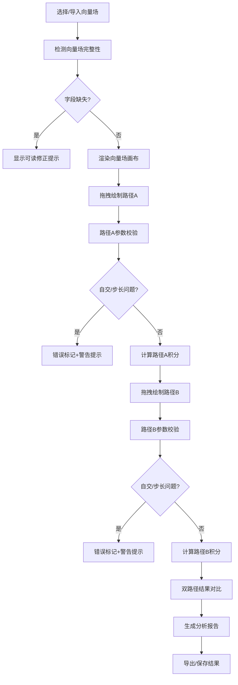

## 1. 产品概述
曲线积分路径比较器是面向高等数学教学的交互式可视化工具，帮助学生直观理解向量场路径积分的方向敏感性、路径依赖性等核心概念。通过拖拽绘制路径、实时计算积分结果、对比不同路径的数值差异，解决学生在学习过程中"方向模糊""路径混淆"的常见痛点。

- 目标用户：大学数学助教、理工科学生、高等数学自学者
- 核心价值：将抽象的曲线积分概念具象化，通过交互式操作强化理解

## 2. 核心特性

### 2.1 用户角色
| 角色 | 登录方式 | 核心权限 |
|------|----------|----------|
| 教师/助教 | 无需登录 | 配置向量场、创建样例、导出教学报告 |
| 学生 | 无需登录 | 绘制路径、对比结果、查看公式解释 |

### 2.2 功能模块
1. **主工作区**：向量场可视化画布、双路径绘制与对比
2. **控制面板**：向量场选择/自定义、积分参数配置、步长调节
3. **计算引擎**：数值积分计算、误差分析、边界值检测
4. **结果展示**：双路径积分结果对比、公式推导、误差提示
5. **报告系统**：计算历史记录、导出PDF/JSON、修正建议

### 2.3 页面详情
| 页面名称 | 模块名称 | 功能描述 |
|----------|----------|----------|
| 主应用页 | 向量场画布 | Canvas渲染向量场箭头，支持鼠标拖拽绘制两条独立路径 |
| 主应用页 | 路径编辑面板 | 显示路径节点坐标、采样点数、方向指示；支持节点增删改 |
| 主应用页 | 积分计算器 | 实时显示两条路径的积分值、方向因子、收敛检测 |
| 主应用页 | 对比分析区 | 数值差异百分比、方向判定、步长敏感性分析图表 |
| 主应用页 | 公式解释区 | 展示曲线积分数学公式、算法原理、计算过程分步展示 |
| 主应用页 | 错误提示区 | 边界越界警告、路径自交检测、步长过大预警、方向反转提示 |

## 3. 核心流程

## 4. 界面设计

### 4.1 设计风格
- **主色调**：科技蓝 (#165DFF) + 数学紫 (#7B61FF)，体现学术严谨性
- **辅助色**：成功绿 (#00B42A)、警告橙 (#FF7D00)、错误红 (#F53F3F)
- **按钮风格**：圆角矩形，轻微阴影，hover时有微妙缩放动画
- **字体**：标题使用 Playfair Display（学术感），正文使用 JetBrains Mono（代码/公式可读性）
- **布局风格**：三栏布局 - 左侧控制面板、中间画布区、右侧结果分析
- **图标风格**：线性简约图标，配合数学符号（∮、∫、∇、→）

### 4.2 页面设计概览
| 页面名称 | 模块名称 | UI元素 |
|----------|----------|--------|
| 主应用页 | 顶部导航 | Logo、项目名称、样例下拉菜单、导出按钮、主题切换 |
| 主应用页 | 左侧控制 | 向量场预设列表、自定义输入框、步长滑块、方向切换开关 |
| 主应用页 | 中央画布 | 网格背景、向量箭头、两条路径（不同颜色）、节点控制点 |
| 主应用页 | 右侧结果 | 积分数值卡片、公式展示区、误差条形图、警告消息列表 |
| 主应用页 | 底部状态栏 | 当前采样点数、计算耗时、最后更新时间 |

### 4.3 响应式设计
- 桌面端：三栏完整布局，画布占60%宽度
- 平板端：左右面板可折叠，画布自适应
- 移动端：单栏垂直布局，优先保证画布可操作

### 4.4 交互动效
- 路径绘制时：节点跟随鼠标有弹性缓动效果
- 积分计算时：数字滚动动画，从0渐变到结果值
- 错误出现时：警告框滑入并轻微震动
- 悬停向量箭头：放大并显示坐标和向量分量
- 页面加载：元素按顺序淡入，画布网格线渐显

## 5. 边界情况处理

### 5.1 数据校验
- 向量场缺失字段：提供友好的字段补全提示，标注必填项
- 路径节点过少：自动插值补充，提示最少节点数
- 步长过大：显示收敛警告，建议步长范围
- 方向反转：高亮方向箭头，提供一键反转功能

### 5.2 数值稳定性
- 路径自交检测：计算交点并标记，提示积分不连续
- 边界越界：限制绘制范围，显示警告标识
- 数值溢出：使用科学计数法显示，附加精度说明
- 除零保护：捕获奇点位置，显示数学解释
