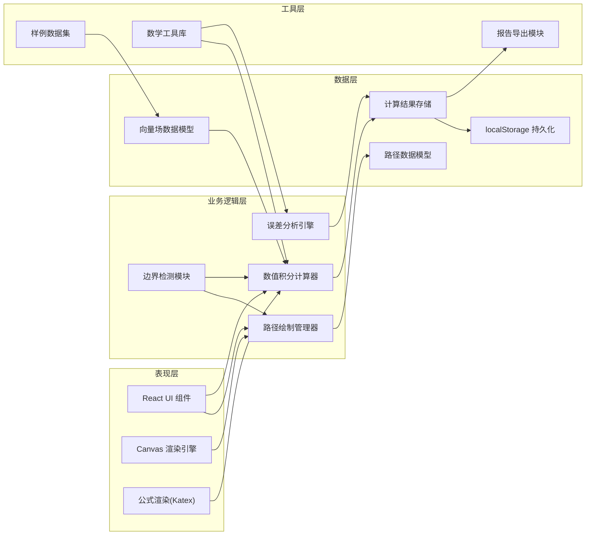

## 1. 架构设计



## 2. 技术栈说明

- **前端框架**: React@18 + TypeScript
- **构建工具**: Vite@5
- **样式方案**: TailwindCSS@3
- **图表绘制**: Canvas API (原生) + Chart.js
- **数学渲染**: KaTeX
- **状态管理**: React Context + useReducer
- **数据持久化**: localStorage
- **导出功能**: jsPDF (PDF导出) + FileSaver (JSON导出)
- **代码规范**: ESLint + Prettier

## 3. 路由定义

| 路由 | 页面用途 |
|------|----------|
| / | 主应用页面 - 完整的曲线积分比较器工作区 |

## 4. 核心数据模型

### 4.1 向量场数据模型

```typescript
interface Vector2D {
  x: number;
  y: number;
}

interface VectorFieldPoint {
  position: Vector2D;
  vector: Vector2D;
}

interface VectorField {
  id: string;
  name: string;
  description: string;
  formula: string;
  bounds: { minX: number; maxX: number; minY: number; maxY: number };
  gridStep: number;
  computeVector: (x: number, y: number) => Vector2D;
  samplePoints?: VectorFieldPoint[];
  hasSelfIntersection?: boolean;
  requiredFields: string[];
  validationErrors?: string[];
}
```

### 4.2 路径数据模型

```typescript
interface PathNode {
  id: string;
  position: Vector2D;
  isControlPoint?: boolean;
}

interface Path {
  id: string;
  name: string;
  color: string;
  nodes: PathNode[];
  isClosed: boolean;
  direction: 1 | -1;
  sampleStep: number;
  createdAt: number;
  updatedAt: number;
}

interface PathValidation {
  isValid: boolean;
  nodeCount: number;
  hasSelfIntersection: boolean;
  intersectionPoints?: Vector2D[];
  isOutOfBounds: boolean;
  outOfBoundsPoints?: Vector2D[];
  stepSizeWarning: boolean;
  recommendedStep: number;
  directionWarnings?: string[];
}
```

### 4.3 积分结果模型

```typescript
interface IntegrationResult {
  pathId: string;
  vectorFieldId: string;
  value: number;
  numericalError: number;
  convergenceRate: number;
  sampleCount: number;
  computationTime: number;
  stepSize: number;
  directionFactor: number;
  breakdown: {
    position: Vector2D;
    vector: Vector2D;
    tangent: Vector2D;
    dotProduct: number;
    contribution: number;
  }[];
  timestamp: number;
}

interface ComparisonReport {
  id: string;
  fieldId: string;
  pathAResult: IntegrationResult;
  pathBResult: IntegrationResult;
  difference: number;
  percentageDiff: number;
  analysisNotes: string[];
  warnings: string[];
  exportedAt?: number;
}
```

## 5. 核心算法

### 5.1 数值积分算法
```typescript
// 梯形法 +  Simpson 复合积分
function computeLineIntegral(
  path: Path,
  field: VectorField,
  method: 'trapezoidal' | 'simpson'
): IntegrationResult;

// 自适应步长控制
function adaptiveIntegration(
  path: Path,
  field: VectorField,
  tolerance: number
): IntegrationResult;
```

### 5.2 路径几何检测
```typescript
// 路径自交检测
function detectSelfIntersection(nodes: PathNode[]): Vector2D[];

// 边界越界检测
function checkBounds(nodes: PathNode[], bounds: Bounds): Vector2D[];

// 方向判定
function computePathDirection(nodes: PathNode[]): 1 | -1;
```

### 5.3 误差分析
```typescript
// 收敛性分析
function convergenceAnalysis(
  path: Path,
  field: VectorField,
  steps: number[]
): { step: number; error: number }[];

// 方向敏感性
function directionSensitivity(
  path: Path,
  field: VectorField
): { forward: number; backward: number };
```

## 6. 组件结构

```
src/
├── components/
│   ├── Layout/
│   │   ├── Header.tsx
│   │   ├── Sidebar.tsx
│   │   └── StatusBar.tsx
│   ├── Canvas/
│   │   ├── VectorFieldCanvas.tsx
│   │   ├── PathRenderer.tsx
│   │   └── VectorArrow.tsx
│   ├── ControlPanel/
│   │   ├── VectorFieldSelector.tsx
│   │   ├── PathEditor.tsx
│   │   └── IntegrationSettings.tsx
│   ├── Results/
│   │   ├── ResultCard.tsx
│   │   ├── ComparisonChart.tsx
│   │   └── FormulaDisplay.tsx
│   └── Common/
│       ├── WarningAlert.tsx
│       └── ExportButton.tsx
├── hooks/
│   ├── useVectorField.ts
│   ├── usePathDrawing.ts
│   ├── useIntegration.ts
│   └── useLocalStorage.ts
├── utils/
│   ├── math/
│   │   ├── integration.ts
│   │   ├── geometry.ts
│   │   └── validation.ts
│   ├── export/
│   │   ├── pdf.ts
│   │   └── json.ts
│   └── constants.ts
├── data/
│   ├── vectorFields.ts
│   └── samplePaths.ts
├── types/
│   └── index.ts
├── App.tsx
└── main.tsx
```

## 7. 状态管理

```typescript
interface AppState {
  vectorFields: VectorField[];
  activeFieldId: string | null;
  paths: Path[];
  activePathId: string | null;
  results: IntegrationResult[];
  reports: ComparisonReport[];
  warnings: Warning[];
  settings: {
    stepSize: number;
    integrationMethod: 'trapezoidal' | 'simpson';
    showVectors: boolean;
    theme: 'light' | 'dark';
  };
}
```

## 8. 样例数据集

### 预设向量场
1. **保守场示例**: F = (x, y) - 路径无关性演示
2. **非保守场**: F = (-y, x) - 方向敏感性演示
3. **有旋场**: F = (-y/(x²+y²), x/(x²+y²)) - 奇点演示
4. **自交场**: 复杂向量场 - 自交路径检测

### 预设路径对
1. **直线 vs 曲线**: 相同起终点不同路径
2. **顺时针 vs 逆时针**: 方向对比
3. **粗略采样 vs 精细采样**: 步长影响演示
4. **自交路径**: 边界情况测试
