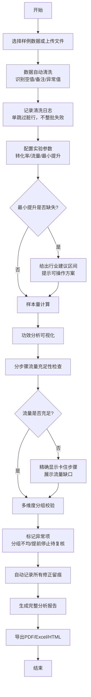

## 1. 产品概述

A/B实验样本量试算工具，专为增长分析师设计，解决实验上线前样本量评估的痛点。支持从样例数据导入、脏数据自动清洗、样本量计算与功效分析、分组校验到报告导出的完整工作流，所有数据修正全程留痕可追溯。

- **核心问题**：历史数据含空值/备注易导致整批失败；流量不足难以定位问题；分组校验仅靠单一提示；最小提升缺失时无操作指引
- **目标用户**：增长分析师、产品运营、数据分析师
- **产品价值**：降低实验设计门槛，减少上线后因样本量不足导致的实验失效，提升实验决策效率

## 2. 核心功能

### 2.1 用户角色

| 角色 | 注册方式 | 核心权限 |
|------|----------|----------|
| 增长分析师 | 无需注册，本地工具 | 完整使用所有功能，数据导入/计算/导出 |

### 2.2 功能模块

1. **数据导入页**：样例数据展示、Excel/CSV导入、数据预览与清洗
2. **计算配置页**：实验参数设置、样本量计算、功效分析可视化
3. **校验分析页**：流量充足性检查、分组校验、问题定位与建议
4. **报告导出页**：修正历史查看、完整报告生成、多格式导出

### 2.3 页面详情

| 页面名称 | 模块名称 | 功能描述 |
|---------|---------|----------|
| 数据导入页 | 样例数据模块 | 内置标准样例数据，支持一键加载，含典型脏数据场景 |
| 数据导入页 | 文件导入模块 | 支持Excel(.xlsx)和CSV格式，拖拽上传，实时解析进度 |
| 数据导入页 | 数据清洗模块 | 自动识别空值、备注行、异常值，单跳过脏行而非整批失败，清洗日志实时展示 |
| 计算配置页 | 参数设置模块 | 历史转化率、日流量、最小提升、显著性水平、检验功效等参数配置 |
| 计算配置页 | 样本量计算模块 | 基于统计功效分析计算所需最小样本量、实验天数、置信区间 |
| 计算配置页 | 功效分析模块 | 功效曲线可视化，不同提升量下的样本量需求对比 |
| 校验分析页 | 流量检查模块 | 分步骤流量校验，精确显示流量不足卡在哪个环节，给出流量缺口 |
| 校验分析页 | 分组校验模块 | 多维度分组均匀性检验（样本量、用户属性、历史行为），每项校验独立展示结果 |
| 校验分析页 | 异常复核模块 | 分组不均、提前停止风险标记为"待分析师复核"状态，不阻断流程 |
| 校验分析页 | 智能提示模块 | 最小提升缺失时，基于行业基准和历史数据给出可操作的建议区间 |
| 报告导出页 | 修正留痕模块 | 完整审计日志：数据修改记录、参数调整历史、计算版本对比 |
| 报告导出页 | 报告生成模块 | 自动生成完整分析报告，含计算过程、校验结果、风险提示 |
| 报告导出页 | 多格式导出 | 支持PDF、Excel、HTML三种格式导出，满足不同汇报场景 |

## 3. 核心流程

用户导入实验历史数据，系统自动清洗并记录异常；配置实验参数后进行样本量计算和功效分析；系统对流量充足性和分组均匀性进行多维度校验，明确标记问题环节；所有操作和修正全程留痕；最终生成可导出的完整分析报告。

## 4. 用户界面设计

### 4.1 设计风格

**设计方向**：精密数据工具风格（Precision Data Tool）—— 专业、严谨、高信息密度但层次分明

- **主色调**：深空蓝 #1e3a5f（专业可靠），搭配科技青 #00d4aa（数据高亮）
- **辅助色**：警示橙 #ff9500（待复核），错误红 #ff3b30（不通过），成功绿 #34c759（通过）
- **按钮风格**：直角微圆角（2px），扁平化设计，边框清晰，hover时有细微阴影
- **字体**：标题使用 JetBrains Mono（等宽字体，强调数据感），正文使用 Inter
- **布局风格**：三栏式工作区（左侧导航+中间主内容+右侧详情面板），卡片式模块分区
- **图标风格**：线性细描边图标（2px），保持技术工具的精密感

### 4.2 页面设计概述

| 页面名称 | 模块名称 | UI元素 |
|---------|---------|--------|
| 数据导入页 | 样例数据模块 | 表格展示样例数据，含脏数据行高亮，一键加载按钮 |
| 数据导入页 | 文件导入模块 | 拖拽上传区域，解析进度条，文件格式说明 |
| 数据导入页 | 数据清洗模块 | 清洗日志时间轴，脏行行号标记，跳过/保留操作按钮 |
| 计算配置页 | 参数设置模块 | 数值输入框带单位，滑杆微调，实时校验提示 |
| 计算配置页 | 样本量计算模块 | 大数字展示卡片，计算公式折叠面板，关键指标高亮 |
| 计算配置页 | 功效分析模块 | 交互式折线图，可悬停查看具体数值，多曲线对比 |
| 校验分析页 | 流量检查模块 | 步骤条式进度展示，每步独立状态灯，失败时展开详情 |
| 校验分析页 | 分组校验模块 | 校验项列表，每项含通过/待复核/失败状态，展开查看检验统计量 |
| 校验分析页 | 智能提示模块 | 信息卡样式，带建议区间和参考依据，可一键采纳 |
| 报告导出页 | 修正留痕模块 | 时间线式日志列表，每项含操作人/时间/修改前后对比 |
| 报告导出页 | 报告生成模块 | 报告预览区，章节导航，可编辑备注区域 |
| 报告导出页 | 多格式导出 | 格式选择按钮组，导出进度，下载历史 |

### 4.3 响应式

- **Desktop-first**：以桌面端体验为核心，支持1280px及以上分辨率
- **平板适配**：左右栏可折叠，中间内容区自适应
- **移动优先提示**：核心计算功能支持移动端，但复杂表格操作建议使用桌面端
- **触控优化**：按钮最小高度44px，支持双指缩放图表

### 4.4 视觉细节

- **背景**：深空灰渐变（#f8f9fa → #e9ecef），配合细微网格纹理增强数据感
- **卡片**：白色背景，1px 浅灰边框，hover时边框变为科技青
- **数据高亮**：关键数值使用等宽字体，科技青色，字号比正文大2号
- **动画**：数据加载时的骨架屏动效，校验结果的渐入动画，步骤切换的滑动过渡
