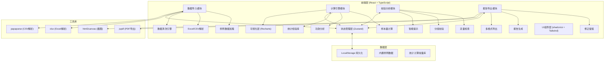
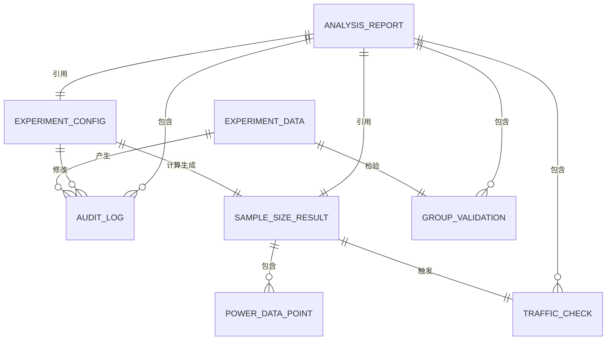

## 1. 架构设计



## 2. 技术描述

- **前端框架**：React@18 + TypeScript@5 + Vite@5
- **样式方案**：TailwindCSS@3 + shadcn/ui 组件库
- **状态管理**：Zustand（轻量级，支持中间件和持久化）
- **可视化**：Recharts（React图表库，轻量且交互友好）
- **数据解析**：xlsx（Excel解析）、papaparse（CSV解析）
- **PDF导出**：jspdf + html2canvas
- **Excel导出**：xlsx（同时用于解析和导出）
- **统计计算**：自定义统计函数库（基于z检验、t检验、卡方检验）
- **初始化工具**：vite-init 创建 React + TypeScript 项目

## 3. 路由定义

| 路由 | 页面名称 | 用途 |
|------|---------|------|
| / | 数据导入页 | 样例数据展示、文件上传、数据清洗预览 |
| /calculate | 计算配置页 | 参数配置、样本量计算、功效分析可视化 |
| /validate | 校验分析页 | 流量检查、分组校验、问题定位、智能提示 |
| /report | 报告导出页 | 修正留痕查看、报告生成、多格式导出 |

## 4. 核心数据结构与类型定义

```typescript
// 实验数据行
interface ExperimentDataRow {
  id: string;
  date: string;
  historicalConversion: number | null;
  dailyTraffic: number | null;
  minimumLift: number | null;
  remarks: string;
  isDirty: boolean;
  dirtyReason: string;
}

// 实验参数配置
interface ExperimentConfig {
  controlConversion: number;           // 对照组转化率
  minimumLift: number;                 // 最小可检测提升
  significanceLevel: number;           // 显著性水平 α (默认0.05)
  power: number;                       // 检验功效 1-β (默认0.8)
  trafficRatio: number;                // 对照组/实验组流量比例 (默认1)
  dailyTraffic: number;                // 预估日均流量
  trafficAllocation: number;           // 实验分配流量比例 (默认0.5)
}

// 样本量计算结果
interface SampleSizeResult {
  requiredSampleSize: number;          // 每组所需样本量
  totalSampleSize: number;             // 总样本量
  estimatedDays: number;               // 预估实验天数
  confidenceInterval: [number, number];// 置信区间
  zScore: number;                      // Z统计量
  standardError: number;               // 标准误
  detectableEffect: number;            // 可检测效应量
}

// 功效分析数据点
interface PowerDataPoint {
  lift: number;                        // 提升量
  requiredSampleSize: number;          // 所需样本量
  power: number;                       // 功效
}

// 流量检查步骤
interface TrafficCheckStep {
  id: string;
  name: string;
  description: string;
  status: 'pass' | 'fail' | 'pending' | 'review';
  required: number;
  available: number;
  gap: number;
  details: string;
}

// 分组校验项
interface GroupValidationItem {
  id: string;
  name: string;
  description: string;
  method: string;                      // 检验方法
  statistic: number;                   // 统计量
  pValue: number;                      // P值
  threshold: number;                   // 阈值
  status: 'pass' | 'fail' | 'review';
  recommendation: string;
}

// 修正留痕记录
interface AuditLogEntry {
  id: string;
  timestamp: number;
  action: 'data_import' | 'data_clean' | 'param_change' | 'calculation' | 'validation' | 'export';
  description: string;
  before: any;
  after: any;
  userNote: string;
}

// 分析报告
interface AnalysisReport {
  id: string;
  generatedAt: number;
  config: ExperimentConfig;
  sampleSizeResult: SampleSizeResult;
  trafficChecks: TrafficCheckStep[];
  groupValidations: GroupValidationItem[];
  auditLogs: AuditLogEntry[];
  summary: string;
  risks: string[];
  recommendations: string[];
}

// 应用全局状态
interface AppState {
  rawData: ExperimentDataRow[];
  cleanedData: ExperimentDataRow[];
  config: ExperimentConfig;
  sampleSizeResult: SampleSizeResult | null;
  powerCurveData: PowerDataPoint[];
  trafficChecks: TrafficCheckStep[];
  groupValidations: GroupValidationItem[];
  auditLogs: AuditLogEntry[];
  currentReport: AnalysisReport | null;
  currentStep: number;
}
```

## 5. 核心算法与统计方法

### 5.1 样本量计算公式

基于双比例Z检验的样本量计算公式：

```
n = (Z_(α/2) * √(2 * p̄ * (1 - p̄)) + Z_β * √(p1*(1-p1) + p2*(1-p2)))² / Δ²

其中：
- p̄ = (p1 + p2) / 2 （合并转化率）
- p1 = 对照组转化率
- p2 = 实验组转化率 = p1 * (1 + lift)
- Δ = p2 - p1 （绝对提升量）
- Z_(α/2) = 显著性水平对应的Z分位数
- Z_β = 第二类错误概率对应的Z分位数
```

### 5.2 功效分析

功效 = P(拒绝H0 | H1为真) = 1 - β

通过迭代计算不同提升量下所需样本量，生成功效曲线。

### 5.3 分组均匀性检验

| 检验维度 | 检验方法 | 原假设 |
|---------|---------|--------|
| 样本量均衡 | 卡方检验 | 两组样本量无显著差异 |
| 转化率均衡 | 双比例Z检验 | 两组历史转化率无显著差异 |
| 离散度检验 | F检验 | 两组方差无显著差异 |

## 6. 数据模型

### 6.1 实体关系图



### 6.2 LocalStorage 持久化键

| 键名 | 数据类型 | 说明 |
|------|---------|------|
| abtest:rawData | ExperimentDataRow[] | 原始导入数据 |
| abtest:cleanedData | ExperimentDataRow[] | 清洗后数据 |
| abtest:config | ExperimentConfig | 实验参数配置 |
| abtest:auditLogs | AuditLogEntry[] | 审计日志 |
| abtest:reports | AnalysisReport[] | 历史报告列表 |
