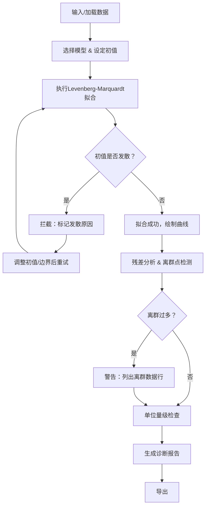

## 1. 产品概述

曲线拟合异常诊断工具——面向实验室研究生的交互式诊断平台，核心目标是让非线性曲线拟合过程中的异常（初值发散、离群点、单位错误）不再隐藏在聊天记录或手动计算中，而是被自动检测、标记、生成可转述的诊断报告。

- 解决问题：实验曲线拟合参数好看但离群点带偏结论、初值发散无解释、异常判断散落在个人经验中
- 目标用户：实验室研究生，需要批量处理实验或题目数据并快速获得诊断结论

## 2. 核心功能

### 2.1 用户角色

| 角色 | 核心权限 |
|------|----------|
| 实验室研究生 | 输入数据、选择模型、查看诊断报告、导出结果 |

### 2.2 功能模块

1. **拟合工作台**：数据输入、模型选择与公式展示、非线性拟合执行、拟合曲线与数据点可视化
2. **异常诊断面板**：初值发散拦截、离群点标记与列表、单位错误检测、诊断摘要
3. **辅助解释区**：残差分析图、参数边界与置信区间

### 2.3 页面详情

| 页面名称 | 模块名称 | 功能描述 |
|----------|----------|----------|
| 拟合工作台 | 数据输入区 | 支持粘贴/手动输入XY数据，自动检测列数与单位；预设样例数据一键加载 |
| 拟合工作台 | 模型选择区 | 预置指数衰减、多项式、高斯、Logistic等非线性模型，展示公式，支持参数初值设定与边界约束 |
| 拟合工作台 | 拟合执行与可视化 | 执行Levenberg-Marquardt拟合，绘制拟合曲线+数据点散点图，离群点用醒目颜色标记 |
| 异常诊断面板 | 初值发散检测 | 检测迭代过程是否发散，发散时拦截并给出原因解释（初值过远/梯度消失/参数无约束） |
| 异常诊断面板 | 离群点标记 | 基于残差阈值自动标记离群点，列出到具体数据行号和残差值；离群过多时弹出警告 |
| 异常诊断面板 | 单位错误检测 | 检测数据数量级异常（如Y值跨多个数量级），提示可能的单位换算错误 |
| 异常诊断面板 | 诊断摘要 | 一句话回答核心问题："初值发散有没有被拦住？" + 红绿灯状态指示 |
| 辅助解释区 | 残差分析图 | 残差vs拟合值散点图，标注残差分布趋势，辅助判断模型适用性 |
| 辅助解释区 | 参数边界表 | 各参数估计值、标准误、95%置信区间、是否触及边界 |

## 3. 核心流程

用户输入或加载实验数据 → 选择拟合模型并设定初值/边界 → 系统执行非线性拟合并实时监控迭代 → 自动检测初值发散、离群点、单位异常 → 生成诊断报告（含模型公式、离群标记、诊断结论）→ 用户可导出诊断报告

## 4. 用户界面设计

### 4.1 设计风格

- 主色调：深靛蓝（#1a1f36）背景 + 琥珀黄（#f59e0b）强调色 + 翠绿（#10b981）成功/安全指示
- 按钮：圆角微凸（rounded-lg），强调按钮用琥珀黄填充，次要按钮用描边
- 字体：数据展示用 JetBrains Mono 等宽字体，正文用 Noto Sans SC
- 布局：左侧为主拟合区（曲线可视化+数据表），右侧为诊断面板（可折叠）
- 图标：lucide-react 图标集

### 4.2 页面设计概览

| 页面名称 | 模块名称 | UI要素 |
|----------|----------|--------|
| 拟合工作台 | 数据输入区 | 暗色文本区域，等宽字体，行号显示，粘贴后自动解析 |
| 拟合工作台 | 模型选择区 | 模型卡片（含公式渲染），初值输入框，边界滑块 |
| 拟合工作台 | 曲线可视化 | Chart.js 散点+线图，离群点用红色大圆标记，拟合线用琥珀黄 |
| 异常诊断面板 | 初值发散检测 | 红绿灯状态灯（红=发散被拦/绿=正常收敛），发散原因文字说明 |
| 异常诊断面板 | 离群点列表 | 表格：行号、X值、Y值、残差、标记状态；离群行高亮红色 |
| 异常诊断面板 | 诊断摘要 | 大号状态图标+一句话结论，可直接复制转述 |
| 辅助解释区 | 残差分析图 | Chart.js 残差散点图，±2σ参考线 |
| 辅助解释区 | 参数边界表 | 紧凑表格：参数名、估计值、标准误、95%CI、边界触达标记 |

### 4.3 响应式设计

- 桌面优先（1920×1080基准）
- 左右分栏在大屏展示，中小屏下诊断面板折叠为底部抽屉
- 曲线图和残差图在小屏下全宽展示

### 4.4 样例数据

提供3组预设样例：
1. **指数衰减**（正常收敛）：放射性衰变数据，8个点，无离群
2. **高斯拟合**（含离群点）：光谱峰数据，12个点，2个离群点
3. **Logistic增长**（初值发散）：种群增长数据，10个点，初值不当导致发散
