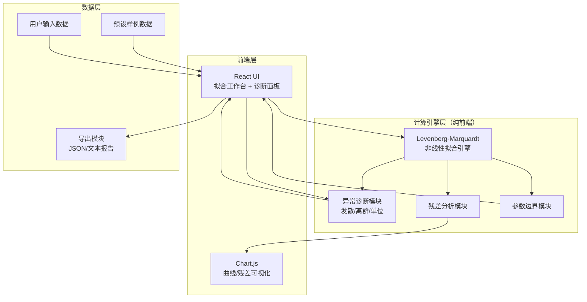

## 1. 架构设计



## 2. 技术选型

- 前端：React@18 + TypeScript + Vite + Tailwind CSS@3
- 状态管理：Zustand
- 可视化：Chart.js + react-chartjs-2
- 数学计算：自行实现 Levenberg-Marquardt 算法（避免外部依赖的版本兼容问题）
- 公式渲染：KaTeX（轻量级LaTeX渲染）
- 图标：lucide-react
- 导出：纯前端 JSON/文本生成，浏览器下载
- 无后端：所有计算在浏览器端完成

## 3. 路由定义

| 路由 | 用途 |
|------|------|
| / | 主拟合工作台（含诊断面板和辅助解释区） |

单页应用，所有功能在一个页面内通过面板折叠展开切换。

## 4. 数据模型

### 4.1 核心数据结构

```typescript
interface DataPoint {
  x: number;
  y: number;
  isOutlier: boolean;
  residual: number;
  rowIndex: number;
}

interface FitModel {
  id: string;
  name: string;
  formula: string;
  latexFormula: string;
  fn: (params: number[], x: number) => number;
  paramNames: string[];
  defaultInitial: number[];
  paramBounds: { lower: number; upper: number }[];
  description: string;
}

interface FitResult {
  success: boolean;
  parameters: number[];
  standardErrors: number[];
  confidenceIntervals: [number, number][];
  rSquared: number;
  adjustedRSquared: number;
  rmse: number;
  iterations: number;
  converged: boolean;
}

interface DiagnosisResult {
  divergenceDetected: boolean;
  divergenceReason: string;
  outliers: DataPoint[];
  outlierCount: number;
  totalPoints: number;
  outlierRatio: number;
  outlierWarning: string | null;
  unitAnomaly: string | null;
  summary: string;
  status: 'pass' | 'warning' | 'fail';
}

interface ResidualAnalysis {
  residuals: number[];
  standardizedResiduals: number[];
  meanResidual: number;
  residualStdDev: number;
  hasPattern: boolean;
  patternDescription: string | null;
}
```

### 4.2 预设模型定义

| 模型 | 公式 | 参数 |
|------|------|------|
| 指数衰减 | y = A·exp(-λx) + C | A, λ, C |
| 二次多项式 | y = ax² + bx + c | a, b, c |
| 高斯峰 | y = A·exp(-(x-μ)²/(2σ²)) + B | A, μ, σ, B |
| Logistic增长 | y = L/(1+exp(-k(x-x₀))) | L, k, x₀ |

## 5. 算法设计

### 5.1 Levenberg-Marquardt 拟合

- 最大迭代次数：200
- 收敛阈值：参数变化 < 1e-8 或 残差变化 < 1e-10
- 阻尼因子初始值：0.001，自适应调节
- 发散判定：残差连续3次增大 或 参数超出边界

### 5.2 异常诊断逻辑

- **初值发散**：迭代过程中残差连续增大3次 → 标记发散，记录发散时的迭代步数和残差变化方向
- **离群点**：标准化残差 > 2σ 标记为离群；离群比例 > 30% 触发"离群过多"警告
- **单位异常**：Y值跨3个以上数量级 或 Y值极小（< 1e-6）或极大（> 1e6）时提示
