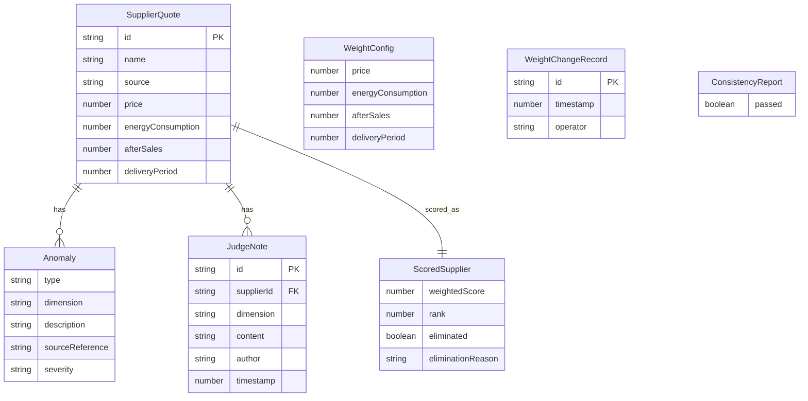

## 1. 架构设计

```mermaid
flowchart TB
    subgraph "前端层"
        "A[评分面板]" --> "B[排名看板]"
        "B" --> "C[溯源与审计]"
        "C" --> "D[导出中心]"
    end
    subgraph "计算引擎层"
        "E[权重校验模块]"
        "F[加权评分模块]"
        "G[异常检测模块]"
        "H[一致性校验模块]"
    end
    subgraph "数据层"
        "I[Zustand Store]"
        "J[示例数据集]"
    end
    "A" --> "E"
    "E" --> "F"
    "F" --> "G"
    "G" --> "B"
    "C" --> "H"
    "H" --> "D"
    "I" --> "A"
    "J" --> "I"
```

## 2. 技术说明

- **前端**：React@18 + TypeScript + Tailwind CSS@3 + Vite
- **初始化工具**：vite-init
- **后端**：无（纯前端，数据存储在 Zustand Store + localStorage）
- **数据库**：无（使用内存状态 + localStorage 持久化）
- **图表**：自定义 SVG 雷达图（无外部图表库依赖）
- **导出**：原生 CSV 生成（Blob + URL.createObjectURL）

## 3. 路由定义

| 路由 | 用途 |
|------|------|
| / | 评分面板：供应商报价录入、权重调节、评委备注 |
| /ranking | 排名看板：加权排名表、雷达图、异常说明 |
| /audit | 溯源与审计：权重变更历史、一致性校验 |
| /export | 导出中心：CSV 导出、校验报告 |

## 4. API 定义

无后端 API，所有计算在前端完成。

### 4.1 核心 TypeScript 类型

```typescript
interface SupplierQuote {
  id: string;
  name: string;
  source: string;
  price: number;
  energyConsumption: number;
  afterSales: number;
  deliveryPeriod: number;
  anomalies: Anomaly[];
}

interface WeightConfig {
  price: number;
  energyConsumption: number;
  afterSales: number;
  deliveryPeriod: number;
}

interface WeightChangeRecord {
  id: string;
  timestamp: number;
  previous: WeightConfig;
  current: WeightConfig;
  operator: string;
}

interface ScoredSupplier extends SupplierQuote {
  weightedScore: number;
  dimensionScores: DimensionScore;
  rank: number;
  eliminated: boolean;
  eliminationReason?: string;
}

interface DimensionScore {
  price: number;
  energyConsumption: number;
  afterSales: number;
  deliveryPeriod: number;
}

interface Anomaly {
  type: 'zero_value' | 'negative_value' | 'extreme_outlier' | 'weight_mismatch' | 'consistency_error';
  dimension: string;
  description: string;
  sourceReference: string;
  severity: 'warning' | 'error';
}

interface ConsistencyReport {
  passed: boolean;
  checks: ConsistencyCheck[];
}

interface ConsistencyCheck {
  name: string;
  passed: boolean;
  detail: string;
}

interface JudgeNote {
  id: string;
  supplierId: string;
  dimension: string;
  content: string;
  author: string;
  timestamp: number;
}
```

## 5. 服务器架构图

不适用（纯前端项目）

## 6. 数据模型

### 6.1 数据模型定义



### 6.2 数据定义语言

不适用（无数据库，使用 TypeScript 类型 + Zustand Store）

### 6.3 示例数据集

内置6家供应商报价数据，其中1家（"华信达设备"）故意设置为坏数据：
- 价格为 0（异常：零值报价）
- 能耗为 -5（异常：负数能耗）
- 交付期为 999 天（异常：极端偏离）
- 售后评分为 0（异常：零值评分）

此坏数据用于验证异常检测路径是否生效，评委无需读代码即可在界面上看到红色标注与异常说明。
