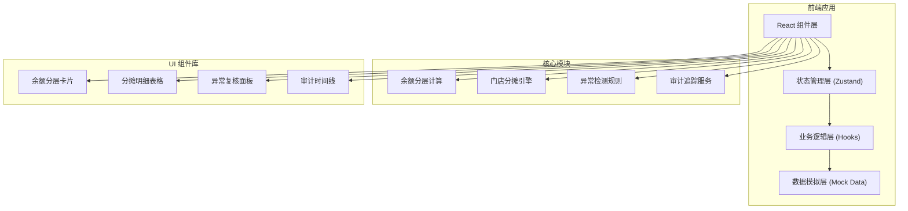
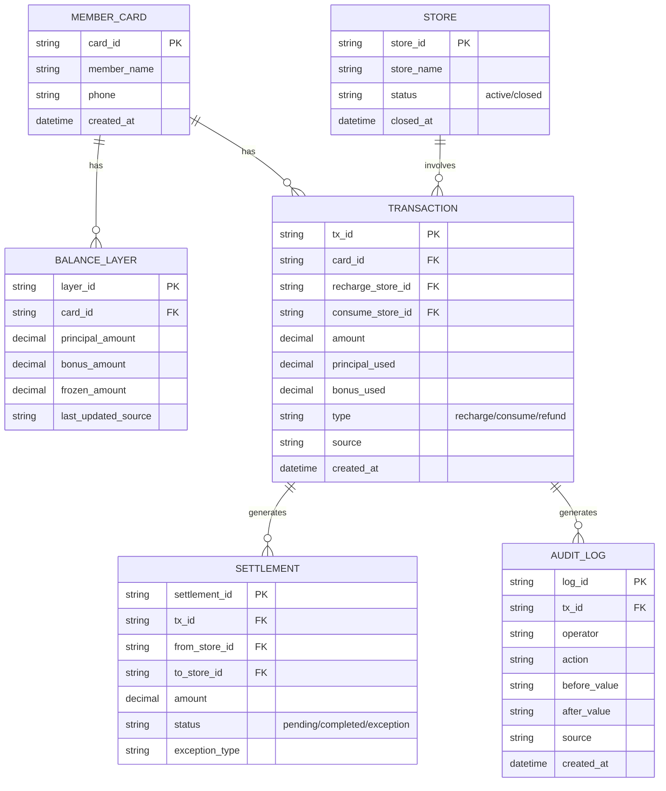

## 1. 架构设计



## 2. 技术描述
- **前端框架**：React@18 + TypeScript
- **构建工具**：Vite@5
- **样式方案**：TailwindCSS@3 + CSS 变量
- **状态管理**：Zustand（轻量级，适合中小型应用）
- **图标库**：Lucide React
- **数据方案**：前端 Mock 数据（无需后端，独立可运行）
- **日期处理**：date-fns

## 3. 路由定义
| 路由 | 页面名称 | 功能说明 |
|-------|---------|----------|
| / | 清算工作台 | 主页，展示余额分层、分摊明细、清算记录 |
| /audit | 审计追踪 | 操作日志、变更历史、数据溯源 |
| /sample | 样例验证 | 正常记录/门店撤店样例对比 |

## 4. 数据模型

### 4.1 核心数据模型定义



### 4.2 TypeScript 类型定义

```typescript
// 余额分层
interface BalanceLayer {
  cardId: string;
  principal: number;      // 本金（可退）
  bonus: number;          // 赠金（不可退）
  frozen: number;         // 冻结金额
  lastUpdatedSource: string;
  updatedAt: Date;
}

// 门店信息
interface Store {
  storeId: string;
  storeName: string;
  status: 'active' | 'closed';
  closedAt?: Date;
}

// 交易记录
interface Transaction {
  txId: string;
  cardId: string;
  cardNumber: string;
  memberName: string;
  rechargeStoreId: string;    // 充值门店
  consumeStoreId: string;     // 消费门店
  totalAmount: number;
  principalUsed: number;      // 使用本金
  bonusUsed: number;          // 使用赠金
  type: 'recharge' | 'consume' | 'refund';
  status: 'pending' | 'settled' | 'exception';
  exceptionType?: 'store_closed' | 'bonus_refund' | 'over_consume';
  source: string;             // 数据来源（文件名/批次号）
  createdAt: Date;
}

// 门店分摊明细
interface StoreSettlement {
  settlementId: string;
  txId: string;
  fromStoreId: string;        // 资金划出门店（充值店）
  toStoreId: string;          // 资金划入门店（消费店）
  principalAmount: number;
  bonusAmount: number;
  status: 'pending' | 'completed' | 'exception';
  traceSource: string;        // 溯源信息
}

// 审计日志
interface AuditLog {
  logId: string;
  txId?: string;
  operator: string;
  action: string;
  fieldName: string;
  beforeValue: string;
  afterValue: string;
  source: string;
  createdAt: Date;
}
```

## 5. 核心业务规则

### 5.1 余额分层规则
- **本金**：用户实际充值金额，可退款、可跨店使用
- **赠金**：活动赠送金额，不可退款、可跨店使用
- **冻结**：门店撤店时的待清算金额

### 5.2 门店分摊算法
```
跨店消费分摊规则：
1. 优先使用赠金抵扣，再使用本金
2. 消费门店获得：本金部分 + 赠金对应的成本（如赠金成本率30%）
3. 充值门店承担：本金划转 + 赠金成本
4. 门店撤店时：未消费本金原路退回，赠金清零
```

### 5.3 异常检测规则
| 异常类型 | 触发条件 | 处理方式 |
|---------|---------|---------|
| store_closed | 充值门店已撤店 | 标记异常，人工复核后原路退回 |
| bonus_refund | 退款申请包含赠金 | 赠金部分驳回，本金部分正常处理 |
| over_consume | 消费金额 > 可用余额 | 标记异常，拒绝清算 |

## 6. 目录结构

```
src/
├── components/
│   ├── BalanceLayerCard.tsx     # 余额分层卡片
│   ├── SettlementTable.tsx      # 分摊明细表格
│   ├── TransactionList.tsx      # 交易记录列表
│   ├── ExceptionPanel.tsx       # 异常复核面板
│   ├── AuditTimeline.tsx        # 审计时间线
│   └── SampleComparison.tsx     # 样例对比组件
├── hooks/
│   ├── useBalance.ts            # 余额计算逻辑
│   ├── useSettlement.ts         # 分摊计算逻辑
│   └── useAudit.ts              # 审计追踪逻辑
├── store/
│   └── useSettlementStore.ts    # Zustand 状态管理
├── data/
│   ├── mockData.ts              # Mock 数据
│   └── sampleData.ts            # 样例验证数据
├── types/
│   └── index.ts                 # 类型定义
├── utils/
│   ├── calculator.ts            # 计算工具
│   └── formatter.ts             # 格式化工具
├── pages/
│   ├── Workbench.tsx            # 清算工作台
│   ├── AuditPage.tsx            # 审计追踪页
│   └── SamplePage.tsx           # 样例验证页
└── App.tsx
```
