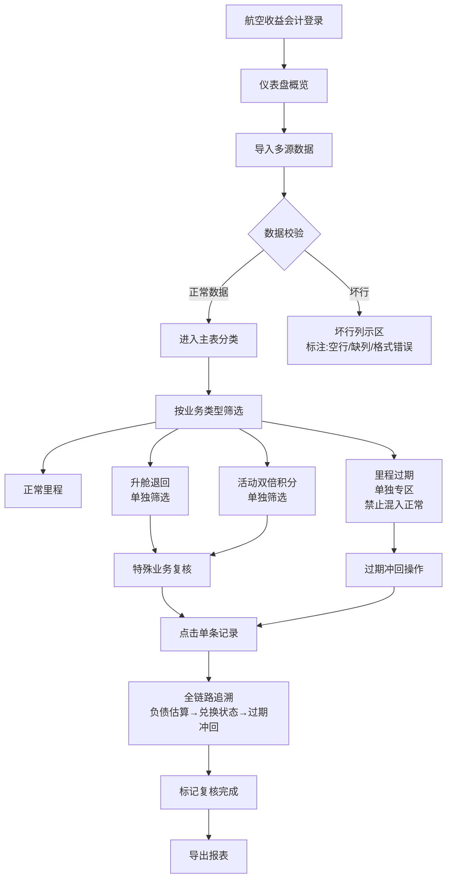

## 1. 产品概述
航司里程兑付负债系统专为航空收益会计设计，解决里程过期时需手动翻阅会员账户和里程流水的痛点。系统实现数据刷新不丢失、智能筛选、复核留痕、导出可追溯，将兑换订单、过期日历等来源的坏行单独列示，确保里程过期记录不混入正常结果，支持升舱退回、活动双倍积分等特殊业务场景的精准筛选与复核。

- **解决问题**：航空收益会计在里程过期时需人工核对海量账户与流水数据，效率低下且易出错
- **目标用户**：航空收益会计、财务复核人员
- **核心价值**：自动化数据清洗、智能分类筛选、全链路可追溯，提升兑付负债核算准确性与效率

## 2. 核心特性

### 2.1 用户角色
| 角色 | 注册方式 | 核心权限 |
|------|----------|----------|
| 航空收益会计 | 系统账号登录 | 数据导入、筛选查询、复核标记、导出报表、查看追溯链路 |
| 财务主管 | 系统账号登录 | 全部会计权限 + 复核审批、数据批量处理、操作日志查看 |

### 2.2 功能模块
1. **仪表盘概览**：兑付负债总览、过期里程预警、待复核事项、数据质量统计
2. **里程兑付负债主表**：多维度筛选、数据刷新、分页浏览、状态标记
3. **数据导入中心**：多源数据导入（会员账户、里程流水、兑换订单、过期日历）、数据校验、坏行列示
4. **特殊业务复核**：升舱退回筛选、活动双倍积分筛选、里程过期单独处理
5. **全链路追溯**：从单条记录追溯至负债估算、兑换状态、过期冲回明细
6. **数据导出中心**：筛选结果导出、复核记录导出、坏行明细导出

### 2.3 页面详情
| 页面名称 | 模块名称 | 功能描述 |
|----------|----------|----------|
| 仪表盘 | 数据概览卡片 | 显示兑付负债总额、本月过期里程、待复核数、数据合格率 |
| 仪表盘 | 趋势图表 | 近6个月兑付负债趋势、过期里程分布 |
| 里程兑付负债主表 | 高级筛选区 | 支持会员号、里程区间、过期日期、业务类型（正常/升舱退回/活动双倍/过期）、状态（未复核/已复核/已冲回）多条件组合筛选 |
| 里程兑付负债主表 | 数据表格 | 展示会员号、账户类型、累计里程、应兑付负债、已兑换里程、剩余里程、最近交易日期、状态标签 |
| 里程兑付负债主表 | 操作列 | 查看详情、追溯链路、标记复核、备注编辑 |
| 数据导入中心 | 上传区域 | 拖拽上传Excel/CSV，支持会员账户、里程流水、兑换订单、过期日历四种来源 |
| 数据导入中心 | 数据校验 | 自动检测空行、缺列、格式错误，实时显示校验进度 |
| 数据导入中心 | 坏行列示 | 单独展示坏行数据，标注错误原因（空行、缺列、格式错误、数据异常）、来源文件、行号 |
| 数据导入中心 | 数据刷新 | 增量刷新不覆盖历史数据，刷新前后数据对比预览 |
| 特殊业务复核 | 升舱退回列表 | 筛选所有升舱退回记录，支持批量复核 |
| 特殊业务复核 | 活动双倍积分列表 | 筛选活动期间双倍积分记录，关联活动规则 |
| 特殊业务复核 | 里程过期专区 | 单独列示所有过期里程记录，禁止混入正常结果，支持过期冲回操作 |
| 追溯链路页面 | 时间线视图 | 以时间线展示从负债估算→兑换状态→过期冲回的全链路节点 |
| 追溯链路页面 | 负债估算详情 | 显示估算公式、参数、计算过程、估算人、估算时间 |
| 追溯链路页面 | 兑换状态流转 | 展示兑换申请→审核→兑付→退回的完整状态流转 |
| 追溯链路页面 | 过期冲回记录 | 显示过期原因、冲回金额、审批人、冲回时间 |
| 数据导出中心 | 导出配置 | 选择导出字段、格式（Excel/CSV）、命名规则 |
| 数据导出中心 | 导出任务 | 显示导出进度、下载历史、操作人 |

## 3. 核心流程

### 3.1 日常业务流程
航空收益会计登录系统 → 查看仪表盘待办事项 → 导入最新数据源 → 查看数据校验结果与坏行列表 → 在主表中按业务类型筛选（升舱退回/活动双倍/过期）→ 对特殊业务进行复核标记 → 点击单条记录查看追溯链路 → 确认负债估算、兑换状态、过期冲回 → 导出复核结果 → 完成本期兑付负债核算

### 3.2 里程过期失败路径验证流程
使用测试会员账户 → 导入包含过期里程的会员账户数据 → 导入对应过期日历 → 系统自动识别过期记录 → 验证过期记录是否进入"里程过期专区"而非混入正常结果 → 点击过期记录查看追溯链路 → 验证能否追踪到负债估算→兑换状态→过期冲回的完整失败路径

### 3.3 Mermaid 流程图

## 4. 用户界面设计

### 4.1 设计风格
- **主色调**：深邃航空蓝 (#1E3A5F) 作为主色，搭配专业银灰 (#F5F7FA) 背景，强调财务系统的专业感与信任感
- **强调色**：警示橙 (#F59E0B) 用于过期预警，成功绿 (#10B981) 用于已复核，危险红 (#EF4444) 用于坏行与过期，信息蓝 (#3B82F6) 用于追溯链路
- **按钮风格**：微立体设计，4px圆角，hover时有微妙的阴影加深与上移动画
- **字体**：标题使用"思源宋体 SemiBold"提升专业质感，正文使用"Inter Regular"确保数字与英文的可读性
- **布局风格**：顶部导航 + 左侧功能菜单 + 右侧内容区的经典财务系统布局，数据表格采用固定表头 + 斑马纹 + 冻结首列设计
- **图标风格**：线性图标，粗细1.5px，颜色与业务状态联动

### 4.2 页面设计概述
| 页面名称 | 模块名称 | UI元素 |
|----------|----------|----------|
| 仪表盘 | 数据概览卡片 | 渐变背景卡片，大号数字带千分位，趋势箭头带颜色区分，底部小字显示同比环比 |
| 仪表盘 | 趋势图表 | 面积图填充航空蓝渐变，X轴月份标签倾斜45度，hover时显示精确数值的十字准线 |
| 里程兑付负债主表 | 高级筛选区 | 卡片式筛选面板，标签式切换常用筛选方案，筛选条件可保存为个人方案 |
| 里程兑付负债主表 | 数据表格 | 固定表头，行高48px，状态标签圆角全填充，操作列按钮hover时背景色变化 |
| 数据导入中心 | 上传区域 | 虚线边框，拖拽进入时边框变色 + 背景微亮，显示支持的文件格式与示例 |
| 数据导入中心 | 坏行列表 | 浅红背景，错误原因标签，点击展开查看原始行数据与修复建议 |
| 特殊业务复核 | 分类标签页 | 三个独立标签页：升舱退回、活动双倍积分、里程过期，标签带数字角标 |
| 特殊业务复核 | 里程过期专区 | 顶部红色警示条，明确提示"此区域数据为过期里程，不参与正常兑付计算" |
| 追溯链路页面 | 时间线视图 | 垂直时间线，每个节点带状态图标，连接线颜色代表状态，可点击节点展开详情 |
| 数据导出中心 | 导出配置 | 复选框组选择字段，拖拽排序，预览导出格式 |

### 4.3 交互细节
- **表格行hover**：背景色变为浅蓝，右侧出现快捷操作按钮
- **筛选条件变更**：数据区域显示骨架屏加载动画，加载完成后数字有轻微的淡入效果
- **复核标记**：点击"标记复核"后按钮变为对勾，行背景色有一个从绿到白的过渡动画
- **追溯链路**：点击节点时有平滑展开动画，相关数据高亮显示
- **数据刷新**：刷新按钮有旋转动画，刷新完成后弹出toast提示"新增X条，更新Y条，无数据丢失"

### 4.4 响应式设计
- **桌面端**：1280px以上完整显示所有功能，左侧菜单240px宽度
- **平板端**：1024px-1280px，左侧菜单可折叠为图标模式，表格支持横向滚动
- **移动端**：768px以下，顶部导航变为汉堡菜单，数据卡片转为单列布局，表格转为卡片列表展示

## 5. 关键业务规则

### 5.1 数据处理规则
- **数据刷新**：采用"主键匹配 + 增量更新"策略，按会员号+交易日期作为唯一主键，新数据更新旧数据但不删除历史记录，刷新前后可对比
- **坏行识别**：空行（所有字段为空）、缺列（关键字段缺失：会员号、里程数、交易日期）、格式错误（日期格式、数字格式）、数据异常（里程数为负、过期日期早于交易日期）
- **坏行处理**：所有坏行单独存储于bad_records表，标注来源文件、来源类型（兑换订单/过期日历/会员账户/里程流水）、行号、错误原因，不参与正常计算

### 5.2 业务分类规则
- **升舱退回**：交易类型为"升舱"且交易状态为"退回"，或备注中包含"升舱退回"关键词
- **活动双倍积分**：交易日期在活动期间内，且交易描述包含"双倍""活动""赠送"等关键词
- **里程过期**：交易类型为"过期"，或当前日期 > 过期日期且剩余里程 > 0，此类记录**强制**进入过期专区，**禁止**在正常主表中显示
- **负债估算**：剩余里程 × 单位里程负债系数 × 兑换概率系数

### 5.3 复核与追溯规则
- 每条记录必须经过"标记复核"后才能导出
- 复核时需填写复核意见，系统自动记录复核人与复核时间
- 追溯链路必须包含：负债估算详情（公式、参数、计算人）、兑换状态流转（每个状态的时间、操作人）、过期冲回记录（如果有）
