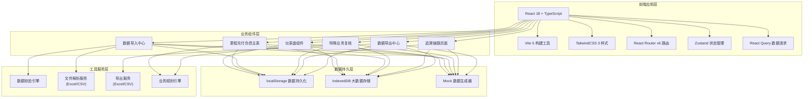

## 1. 架构设计



## 2. 技术描述

### 2.1 前端技术栈
- **框架**: React 18.2 + TypeScript 5.3
- **构建工具**: Vite 5.0
- **样式方案**: TailwindCSS 3.4 + PostCSS
- **路由管理**: React Router v6
- **状态管理**: Zustand 4.4（轻量级状态管理，支持持久化）
- **数据请求**: React Query/TanStack Query（管理服务器状态，内置缓存）
- **UI 组件**: 自定义组件库（基于TailwindCSS）+ Lucide React 图标
- **图表**: Recharts 2.10（数据可视化）
- **文件处理**: xlsx 0.18（Excel解析与导出）+ papaparse 5.4（CSV解析）
- **表单校验**: Zod 3.22（TypeScript优先的schema校验）
- **日期处理**: date-fns 3.0（轻量级日期库）

### 2.2 数据持久化方案
- **localStorage**: 存储用户配置、筛选方案、操作日志（<5MB）
- **IndexedDB**: 存储大量业务数据（会员账户、里程流水、兑换订单、过期日历），使用 dexie.js 封装
- **刷新保障机制**: 采用"写前缓存 + 增量更新 + 操作日志"三重保障，确保数据刷新不丢失：
  1. 每次数据写入前先备份到localStorage
  2. 增量更新而非全量覆盖
  3. 所有操作记录到operation_log表，可回滚

### 2.3 初始化工具
- 使用 `npm create vite@latest . -- --template react-ts` 初始化项目
- 配置 TailwindCSS 3.x
- 配置路径别名 `@` 指向 `src/`

## 3. 路由定义

| 路由路径 | 页面名称 | 模块说明 |
|----------|----------|----------|
| `/` | 仪表盘概览 | 兑付负债总览、过期预警、待办事项 |
| `/liability` | 里程兑付负债主表 | 多维度筛选、数据列表、复核标记 |
| `/liability/:id` | 负债记录详情 | 单条记录完整信息、编辑备注 |
| `/import` | 数据导入中心 | 多源数据上传、数据校验、坏行列示 |
| `/review` | 特殊业务复核 | 升舱退回、活动双倍积分、里程过期专区 |
| `/trace/:id` | 追溯链路页面 | 时间线视图、全链路节点详情 |
| `/export` | 数据导出中心 | 导出配置、导出任务管理 |
| `/bad-records` | 坏行管理 | 所有坏行列表、错误详情、修复建议 |

## 4. 数据模型定义

### 4.1 核心数据接口

```typescript
// 会员账户
interface MemberAccount {
  id: string;
  memberNo: string;           // 会员号
  memberName: string;
  accountType: '普通' | '银卡' | '金卡' | '白金卡';
  totalMiles: number;         // 累计里程
  usedMiles: number;          // 已兑换里程
  remainingMiles: number;     // 剩余里程
  expireDate: string;         // 过期日期
  lastTransactionDate: string;
  createTime: string;
  updateTime: string;
  remark?: string;
}

// 里程流水
interface MileageTransaction {
  id: string;
  memberNo: string;
  transactionType: '累积' | '兑换' | '过期' | '退回' | '调整';
  businessType: '正常' | '升舱' | '活动赠送' | '系统调整';
  miles: number;
  transactionDate: string;
  orderNo?: string;           // 关联订单号
  activityId?: string;        // 活动ID
  description: string;
  operator: string;
  status: '待处理' | '已完成' | '已取消';
  remark?: string;
}

// 兑换订单
interface ExchangeOrder {
  id: string;
  orderNo: string;
  memberNo: string;
  exchangeType: '机票' | '升舱' | '礼品' | '积分';
  miles: number;
  amount: number;             // 兑付金额
  applyDate: string;
  status: '待审核' | '已审核' | '已兑付' | '已退回';
  auditor?: string;
  auditTime?: string;
  payoutTime?: string;
  rejectReason?: string;
  remark?: string;
}

// 过期日历
interface ExpireCalendar {
  id: string;
  memberNo: string;
  batchNo: string;            // 过期批次号
  expireDate: string;
  milesToExpire: number;      // 即将过期里程
  actualExpiredMiles: number; // 实际过期里程
  isExpired: boolean;
  expireReason: string;
  processStatus: '未处理' | '已冲回' | '已豁免';
  processor?: string;
  processTime?: string;
  remark?: string;
}

// 兑付负债记录
interface LiabilityRecord {
  id: string;
  memberNo: string;
  memberName: string;
  accountType: string;
  remainingMiles: number;
  liabilityCoefficient: number;    // 单位里程负债系数
  probabilityCoefficient: number;  // 兑换概率系数
  estimatedLiability: number;      // 估算负债 = 剩余里程 × 系数1 × 系数2
  businessCategory: '正常' | '升舱退回' | '活动双倍' | '里程过期';
  reviewStatus: '未复核' | '复核中' | '已复核' | '已冲回';
  reviewer?: string;
  reviewTime?: string;
  reviewComment?: string;
  isExpired: boolean;        // 是否过期（关键标志，用于隔离）
  expireDate?: string;
  latestTransaction: MileageTransaction | null;
  exchangeOrders: ExchangeOrder[];
  expireRecords: ExpireCalendar[];
  estimateDetail: EstimateDetail;
  createTime: string;
  updateTime: string;
}

// 负债估算详情
interface EstimateDetail {
  formula: string;
  parameters: {
    remainingMiles: number;
    liabilityCoefficient: number;
    probabilityCoefficient: number;
  };
  calculationProcess: string;
  calculator: string;
  calculateTime: string;
}

// 坏行记录
interface BadRecord {
  id: string;
  sourceType: '会员账户' | '里程流水' | '兑换订单' | '过期日历';
  sourceFile: string;
  rowNumber: number;
  errorType: '空行' | '缺列' | '格式错误' | '数据异常';
  errorDescription: string;
  originalData: Record<string, any>;
  repairSuggestion: string;
  isProcessed: boolean;
  processor?: string;
  processTime?: string;
  importBatchNo: string;
  createTime: string;
}

// 操作日志
interface OperationLog {
  id: string;
  operator: string;
  operationType: '导入' | '刷新' | '复核' | '导出' | '冲回' | '修改';
  targetType: string;
  targetId: string;
  beforeData: Record<string, any> | null;
  afterData: Record<string, any> | null;
  detail: string;
  createTime: string;
}
```

### 4.2 数据校验Schema（Zod）

```typescript
import { z } from 'zod';

const MemberAccountSchema = z.object({
  memberNo: z.string().min(1, '会员号不能为空'),
  memberName: z.string().min(1, '会员姓名不能为空'),
  accountType: z.enum(['普通', '银卡', '金卡', '白金卡']),
  totalMiles: z.number().int().min(0, '累计里程不能为负'),
  usedMiles: z.number().int().min(0, '已兑换里程不能为负'),
  remainingMiles: z.number().int().min(0, '剩余里程不能为负'),
  expireDate: z.string().refine((d) => !isNaN(Date.parse(d)), '日期格式错误'),
  lastTransactionDate: z.string().refine((d) => !isNaN(Date.parse(d)), '日期格式错误'),
}).refine(
  (data) => data.totalMiles >= data.usedMiles,
  { message: '已兑换里程不能大于累计里程', path: ['usedMiles'] }
).refine(
  (data) => data.remainingMiles === data.totalMiles - data.usedMiles,
  { message: '剩余里程计算错误', path: ['remainingMiles'] }
);

const BadRecordSchema = z.object({
  sourceType: z.enum(['会员账户', '里程流水', '兑换订单', '过期日历']),
  sourceFile: z.string(),
  rowNumber: z.number().int().positive(),
  errorType: z.enum(['空行', '缺列', '格式错误', '数据异常']),
  errorDescription: z.string(),
  originalData: z.record(z.any()),
  repairSuggestion: z.string(),
  importBatchNo: z.string(),
});
```

## 5. 核心业务逻辑模块

### 5.1 数据校验引擎

```typescript
interface ValidationResult {
  valid: boolean;
  data: any[];
  badRecords: BadRecord[];
  stats: {
    totalRows: number;
    validRows: number;
    badRows: number;
    errorTypeCount: Record<string, number>;
  };
}

class DataValidator {
  validateMemberAccount(rows: any[], sourceFile: string, batchNo: string): ValidationResult;
  validateMileageTransaction(rows: any[], sourceFile: string, batchNo: string): ValidationResult;
  validateExchangeOrder(rows: any[], sourceFile: string, batchNo: string): ValidationResult;
  validateExpireCalendar(rows: any[], sourceFile: string, batchNo: string): ValidationResult;
  
  // 坏行检测
  detectEmptyRow(row: any): boolean;
  detectMissingColumns(row: any, requiredColumns: string[]): string[];
  detectFormatErrors(row: any, schema: z.ZodSchema): z.ZodIssue[];
  detectDataAnomalies(row: any): string[];
}
```

### 5.2 业务规则引擎

```typescript
class BusinessRuleEngine {
  // 分类识别
  classifyBusinessCategory(transaction: MileageTransaction, expireCalendar?: ExpireCalendar): '正常' | '升舱退回' | '活动双倍' | '里程过期';
  
  // 升舱退回识别
  isUpgradeRefund(transaction: MileageTransaction): boolean;
  
  // 活动双倍积分识别
  isActivityDoublePoints(transaction: MileageTransaction, activities: Activity[]): boolean;
  
  // 里程过期识别（关键：隔离过期记录）
  isMileageExpired(account: MemberAccount, expireCalendar?: ExpireCalendar): boolean;
  
  // 负债估算
  calculateEstimatedLiability(remainingMiles: number, accountType: string): EstimateDetail;
  
  // 生成追溯链路
  generateTraceChain(record: LiabilityRecord): TraceNode[];
}
```

### 5.3 数据刷新策略

```typescript
class DataRefreshService {
  // 增量刷新：主键匹配 + 更新 + 不删除历史
  incrementalRefresh(newData: any[], existingData: any[], primaryKey: string[]): {
    added: any[];
    updated: any[];
    unchanged: any[];
    deleted: any[]; // 仅记录，不实际删除
  };
  
  // 刷新前后对比
  compareBeforeAfter(before: any, after: any): Record<string, { before: any; after: any }>;
  
  // 备份机制
  backupData(key: string, data: any): void;
  restoreData(key: string): any | null;
}
```

## 6. 状态管理设计（Zustand）

```typescript
interface AppState {
  // 数据
  memberAccounts: MemberAccount[];
  transactions: MileageTransaction[];
  exchangeOrders: ExchangeOrder[];
  expireCalendars: ExpireCalendar[];
  liabilityRecords: LiabilityRecord[];
  badRecords: BadRecord[];
  operationLogs: OperationLog[];
  
  // UI状态
  currentPage: string;
  loading: boolean;
  filters: LiabilityFilters;
  selectedRecords: string[];
  
  // 操作
  loadData: () => Promise<void>;
  importData: (sourceType: string, file: File) => Promise<ImportResult>;
  refreshData: () => Promise<RefreshResult>;
  applyFilters: (filters: LiabilityFilters) => void;
  markReviewed: (recordId: string, comment: string) => void;
  processExpired: (recordId: string, action: '冲回' | '豁免') => void;
  exportData: (config: ExportConfig) => Promise<string>;
  getTraceChain: (recordId: string) => TraceNode[];
}
```

## 7. 目录结构

```
src/
├── assets/                # 静态资源
│   ├── fonts/            # 思源宋体等字体
│   └── images/
├── components/           # 通用组件
│   ├── layout/           # 布局组件
│   │   ├── Header.tsx
│   │   ├── Sidebar.tsx
│   │   └── MainLayout.tsx
│   ├── ui/               # 基础UI组件
│   │   ├── Button.tsx
│   │   ├── Table.tsx
│   │   ├── Modal.tsx
│   │   ├── Tabs.tsx
│   │   ├── Badge.tsx
│   │   ├── DatePicker.tsx
│   │   └── StatusTag.tsx
│   ├── filters/          # 筛选组件
│   │   ├── FilterPanel.tsx
│   │   └── SavedFilters.tsx
│   └── common/
│       ├── LoadingSkeleton.tsx
│       ├── EmptyState.tsx
│       └── Pagination.tsx
├── pages/                # 页面组件
│   ├── Dashboard/
│   ├── LiabilityList/
│   ├── LiabilityDetail/
│   ├── ImportCenter/
│   ├── ReviewCenter/
│   ├── TracePage/
│   ├── ExportCenter/
│   └── BadRecords/
├── store/                # Zustand状态管理
│   ├── useAppStore.ts
│   └── persistConfig.ts
├── services/             # 业务服务
│   ├── dataValidator.ts
│   ├── businessRules.ts
│   ├── refreshService.ts
│   ├── importService.ts
│   ├── exportService.ts
│   └── traceService.ts
├── types/                # TypeScript类型定义
│   ├── index.ts
│   ├── api.ts
│   └── business.ts
├── utils/                # 工具函数
│   ├── storage.ts        # localStorage/IndexedDB封装
│   ├── date.ts           # 日期处理
│   ├── number.ts         # 数字格式化
│   ├── file.ts           # 文件处理
│   └── mock.ts           # Mock数据生成
├── data/                 # Mock数据
│   ├── members.ts
│   ├── transactions.ts
│   ├── orders.ts
│   └── expireCalendar.ts
├── hooks/                # 自定义Hooks
│   ├── useDataRefresh.ts
│   ├── useExport.ts
│   └── useTrace.ts
├── router/               # 路由配置
│   └── index.tsx
├── App.tsx
├── main.tsx
└── index.css             # TailwindCSS入口 + 全局样式
```

## 8. 关键技术实现要点

### 8.1 数据刷新不丢失
1. 使用IndexedDB存储主数据，localStorage存储配置和备份
2. 每次写入前先将旧数据写入`backup`表
3. 采用增量更新策略，按`memberNo + transactionDate`作为复合主键
4. 所有删除操作仅标记`isDeleted`标志，不物理删除
5. 记录完整操作日志，支持数据回滚

### 8.2 坏行处理机制
1. 四种错误类型：空行、缺列、格式错误、数据异常
2. 每种错误有修复建议
3. 坏行独立存储于`bad_records`表，不参与任何业务计算
4. 支持查看原始行数据、错误详情、来源文件、行号
5. 支持标记为已处理、记录处理人、处理时间

### 8.3 里程过期隔离（关键需求）
1. `LiabilityRecord.isExpired`字段为`true`的记录**强制**不进入主列表
2. 主列表查询时自动添加`WHERE isExpired = false`条件
3. 过期记录仅在"里程过期专区"显示
4. 专区顶部有红色警示条："此区域数据为过期里程，不参与正常兑付计算"
5. 过期记录的`businessCategory`强制为"里程过期"

### 8.4 全链路追溯
1. 时间线组件展示：负债估算 → 兑换状态 → 过期冲回
2. 每个节点可点击展开详情
3. 支持追溯到原始单据（会员账户、里程流水、兑换订单、过期日历）
4. 高亮显示异常节点
5. 支持一键复制追溯链路

### 8.5 筛选功能
1. 支持多条件组合筛选：会员号、里程区间、过期日期、业务类型、状态
2. 业务类型筛选项：全部、正常、升舱退回、活动双倍、里程过期
3. 支持保存筛选方案为个人方案
4. 筛选条件变更时显示骨架屏加载
5. 支持筛选结果导出

### 8.6 复核功能
1. 每条记录必须填写复核意见后才能标记为已复核
2. 支持批量复核
3. 复核记录不可删除，仅可追加注释
4. 系统自动记录复核人、复核时间
5. 已复核记录有绿色边框高亮

## 9. Mock数据设计

为了完整验证系统功能，Mock数据需包含：
1. **正常会员**：50条，涵盖普通/银卡/金卡/白金卡
2. **升舱退回记录**：10条，含完整的状态流转
3. **活动双倍积分**：15条，关联3个不同活动
4. **里程过期记录**：8条，含完整的过期失败路径
5. **坏行数据**：12条，覆盖四种错误类型，来源包括兑换订单、过期日历
6. **过期日历**：与过期会员对应

特别设计一个测试会员号`TEST-2024-EXPIRE`，包含完整的过期失败路径，用于同事验证。
