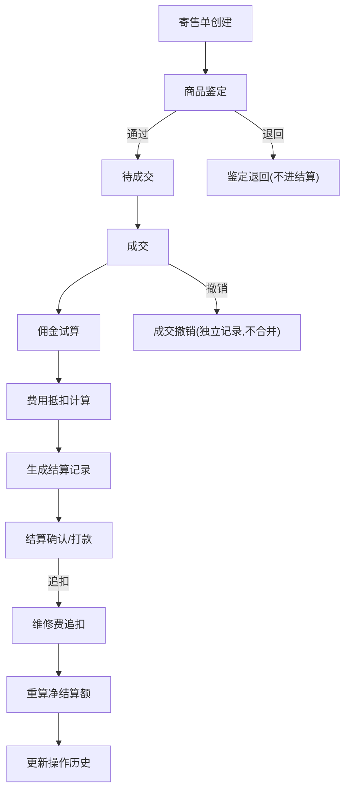

## 1. 产品概述

二手奢侈品寄售结算工作台——面向寄售店财务人员的本地 Web 应用，解决寄售单、成交订单、结算表三表混杂导致费用追扣难以追溯的问题。核心价值：每条结算判断均可追溯到原始寄售单与鉴定记录，佣金试算、费用抵扣、卖家对账一站跑稳。

- 目标用户：寄售店财务/结算人员
- 核心痛点：维修费追扣是否计入、成交撤销与鉴定退回是否被错误合并、历史结论不可追溯
- 关键指标：每条结算可溯源、重启后数据不丢失不重复

## 2. 核心功能

### 2.1 用户角色

| 角色 | 注册方式 | 核心权限 |
|------|----------|----------|
| 财务人员 | 本地登录 | 查看/修正/导出所有寄售结算数据 |

### 2.2 功能模块

1. **结算列表页**：寄售结算总览，多维度筛选与状态标记
2. **结算详情页**：单笔寄售全链路追踪（寄售单→鉴定→成交→结算），佣金试算与费用抵扣明细
3. **结算修正页**：对已有结算条目进行修正，记录修正原因与来源
4. **操作历史页**：所有修正、撤销、追扣操作的完整审计日志
5. **下载导出**：按条件导出结算表为 CSV

### 2.3 页面详情

| 页面名称 | 模块名称 | 功能描述 |
|----------|----------|----------|
| 结算列表页 | 筛选栏 | 按状态（待结算/已结算/已撤销/鉴定退回）、卖家、日期范围筛选 |
| 结算列表页 | 结算表格 | 显示寄售单号、商品信息、卖家、成交价、佣金、费用抵扣、净结算额、状态 |
| 结算列表页 | 批量操作 | 批量导出选中条目 |
| 结算详情页 | 寄售信息卡 | 原始寄售单号、寄售日期、商品描述、卖家信息 |
| 结算详情页 | 鉴定记录时间线 | 鉴定通过/退回记录，含鉴定日期、结果、备注 |
| 结算详情页 | 成交信息 | 成交订单号、成交日期、成交价格 |
| 结算详情页 | 佣金试算 | 按佣金规则计算佣金金额，显示规则名称与费率 |
| 结算详情页 | 费用抵扣明细 | 维修费追扣、鉴定费、其他抵扣项逐条列出 |
| 结算详情页 | 净结算额 | 成交价 - 佣金 - 费用抵扣 = 净结算额 |
| 结算详情页 | 来源追溯 | 每个金额字段标注来源单据号 |
| 结算修正页 | 修正表单 | 修正佣金费率、增减费用抵扣项、填写修正原因 |
| 结算修正页 | 修正预览 | 修正前后对比，净结算额差异高亮 |
| 操作历史页 | 历史时间线 | 按时间倒序显示所有操作（创建、修正、撤销、追扣） |
| 操作历史页 | 操作详情 | 操作类型、操作人、操作时间、变更内容、关联单据 |
| 下载导出 | 导出面板 | 选择导出范围与字段，生成 CSV 文件下载 |

## 3. 核心流程

### 3.1 寄售结算主流程

1. 寄售单创建 → 商品进入鉴定环节
2. 鉴定通过 → 等待成交；鉴定退回 → 标记状态，不进入结算
3. 成交 → 触发佣金试算 + 费用抵扣计算 → 生成结算记录
4. 结算确认 → 打款给卖家
5. 成交撤销 → 回滚结算记录，标记为已撤销，不与原结算合并

### 3.2 维修费追扣流程

1. 成交后发现需维修 → 创建维修费追扣条目
2. 追扣条目关联原成交订单，独立记录
3. 净结算额重算：原净额 - 维修费
4. 追扣操作记入操作历史

### 3.3 流程图

## 4. 用户界面设计

### 4.1 设计风格

- 主色调：深炭灰(#1a1a2e) + 金色点缀(#c9a96e)，体现奢侈品行业质感
- 辅助色：暖白(#f5f0eb)背景，深灰(#2d2d44)卡片
- 按钮风格：圆角8px，金色主按钮，灰色次要按钮
- 字体：Playfair Display（标题）+ Noto Sans SC（正文）
- 布局风格：侧边栏导航 + 右侧内容区，卡片式内容组织
- 图标风格：线性图标，1.5px 描边

### 4.2 页面设计概览

| 页面名称 | 模块名称 | UI要素 |
|----------|----------|--------|
| 结算列表页 | 筛选栏 | 顶部固定，下拉选择+日期范围选择器，深色背景金色边框 |
| 结算列表页 | 结算表格 | 斑马纹表格，状态标签彩色标记，悬停行高亮 |
| 结算详情页 | 信息卡组 | 左右分栏，左侧寄售/鉴定/成交，右侧佣金/抵扣/净额 |
| 结算详情页 | 来源追溯标签 | 金额旁小标签，点击跳转原始单据 |
| 结算修正页 | 修正表单 | 分步骤表单，修正前/后并排对比 |
| 操作历史页 | 时间线 | 垂直时间线，节点按操作类型着色 |

### 4.3 响应式策略

- 桌面优先设计，最小宽度 1280px
- 侧边栏可折叠，内容区自适应宽度
- 表格水平滚动处理窄屏场景

### 4.4 无3D场景
