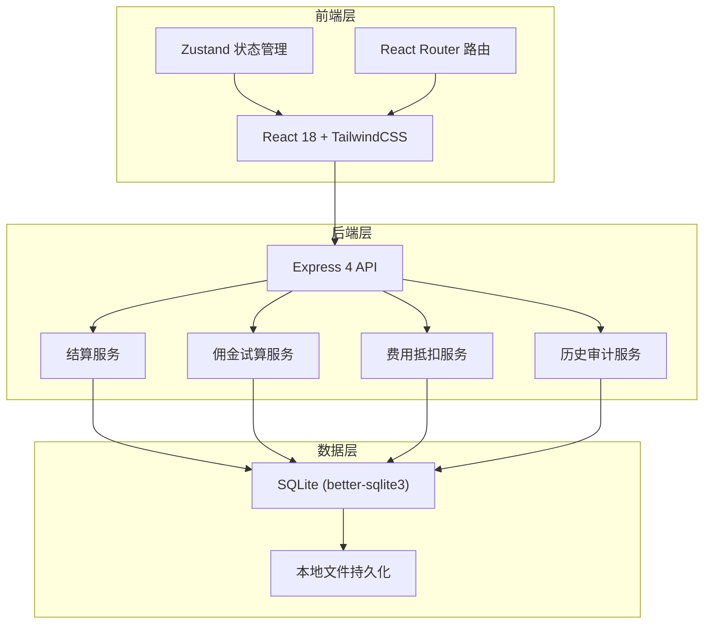
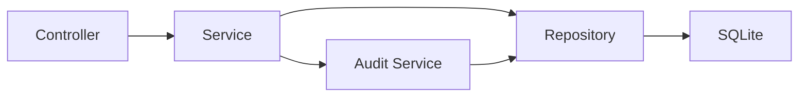
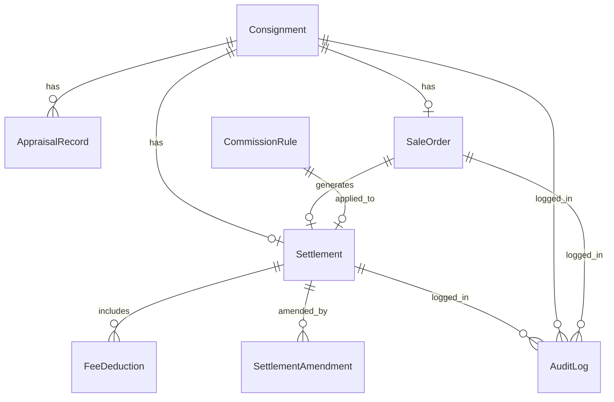

## 1. 架构设计



## 2. 技术说明

- 前端：React@18 + TailwindCSS@3 + Vite + Zustand
- 初始化工具：vite-init (react-express-ts 模板)
- 后端：Express@4 + TypeScript (ESM)
- 数据库：SQLite (better-sqlite3)，本地文件 `data/consignment.db`
- 数据持久化：SQLite 文件存储，重启后数据不丢失；所有写操作使用事务保证一致性，通过唯一约束防止重复记录

## 3. 路由定义

| 路由 | 用途 |
|------|------|
| `/` | 结算列表页，展示所有寄售结算记录 |
| `/settlement/:id` | 结算详情页，单笔寄售全链路追踪 |
| `/settlement/:id/amend` | 结算修正页，修正佣金/抵扣项 |
| `/history` | 操作历史页，审计日志时间线 |

## 4. API 定义

### 4.1 公共类型

```typescript
interface Consignment {
  id: string;
  consignmentNo: string;
  sellerName: string;
  sellerContact: string;
  itemName: string;
  itemBrand: string;
  itemCategory: string;
  itemCondition: string;
  listedPrice: number;
  createdAt: string;
  status: "pending" | "appraising" | "appraised" | "listed" | "sold" | "returned" | "cancelled";
}

interface AppraisalRecord {
  id: string;
  consignmentId: string;
  appraisalDate: string;
  result: "passed" | "returned";
  notes: string;
  appraiser: string;
}

interface SaleOrder {
  id: string;
  saleNo: string;
  consignmentId: string;
  salePrice: number;
  saleDate: string;
  status: "active" | "cancelled";
  cancelledAt?: string;
  cancelReason?: string;
}

interface CommissionRule {
  id: string;
  name: string;
  minPrice: number;
  maxPrice: number;
  rate: number;
  fixedFee: number;
}

interface FeeDeduction {
  id: string;
  settlementId: string;
  type: "repair" | "appraisal" | "storage" | "other";
  amount: number;
  description: string;
  sourceRef: string;
  createdAt: string;
}

interface Settlement {
  id: string;
  consignmentId: string;
  saleOrderId: string;
  salePrice: number;
  commissionRate: number;
  commissionAmount: number;
  totalDeductions: number;
  netAmount: number;
  status: "pending" | "confirmed" | "amended" | "cancelled";
  createdAt: string;
  confirmedAt?: string;
}

interface SettlementAmendment {
  id: string;
  settlementId: string;
  field: string;
  oldValue: string | number;
  newValue: string | number;
  reason: string;
  operator: string;
  createdAt: string;
}

interface AuditLog {
  id: string;
  entityType: "settlement" | "consignment" | "sale_order" | "deduction";
  entityId: string;
  action: "create" | "amend" | "cancel" | "deduct" | "confirm";
  details: string;
  operator: string;
  createdAt: string;
}
```

### 4.2 API 端点

| 方法 | 路径 | 描述 |
|------|------|------|
| GET | `/api/settlements` | 获取结算列表，支持筛选参数 |
| GET | `/api/settlements/:id` | 获取结算详情（含寄售单、鉴定、成交、抵扣） |
| POST | `/api/settlements/:id/amend` | 提交结算修正 |
| POST | `/api/settlements/:id/confirm` | 确认结算 |
| POST | `/api/settlements/:id/cancel` | 撤销结算（成交撤销） |
| POST | `/api/settlements/:id/deductions` | 添加费用抵扣（含维修费追扣） |
| GET | `/api/settlements/:id/trail` | 获取结算来源追溯链 |
| GET | `/api/audit-logs` | 获取操作历史，支持筛选 |
| GET | `/api/commission-rules` | 获取佣金规则列表 |
| POST | `/api/commission-rules/calculate` | 佣金试算 |
| GET | `/api/consignments` | 获取寄售单列表 |
| GET | `/api/export/csv` | 导出结算数据为 CSV |

## 5. 服务端架构图



## 6. 数据模型

### 6.1 数据模型定义



### 6.2 数据定义语言

```sql
CREATE TABLE IF NOT EXISTS consignments (
  id TEXT PRIMARY KEY,
  consignment_no TEXT UNIQUE NOT NULL,
  seller_name TEXT NOT NULL,
  seller_contact TEXT NOT NULL,
  item_name TEXT NOT NULL,
  item_brand TEXT NOT NULL,
  item_category TEXT NOT NULL,
  item_condition TEXT NOT NULL,
  listed_price REAL NOT NULL,
  status TEXT NOT NULL DEFAULT 'pending',
  created_at TEXT NOT NULL DEFAULT (datetime('now')),
  updated_at TEXT NOT NULL DEFAULT (datetime('now'))
);

CREATE TABLE IF NOT EXISTS appraisal_records (
  id TEXT PRIMARY KEY,
  consignment_id TEXT NOT NULL REFERENCES consignments(id),
  appraisal_date TEXT NOT NULL,
  result TEXT NOT NULL CHECK(result IN ('passed', 'returned')),
  notes TEXT DEFAULT '',
  appraiser TEXT NOT NULL,
  created_at TEXT NOT NULL DEFAULT (datetime('now'))
);

CREATE TABLE IF NOT EXISTS sale_orders (
  id TEXT PRIMARY KEY,
  sale_no TEXT UNIQUE NOT NULL,
  consignment_id TEXT NOT NULL REFERENCES consignments(id),
  sale_price REAL NOT NULL,
  sale_date TEXT NOT NULL,
  status TEXT NOT NULL DEFAULT 'active' CHECK(status IN ('active', 'cancelled')),
  cancelled_at TEXT,
  cancel_reason TEXT,
  created_at TEXT NOT NULL DEFAULT (datetime('now')),
  updated_at TEXT NOT NULL DEFAULT (datetime('now'))
);

CREATE TABLE IF NOT EXISTS commission_rules (
  id TEXT PRIMARY KEY,
  name TEXT NOT NULL,
  min_price REAL NOT NULL DEFAULT 0,
  max_price REAL NOT NULL DEFAULT 999999999,
  rate REAL NOT NULL,
  fixed_fee REAL NOT NULL DEFAULT 0,
  created_at TEXT NOT NULL DEFAULT (datetime('now'))
);

CREATE TABLE IF NOT EXISTS settlements (
  id TEXT PRIMARY KEY,
  consignment_id TEXT NOT NULL REFERENCES consignments(id),
  sale_order_id TEXT NOT NULL REFERENCES sale_orders(id),
  sale_price REAL NOT NULL,
  commission_rule_id TEXT REFERENCES commission_rules(id),
  commission_rate REAL NOT NULL,
  commission_amount REAL NOT NULL,
  total_deductions REAL NOT NULL DEFAULT 0,
  net_amount REAL NOT NULL,
  status TEXT NOT NULL DEFAULT 'pending' CHECK(status IN ('pending', 'confirmed', 'amended', 'cancelled')),
  created_at TEXT NOT NULL DEFAULT (datetime('now')),
  updated_at TEXT NOT NULL DEFAULT (datetime('now'))
);

CREATE TABLE IF NOT EXISTS fee_deductions (
  id TEXT PRIMARY KEY,
  settlement_id TEXT NOT NULL REFERENCES settlements(id),
  type TEXT NOT NULL CHECK(type IN ('repair', 'appraisal', 'storage', 'other')),
  amount REAL NOT NULL,
  description TEXT NOT NULL,
  source_ref TEXT NOT NULL,
  created_at TEXT NOT NULL DEFAULT (datetime('now'))
);

CREATE TABLE IF NOT EXISTS settlement_amendments (
  id TEXT PRIMARY KEY,
  settlement_id TEXT NOT NULL REFERENCES settlements(id),
  field TEXT NOT NULL,
  old_value TEXT NOT NULL,
  new_value TEXT NOT NULL,
  reason TEXT NOT NULL,
  operator TEXT NOT NULL DEFAULT 'system',
  created_at TEXT NOT NULL DEFAULT (datetime('now'))
);

CREATE TABLE IF NOT EXISTS audit_logs (
  id TEXT PRIMARY KEY,
  entity_type TEXT NOT NULL CHECK(entity_type IN ('settlement', 'consignment', 'sale_order', 'deduction')),
  entity_id TEXT NOT NULL,
  action TEXT NOT NULL CHECK(action IN ('create', 'amend', 'cancel', 'deduct', 'confirm')),
  details TEXT NOT NULL,
  operator TEXT NOT NULL DEFAULT 'system',
  created_at TEXT NOT NULL DEFAULT (datetime('now'))
);

CREATE INDEX IF NOT EXISTS idx_settlements_consignment ON settlements(consignment_id);
CREATE INDEX IF NOT EXISTS idx_settlements_status ON settlements(status);
CREATE INDEX IF NOT EXISTS idx_appraisal_consignment ON appraisal_records(consignment_id);
CREATE INDEX IF NOT EXISTS idx_sale_consignment ON sale_orders(consignment_id);
CREATE INDEX IF NOT EXISTS idx_deduction_settlement ON fee_deductions(settlement_id);
CREATE INDEX IF NOT EXISTS idx_amendment_settlement ON settlement_amendments(settlement_id);
CREATE INDEX IF NOT EXISTS idx_audit_entity ON audit_logs(entity_type, entity_id);
CREATE INDEX IF NOT EXISTS idx_audit_created ON audit_logs(created_at);
```
