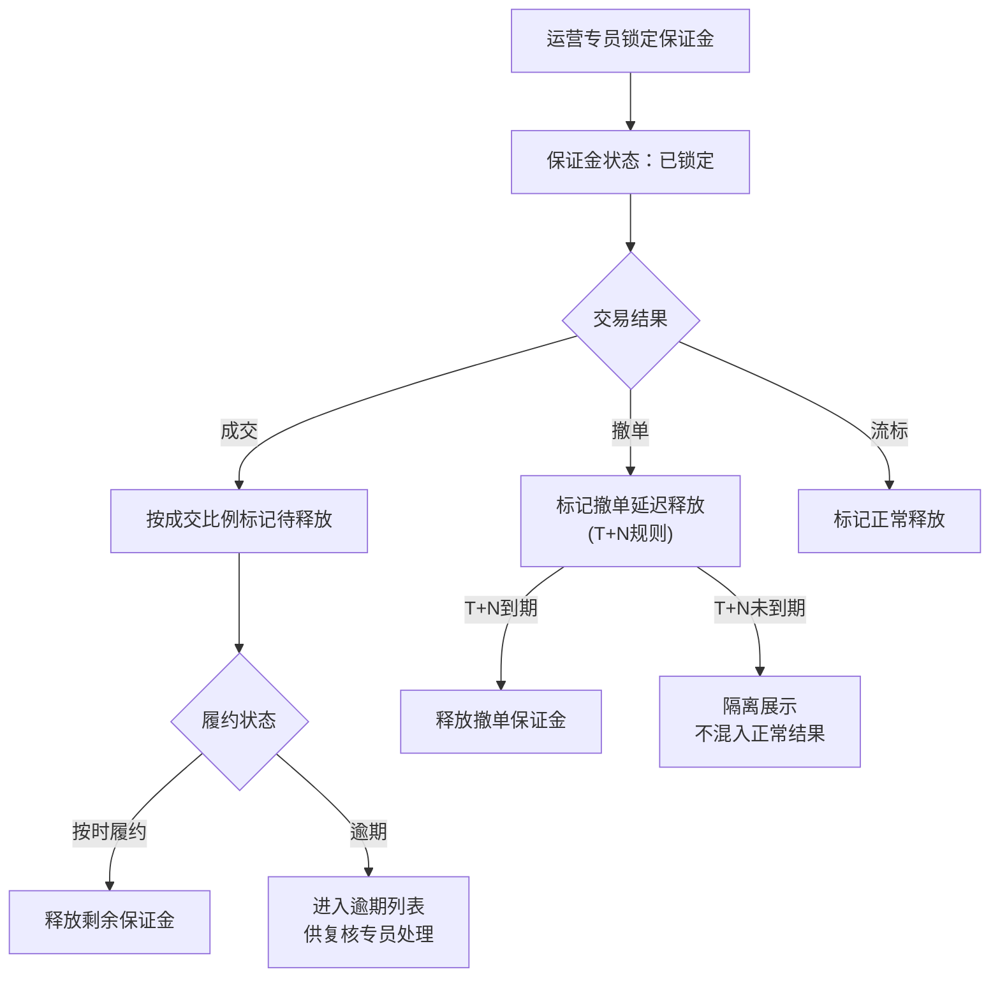
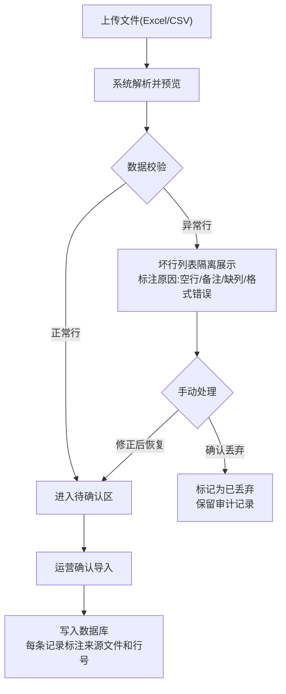
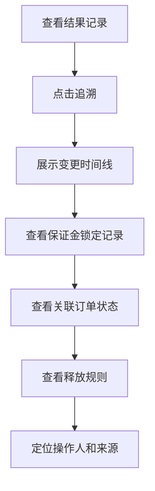

## 1. 产品概述

碳配额交易保证金管理系统，面向碳交易运营团队，替代手工台账，实现企业竞价前保证金锁定、成交/撤单/履约释放的全流程数字化管理。系统核心解决跨批次保证金流水混乱、脏数据混杂、操作无追溯等问题，确保从企业账户到报告导出的全链路可审计、可追溯。

- 目标用户：碳交易运营人员、复核人员
- 核心价值：消除手工台账误差，保证金锁定-释放全链路可追溯，脏数据隔离不污染正常结果

## 2. 核心功能

### 2.1 用户角色

| 角色 | 权限说明 |
|------|----------|
| 运营专员 | 录入保证金流水、锁定/释放保证金、导入数据、生成报告 |
| 复核专员 | 审核异常操作、复核成交拆分与履约逾期、确认撤单释放 |

### 2.2 功能模块

1. **总览仪表盘**：关键指标卡片、异常预警、批次进度概览
2. **保证金管理**：锁定、释放、跨批次流水、撤单延迟释放隔离
3. **交易订单管理**：竞价订单状态跟踪、成交拆分、履约逾期筛选
4. **数据导入与清洗**：保证金流水/履约证明导入、坏行检测与单独列出
5. **审计追溯**：全量变更记录、来源标注、前后值对比、链路追踪
6. **报告导出**：按企业/批次生成保证金报告，可追溯到原始流水

### 2.3 页面详情

| 页面名称 | 模块名称 | 功能描述 |
|----------|----------|----------|
| 总览仪表盘 | 指标卡片 | 已锁定保证金总额、待释放金额、撤单延迟释放数、履约逾期数 |
| 总览仪表盘 | 异常预警 | 撤单释放晚、履约逾期、跨批次未闭环的实时告警列表 |
| 总览仪表盘 | 批次进度 | 当前各交易批次的保证金锁定/释放比例进度条 |
| 保证金管理 | 保证金锁定 | 选择企业→输入金额→选择批次→锁定保证金，自动记录操作来源 |
| 保证金管理 | 保证金释放 | 按释放规则（成交/撤单/履约）释放，撤单延迟释放标红隔离展示 |
| 保证金管理 | 跨批次流水 | 按企业维度展示跨批次保证金流水，支持批次切换和穿透查看 |
| 保证金管理 | 释放规则配置 | 配置不同释放场景的规则（成交自动释放、撤单T+N释放、履约到期释放） |
| 交易订单管理 | 订单列表 | 竞价订单列表，按状态筛选（待竞价/已成交/已撤单/履约中/已履约） |
| 交易订单管理 | 成交拆分 | 一笔保证金对应多笔成交时的拆分明细，标记拆分比例供复核 |
| 交易订单管理 | 履约逾期 | 筛选履约到期未完成的订单，标记逾期天数，供复核专员处理 |
| 数据导入与清洗 | 文件上传 | 上传保证金流水、履约证明等Excel/CSV文件 |
| 数据导入与清洗 | 预览与校验 | 预览导入数据，自动检测空行、缺列、格式异常，坏行单独列出具名原因 |
| 数据导入与清洗 | 坏行列表 | 展示所有被隔离的坏行，标注行号、原因（空行/备注行/缺列/格式错误），支持手动恢复 |
| 审计追溯 | 变更时间线 | 按实体（企业/订单/保证金记录）展示全量变更时间线，每条含来源、操作人、前后值 |
| 审计追溯 | 链路追踪 | 从一条结果反向追到保证金锁定→订单状态→释放规则的完整链路 |
| 审计追溯 | 来源标注 | 每条记录标注来源（手工录入/文件导入/系统自动），导入文件记录文件名和行号 |
| 报告导出 | 报告生成 | 按企业+批次生成保证金管理报告，含锁定/释放/逾期汇总 |
| 报告导出 | 链路验证 | 报告中每行数据可点击追溯到原始保证金流水和操作记录 |

## 3. 核心流程

### 3.1 保证金锁定-交易-释放主流程

运营专员选择企业和批次，输入锁定金额，系统锁定保证金并记录来源。企业竞价成交后，系统按释放规则自动标记待释放；若撤单，保证金按T+N规则延迟释放，标记为"撤单延迟释放"不混入正常结果。履约到期后自动释放剩余保证金，逾期则进入逾期列表供复核。

### 3.2 数据导入与清洗流程

### 3.3 审计追溯流程

## 4. 用户界面设计

### 4.1 设计风格

- **主色调**：深青色(#0F766E)为主，琥珀色(#D97706)为警示强调色，中性色用锌灰(zinc)
- **按钮风格**：圆角8px，主操作实色填充，次要操作描边，危险操作红色填充
- **字体**：标题用 DM Sans (bold)，正文用 Noto Sans SC (regular)，数据表格用 JetBrains Mono
- **布局风格**：左侧固定导航 + 右侧内容区，内容区顶部面包屑+操作栏
- **图标风格**：Lucide 线性图标，16px/20px 两种规格

### 4.2 页面设计概览

| 页面名称 | 模块名称 | UI元素 |
|----------|----------|--------|
| 总览仪表盘 | 指标卡片 | 4列网格卡片，每卡片含图标+数值+趋势箭头，深青色渐变背景 |
| 总览仪表盘 | 异常预警 | 右侧面板，红色/琥珀色标签，点击可跳转详情 |
| 总览仪表盘 | 批次进度 | 水平进度条组，锁定比例用青色、已释放用绿色、延迟释放用琥珀色 |
| 保证金管理 | 锁定操作 | 模态对话框，表单含企业选择器、金额输入、批次选择、备注 |
| 保证金管理 | 流水表格 | 宽表格，状态列用彩色徽章，撤单延迟释放行用琥珀色背景高亮 |
| 保证金管理 | 跨批次视图 | 标签页切换批次，下方为当前批次流水详情 |
| 交易订单管理 | 订单列表 | 可筛选表格，状态列用不同颜色徽章，成交拆分行可展开 |
| 交易订单管理 | 履约逾期 | 筛选面板+表格，逾期天数用红色粗体，复核按钮在行尾 |
| 数据导入与清洗 | 上传区 | 虚线拖拽区，支持点击上传，显示文件名和大小 |
| 数据导入与清洗 | 预览表格 | 左侧正常行（绿色边框），右侧坏行（红色边框），底部统计 |
| 数据导入与清洗 | 坏行列表 | 独立表格，每行含行号、原内容、原因标签、操作按钮 |
| 审计追溯 | 时间线 | 垂直时间线组件，每个节点含时间、操作人、来源、前后值diff |
| 审计追溯 | 链路图 | 水平流程图，节点可点击展开详情 |
| 报告导出 | 报告列表 | 卡片列表，每卡片含企业名、批次、汇总数据、生成/下载按钮 |
| 报告导出 | 链路验证 | 报告预览中数据行含追溯图标，点击弹出链路图 |

### 4.3 响应式设计

- 桌面优先设计，最小宽度1280px
- 表格在小屏幕下支持水平滚动
- 侧边导航可折叠为图标模式
