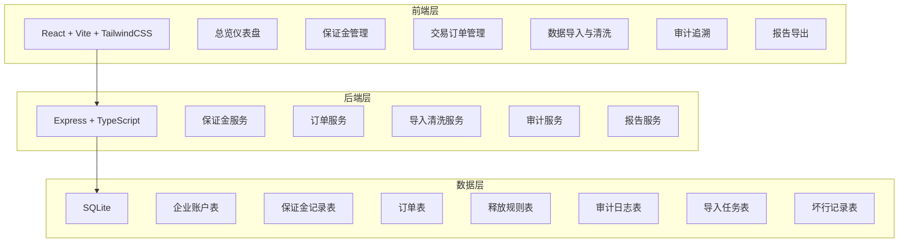
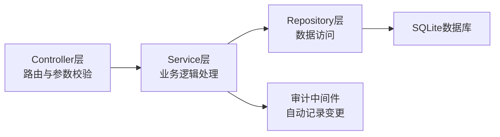
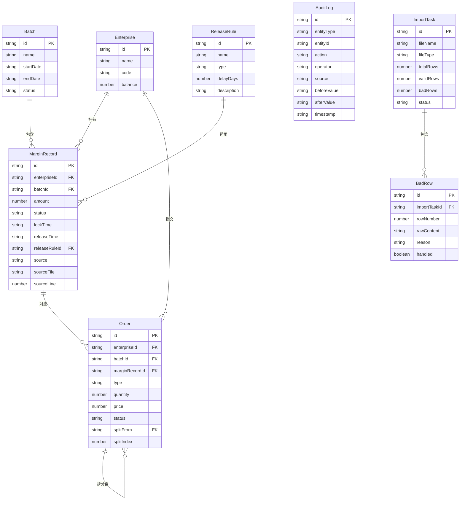

## 1. 架构设计



## 2. 技术说明

- 前端：React@18 + TailwindCSS@3 + Vite + Zustand
- 初始化工具：vite-init
- 后端：Express@4 + TypeScript (ESM)
- 数据库：SQLite (better-sqlite3)
- 数据导入解析：xlsx 库解析 Excel/CSV
- 报告导出：前端生成，使用 jsPDF + autoTable

## 3. 路由定义

| 路由 | 用途 |
|------|------|
| / | 总览仪表盘，关键指标和异常预警 |
| /margin | 保证金管理，锁定/释放/跨批次流水 |
| /orders | 交易订单管理，订单状态和成交拆分 |
| /import | 数据导入与清洗，上传和坏行处理 |
| /audit | 审计追溯，变更时间线和链路追踪 |
| /reports | 报告导出，生成和下载保证金报告 |

## 4. API定义

### 4.1 保证金相关

```typescript
interface MarginRecord {
  id: string
  enterpriseId: string
  enterpriseName: string
  batchId: string
  batchName: string
  amount: number
  status: "locked" | "pending_release" | "released" | "delayed_release"
  lockTime: string
  releaseTime: string | null
  releaseRule: string | null
  source: "manual" | "import" | "system"
  sourceFile: string | null
  sourceLine: number | null
  remark: string | null
}

interface LockMarginRequest {
  enterpriseId: string
  batchId: string
  amount: number
  remark?: string
}

interface ReleaseMarginRequest {
  recordId: string
  releaseType: "deal" | "cancel" | "compliance"
  amount?: number
  remark?: string
}

// POST /api/margin/lock - 锁定保证金
// POST /api/margin/release - 释放保证金
// GET /api/margin/list - 保证金列表（支持企业/批次/状态筛选）
// GET /api/margin/:id - 保证金详情
// GET /api/margin/enterprise/:id/cross-batch - 企业跨批次保证金视图
```

### 4.2 订单相关

```typescript
interface Order {
  id: string
  enterpriseId: string
  enterpriseName: string
  batchId: string
  marginRecordId: string
  type: "bid" | "ask"
  quantity: number
  price: number
  status: "pending" | "dealt" | "cancelled" | "complying" | "complied" | "overdue"
  dealTime: string | null
  cancelTime: string | null
  complianceDeadline: string | null
  complianceTime: string | null
  splitFrom: string | null
  splitIndex: number | null
}

// GET /api/orders - 订单列表（支持状态/企业/批次筛选）
// GET /api/orders/:id - 订单详情
// GET /api/orders/overdue - 履约逾期列表
// GET /api/orders/:id/splits - 成交拆分详情
// GET /api/orders/:id/trace - 从订单追溯保证金和释放规则
```

### 4.3 导入清洗相关

```typescript
interface ImportTask {
  id: string
  fileName: string
  fileType: "margin_flow" | "compliance_proof"
  totalRows: number
  validRows: number
  badRows: number
  status: "previewing" | "confirmed" | "discarded"
  createdAt: string
}

interface BadRow {
  id: string
  importTaskId: string
  rowNumber: number
  rawContent: string
  reason: "empty_row" | "remark_row" | "missing_column" | "format_error"
  handled: boolean
  handleAction: "restored" | "discarded" | null
}

// POST /api/import/upload - 上传文件并解析
// GET /api/import/:id/preview - 预览导入数据
// GET /api/import/:id/bad-rows - 获取坏行列表
// POST /api/import/:id/confirm - 确认导入
// POST /api/import/bad-rows/:id/restore - 恢复坏行
// POST /api/import/bad-rows/:id/discard - 丢弃坏行
```

### 4.4 审计相关

```typescript
interface AuditLog {
  id: string
  entityType: "margin" | "order" | "rule" | "import"
  entityId: string
  action: "create" | "update" | "delete" | "lock" | "release" | "import"
  operator: string
  source: "manual" | "import" | "system"
  sourceFile: string | null
  sourceLine: number | null
  beforeValue: Record<string, unknown> | null
  afterValue: Record<string, unknown> | null
  timestamp: string
}

interface TraceResult {
  entityId: string
  entityType: string
  marginLock: MarginRecord | null
  order: Order | null
  releaseRule: ReleaseRule | null
  auditTrail: AuditLog[]
}

// GET /api/audit/logs - 审计日志列表（支持实体类型/ID/时间筛选）
// GET /api/audit/trace/:entityType/:id - 链路追踪
```

### 4.5 报告相关

```typescript
interface Report {
  id: string
  enterpriseId: string
  enterpriseName: string
  batchId: string
  batchName: string
  totalLocked: number
  totalReleased: number
  pendingRelease: number
  delayedRelease: number
  overdueCount: number
  generatedAt: string
}

// POST /api/reports/generate - 生成报告
// GET /api/reports - 报告列表
// GET /api/reports/:id - 报告详情
// GET /api/reports/:id/trace/:rowId - 报告数据行追溯
```

## 5. 服务端架构图



## 6. 数据模型

### 6.1 数据模型定义



### 6.2 数据定义语言

```sql
CREATE TABLE enterprise (
  id TEXT PRIMARY KEY,
  name TEXT NOT NULL,
  code TEXT NOT NULL UNIQUE,
  balance REAL NOT NULL DEFAULT 0
);

CREATE TABLE batch (
  id TEXT PRIMARY KEY,
  name TEXT NOT NULL,
  start_date TEXT NOT NULL,
  end_date TEXT NOT NULL,
  status TEXT NOT NULL CHECK(status IN ('active', 'closed', 'settling'))
);

CREATE TABLE release_rule (
  id TEXT PRIMARY KEY,
  name TEXT NOT NULL,
  type TEXT NOT NULL CHECK(type IN ('deal', 'cancel', 'compliance')),
  delay_days INTEGER NOT NULL DEFAULT 0,
  description TEXT
);

CREATE TABLE margin_record (
  id TEXT PRIMARY KEY,
  enterprise_id TEXT NOT NULL REFERENCES enterprise(id),
  batch_id TEXT NOT NULL REFERENCES batch(id),
  amount REAL NOT NULL,
  status TEXT NOT NULL CHECK(status IN ('locked', 'pending_release', 'released', 'delayed_release')),
  lock_time TEXT NOT NULL,
  release_time TEXT,
  release_rule_id TEXT REFERENCES release_rule(id),
  source TEXT NOT NULL CHECK(source IN ('manual', 'import', 'system')),
  source_file TEXT,
  source_line INTEGER,
  remark TEXT,
  created_at TEXT NOT NULL DEFAULT (datetime('now')),
  updated_at TEXT NOT NULL DEFAULT (datetime('now'))
);

CREATE TABLE "order" (
  id TEXT PRIMARY KEY,
  enterprise_id TEXT NOT NULL REFERENCES enterprise(id),
  batch_id TEXT NOT NULL REFERENCES batch(id),
  margin_record_id TEXT NOT NULL REFERENCES margin_record(id),
  type TEXT NOT NULL CHECK(type IN ('bid', 'ask')),
  quantity REAL NOT NULL,
  price REAL NOT NULL,
  status TEXT NOT NULL CHECK(status IN ('pending', 'dealt', 'cancelled', 'complying', 'complied', 'overdue')),
  deal_time TEXT,
  cancel_time TEXT,
  compliance_deadline TEXT,
  compliance_time TEXT,
  split_from TEXT REFERENCES "order"(id),
  split_index INTEGER,
  created_at TEXT NOT NULL DEFAULT (datetime('now')),
  updated_at TEXT NOT NULL DEFAULT (datetime('now'))
);

CREATE TABLE audit_log (
  id TEXT PRIMARY KEY,
  entity_type TEXT NOT NULL CHECK(entity_type IN ('margin', 'order', 'rule', 'import')),
  entity_id TEXT NOT NULL,
  action TEXT NOT NULL CHECK(action IN ('create', 'update', 'delete', 'lock', 'release', 'import')),
  operator TEXT NOT NULL DEFAULT 'system',
  source TEXT NOT NULL CHECK(source IN ('manual', 'import', 'system')),
  source_file TEXT,
  source_line INTEGER,
  before_value TEXT,
  after_value TEXT,
  timestamp TEXT NOT NULL DEFAULT (datetime('now'))
);

CREATE TABLE import_task (
  id TEXT PRIMARY KEY,
  file_name TEXT NOT NULL,
  file_type TEXT NOT NULL CHECK(file_type IN ('margin_flow', 'compliance_proof')),
  total_rows INTEGER NOT NULL DEFAULT 0,
  valid_rows INTEGER NOT NULL DEFAULT 0,
  bad_rows INTEGER NOT NULL DEFAULT 0,
  status TEXT NOT NULL CHECK(status IN ('previewing', 'confirmed', 'discarded')),
  created_at TEXT NOT NULL DEFAULT (datetime('now'))
);

CREATE TABLE bad_row (
  id TEXT PRIMARY KEY,
  import_task_id TEXT NOT NULL REFERENCES import_task(id),
  row_number INTEGER NOT NULL,
  raw_content TEXT NOT NULL,
  reason TEXT NOT NULL CHECK(reason IN ('empty_row', 'remark_row', 'missing_column', 'format_error')),
  handled INTEGER NOT NULL DEFAULT 0,
  handle_action TEXT CHECK(handle_action IN ('restored', 'discarded')),
  created_at TEXT NOT NULL DEFAULT (datetime('now'))
);

CREATE INDEX idx_margin_enterprise ON margin_record(enterprise_id);
CREATE INDEX idx_margin_batch ON margin_record(batch_id);
CREATE INDEX idx_margin_status ON margin_record(status);
CREATE INDEX idx_order_enterprise ON "order"(enterprise_id);
CREATE INDEX idx_order_batch ON "order"(batch_id);
CREATE INDEX idx_order_status ON "order"(status);
CREATE INDEX idx_audit_entity ON audit_log(entity_type, entity_id);
CREATE INDEX idx_audit_timestamp ON audit_log(timestamp);
CREATE INDEX idx_badrow_task ON bad_row(import_task_id);
```
