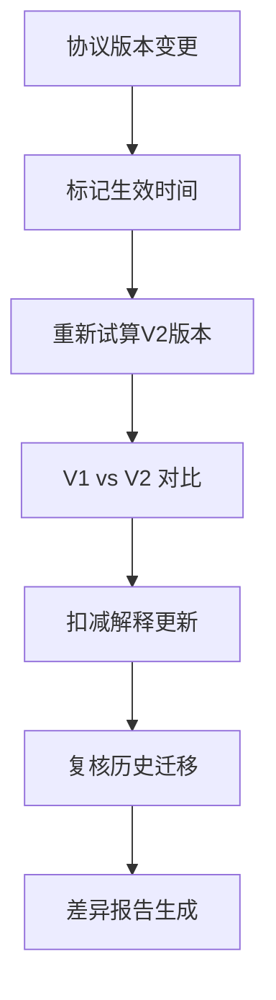

## 1. 产品概述
医药返利合规核算系统，专为药企财务BP设计，解决返利协议滞后、数据不完整、试算对比困难等业务痛点。系统支持从样例导入到报告输出的完整流程，实现人工修正全程留痕、协议版本追溯、返利试算多版本对比，确保财务核算的合规性与可追溯性。

## 2. 核心特性

### 2.1 用户角色
| 角色 | 注册方式 | 核心权限 |
|------|----------|----------|
| 财务BP | 系统分配 | 数据导入、返利试算、人工修正、报告生成、版本对比 |
| 复核人员 | 系统分配 | 查看试算结果、复核历史、导出报告 |
| 系统管理员 | 系统分配 | 用户管理、系统配置、数据备份 |

### 2.2 功能模块
1. **数据工作台**: 经销商档案管理、销售发货录入、回款流水导入
2. **协议管理**: 返利协议录入、版本追溯、生效时间管理
3. **返利试算**: 自动试算、人工调整、扣减解释、试算版本对比
4. **修正中心**: 回款冲销建议、销量退货处理、数据清洗记录
5. **报告输出**: 合规报告生成、历史回溯、差异分析报告

### 2.3 页面详情
| 页面名称 | 模块名称 | 功能描述 |
|----------|----------|----------|
| 数据工作台 | 经销商档案 | 导入/导出、备注管理、字段完整性检查 |
| 数据工作台 | 销售发货 | 批量导入、缺字段提示、修改历史记录 |
| 数据工作台 | 回款流水 | 延迟到账标记、对账匹配、到账提醒 |
| 协议管理 | 协议录入 | 多版本管理、生效时间、追溯配置 |
| 协议管理 | 版本追溯 | 版本对比、变更记录、生效范围可视化 |
| 返利试算 | 试算引擎 | 多维度计算、规则引擎、异常标记 |
| 返利试算 | 人工调整 | 修正留痕、原因记录、复核流程 |
| 返利试算 | 版本对比 | 新旧结果差异、扣减解释变化、复核历史 |
| 修正中心 | 冲销建议 | 可操作建议、一键执行、操作记录 |
| 修正中心 | 退货处理 | 销量调整、库存联动、影响分析 |
| 报告输出 | 合规报告 | PDF/Excel导出、审计痕迹、签名确认 |
| 报告输出 | 差异分析 | 变更可视化、影响范围、责任人追踪 |

## 3. 核心流程

### 3.1 返利核算主流程

### 3.2 协议变更追溯流程

### 3.3 数据修正留痕流程

## 4. 用户界面设计

### 4.1 设计风格
- **主色调**: 专业蓝 (#165DFF) - 体现财务合规的专业性
- **辅助色**: 警示橙 (#FF7D00) - 标记异常和待处理项；成功绿 (#00B42A) - 标记完成项
- **中性色**: 深灰 (#1D2129) 正文、中灰 (#4E5969) 次要文字、浅灰 (#F2F3F5) 背景
- **按钮风格**: 圆角8px，主按钮实色填充，次要按钮描边
- **字体**: 标题使用思源黑体 Bold，正文使用思源黑体 Regular，数字使用等宽字体
- **布局风格**: 卡片式布局，左侧导航+右侧内容区，清晰的信息层级
- **图标风格**: 线性图标，统一24px尺寸，蓝白配色

### 4.2 页面设计总览
| 页面名称 | 模块名称 | UI元素 |
|----------|----------|--------|
| 数据工作台 | 总览仪表板 | 数据质量评分卡片、待处理事项列表、导入进度条 |
| 数据工作台 | 经销商档案 | 表格+筛选、备注展开面板、完整性进度条 |
| 数据工作台 | 销售发货 | 批量导入区、缺字段高亮、修改历史侧边栏 |
| 协议管理 | 协议列表 | 时间轴视图、版本标签、生效状态徽章 |
| 协议管理 | 版本追溯 | 双列对比视图、变更差异高亮、时间滑块 |
| 返利试算 | 试算主页面 | 计算进度环形图、结果卡片、异常提示横幅 |
| 返利试算 | 版本对比 | 左右分栏对比、差异行高亮、变更图例 |
| 修正中心 | 建议列表 | 优先级标签、一键执行按钮、影响预览抽屉 |
| 报告输出 | 报告预览 | 分页预览、导出按钮组、审计痕迹折叠面板 |

### 4.3 响应式设计
- **桌面优先**: 1440px基准设计，适配1920px大屏
- **平板适配**: 1024px时导航折叠为图标模式，表格横向滚动
- **触控优化**: 最小触摸目标44px，重要操作按钮放大
- **打印优化**: 报告页面提供打印专用样式，隐藏导航和操作按钮

### 4.4 动效设计
- **页面加载**: 骨架屏渐入，内容区块错峰显示（间隔100ms）
- **数据更新**: 数值变化时数字滚动动画，表格行高亮闪烁
- **版本切换**: 平滑过渡动画，差异点脉冲提示
- **操作反馈**: 按钮点击缩放效果，成功/失败toast通知
