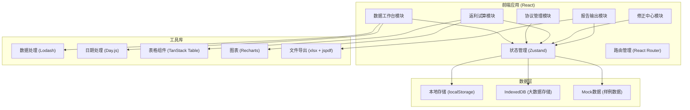
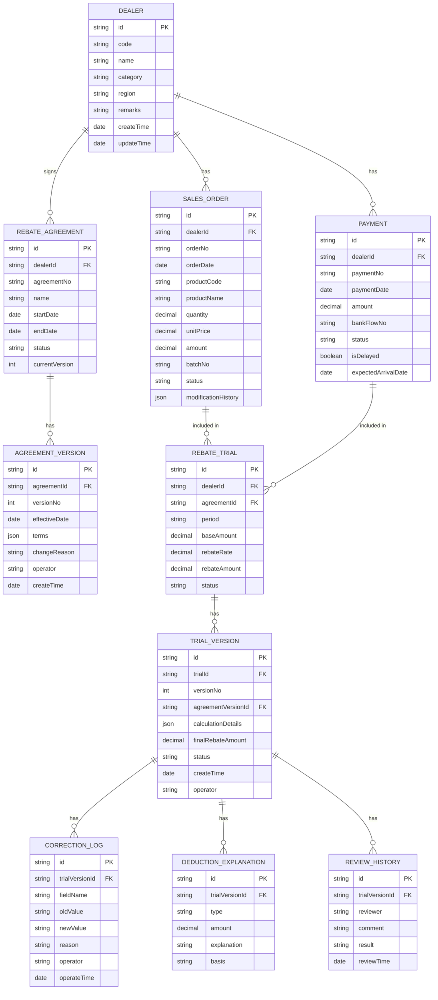

## 1. 架构设计



## 2. 技术描述
- **前端框架**: React@18 + TypeScript
- **构建工具**: Vite@5
- **样式方案**: TailwindCSS@3 + CSS变量
- **状态管理**: Zustand (轻量级状态管理)
- **路由方案**: React Router@6
- **表格组件**: TanStack Table@8
- **图表库**: Recharts@2
- **数据处理**: Lodash + Day.js
- **文件导出**: xlsx (Excel) + jspdf (PDF)
- **数据存储**: localStorage + IndexedDB (浏览器端持久化)
- **代码规范**: ESLint + Prettier

## 3. 路由定义
| 路由路径 | 页面名称 | 用途说明 |
|----------|----------|----------|
| /dashboard | 数据工作台总览 | 数据质量概览、待处理事项 |
| /data/dealers | 经销商档案 | 经销商信息管理、备注查看 |
| /data/sales | 销售发货 | 销售数据导入、编辑、历史记录 |
| /data/payments | 回款流水 | 回款记录、到账匹配 |
| /agreement/list | 协议列表 | 返利协议管理、版本展示 |
| /agreement/trace | 协议追溯 | 版本对比、变更历史 |
| /trial/calculate | 返利试算 | 自动计算、人工调整 |
| /trial/compare | 版本对比 | 新旧试算结果对比分析 |
| /correction/suggestions | 修正建议 | 回款冲销、退货处理建议 |
| /report/preview | 报告预览 | 合规报告生成与导出 |
| /report/diff | 差异报告 | 变更影响分析报告 |

## 4. 数据模型

### 4.1 数据模型ER图


### 4.2 核心状态模型 (TypeScript)
```typescript
// 经销商
interface Dealer {
  id: string;
  code: string;
  name: string;
  category: string;
  region: string;
  remarks: string;
  createTime: string;
  updateTime: string;
}

// 销售发货
interface SalesOrder {
  id: string;
  dealerId: string;
  orderNo: string;
  orderDate: string;
  productCode: string;
  productName: string;
  quantity: number;
  unitPrice: number;
  amount: number;
  batchNo: string;
  status: 'normal' | 'returned' | 'corrected';
  modificationHistory: ModificationRecord[];
  missingFields: string[];
}

// 返利协议
interface RebateAgreement {
  id: string;
  dealerId: string;
  agreementNo: string;
  name: string;
  startDate: string;
  endDate: string;
  status: 'draft' | 'active' | 'expired';
  currentVersion: number;
  versions: AgreementVersion[];
}

// 协议版本
interface AgreementVersion {
  id: string;
  agreementId: string;
  versionNo: number;
  effectiveDate: string;
  terms: AgreementTerms;
  changeReason: string;
  operator: string;
  createTime: string;
}

// 试算版本
interface TrialVersion {
  id: string;
  trialId: string;
  versionNo: number;
  agreementVersionId: string;
  calculationDetails: CalculationDetail[];
  deductions: DeductionItem[];
  finalRebateAmount: number;
  status: 'draft' | 'calculated' | 'adjusted' | 'reviewed';
  createTime: string;
  operator: string;
  correctionLogs: CorrectionLog[];
  reviewHistory: ReviewRecord[];
}

// 修正建议
interface CorrectionSuggestion {
  id: string;
  type: 'payment_writeoff' | 'sales_return' | 'data_clean';
  priority: 'high' | 'medium' | 'low';
  title: string;
  description: string;
  actionableSteps: string[];
  affectedOrders: string[];
  impactPreview: ImpactPreview;
  status: 'pending' | 'applied' | 'dismissed';
}
```

## 5. 核心模块设计

### 5.1 返利试算引擎
```typescript
// 试算规则引擎
interface RebateCalculationEngine {
  calculate(
    dealerId: string,
    agreementVersion: AgreementVersion,
    salesOrders: SalesOrder[],
    payments: Payment[]
  ): TrialCalculationResult;
  
  applyCorrection(
    trialVersion: TrialVersion,
    correction: CorrectionData
  ): TrialVersion;
  
  compareVersions(
    v1: TrialVersion,
    v2: TrialVersion
  ): VersionDifference;
}

// 版本对比器
interface VersionComparator {
  compareTrialVersions(v1Id: string, v2Id: string): DiffReport;
  compareAgreementVersions(v1Id: string, v2Id: string): AgreementDiff;
  generateDiffReport(diff: DiffReport): string;
}
```

### 5.2 审计留痕机制
```typescript
// 操作日志记录器
interface AuditTrailService {
  logModification(
    entityType: string,
    entityId: string,
    fieldName: string,
    oldValue: any,
    newValue: any,
    reason: string,
    operator: string
  ): void;
  
  getModificationHistory(
    entityType: string,
    entityId: string
  ): ModificationRecord[];
  
  generateAuditReport(
    startDate: string,
    endDate: string
  ): AuditReport;
}
```

## 6. 样例数据结构
系统将内置完整的样例数据集，包括：
- 10家经销商档案（含备注）
- 100条销售发货记录（部分缺字段）
- 50条回款流水（含延迟到账）
- 5份返利协议（每份含2-3个版本）
- 完整的试算历史和修正记录
