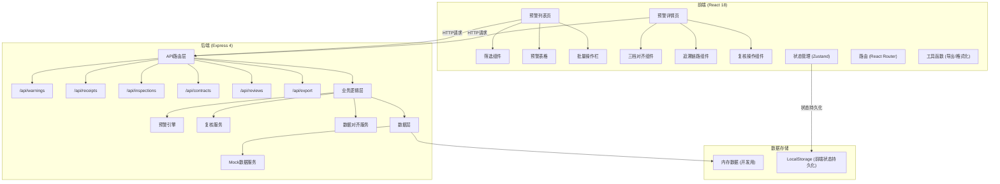
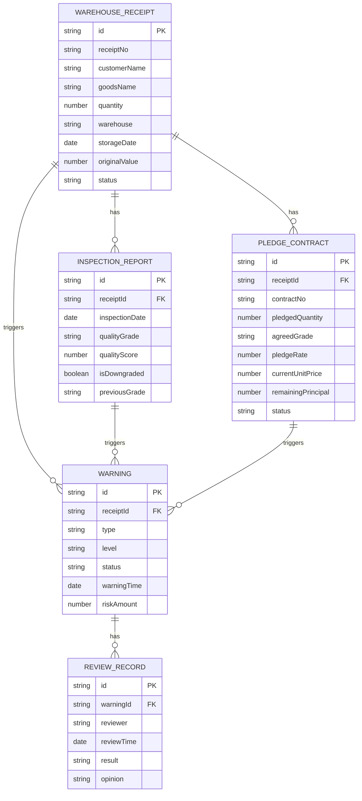

## 1. 架构设计



## 2. 技术描述

- **前端**：React@18 + TypeScript + Vite + React Router@6 + Zustand + TailwindCSS@3 + lucide-react + xlsx
- **后端**：Express@4 + TypeScript + cors
- **初始化工具**：vite-init react-express-ts
- **数据**：Mock数据（内存存储），含正常样例和异常样例（质检降级、重复仓单、价格缺口）
- **状态持久化**：Zustand + LocalStorage，刷新不丢筛选条件和复核状态

## 3. 路由定义

| 路由 | 用途 |
|-------|---------|
| / | 预警列表页（首页） |
| /warnings/:id | 预警详情页 |
| /dashboard | 数据看板 |

### 后端API路由

| 方法 | 路由 | 用途 |
|------|------|------|
| GET | /api/warnings | 获取预警列表（支持筛选参数） |
| GET | /api/warnings/:id | 获取单条预警详情（含关联数据） |
| POST | /api/warnings/:id/review | 提交复核结果 |
| PUT | /api/warnings/refresh | 刷新预警数据（保留筛选条件） |
| GET | /api/warnings/:id/trace | 获取预警追溯链路数据 |
| GET | /api/export/warnings | 导出预警数据为Excel |

## 4. API定义

### TypeScript类型定义

```typescript
// 核心数据类型
type WarningType = 'quality_downgrade' | 'duplicate_receipt' | 'price_gap' | 'normal';
type WarningLevel = 'high' | 'medium' | 'low';
type WarningStatus = 'pending' | 'reviewing' | 'confirmed' | 'dismissed' | 'pending_info';
type QualityGrade = 'A' | 'B' | 'C' | 'D';

interface WarehouseReceipt {
  id: string;
  receiptNo: string;
  customerName: string;
  goodsName: string;
  quantity: number;
  unit: string;
  warehouse: string;
  storageDate: string;
  expiryDate: string;
  status: 'normal' | 'frozen' | 'released' | 'duplicate';
  originalValue: number;
}

interface InspectionReport {
  id: string;
  receiptId: string;
  receiptNo: string;
  inspectionDate: string;
  inspector: string;
  qualityGrade: QualityGrade;
  qualityScore: number;
  moistureContent: number;
  impurityContent: number;
  unitWeight: number;
  remarks: string;
  isDowngraded: boolean;
  previousGrade?: QualityGrade;
}

interface PledgeContract {
  id: string;
  receiptId: string;
  receiptNo: string;
  contractNo: string;
  customerName: string;
  pledgedQuantity: number;
  unit: string;
  agreedGrade: QualityGrade;
  pledgeRate: number;
  originalUnitPrice: number;
  currentUnitPrice: number;
  pledgedAmount: number;
  remainingPrincipal: number;
  startDate: string;
  endDate: string;
  status: 'active' | 'closed' | 'overdue';
}

interface Warning {
  id: string;
  type: WarningType;
  level: WarningLevel;
  status: WarningStatus;
  receiptId: string;
  receiptNo: string;
  customerName: string;
  goodsName: string;
  warningTime: string;
  description: string;
  riskAmount: number;
  receipt: WarehouseReceipt;
  inspections: InspectionReport[];
  contracts: PledgeContract[];
  reviews: ReviewRecord[];
}

interface ReviewRecord {
  id: string;
  warningId: string;
  reviewer: string;
  reviewTime: string;
  result: WarningStatus;
  opinion: string;
}

interface TraceNode {
  id: string;
  type: 'warning' | 'valuation' | 'limit' | 'status';
  title: string;
  description: string;
  time: string;
  data: Record<string, any>;
  previousValue?: any;
  currentValue?: any;
}
```

### 响应格式

```typescript
interface ApiResponse<T> {
  code: number;
  message: string;
  data: T;
  timestamp: string;
}

interface ListResponse<T> {
  items: T[];
  total: number;
  page: number;
  pageSize: number;
}
```

## 5. 数据模型

### 6.1 ER图



### 6.2 Mock数据设计

**样例数据包含：**

1. **正常样例（2条）**：三档数据一致，无预警
2. **质检降级样例（2条）**：
   - 质检报告等级从A降至C，合同约定为A
   - 押品估值从500万降至350万，剩余本金400万，存在50万风险敞口
3. **重复仓单样例（1条）**：
   - 同一仓单编号对应2笔质押合同
   - 仓单数量1000吨，两笔合同分别质押600吨和500吨
4. **价格缺口样例（1条）**：
   - 当前价格2800元/吨 × 质押率70% = 1960元/吨
   - 剩余本金300万，质押数量1500吨，单位剩余本金2000元/吨
   - 存在40元/吨 × 1500吨 = 6万价格缺口

**数据刷新机制：**
- 后端提供`/api/warnings/refresh`接口
- 重新计算所有预警，但保留用户已复核状态
- 前端使用Zustand store + LocalStorage持久化筛选条件
- 刷新按钮仅重新获取数据，不重置筛选条件和页码
