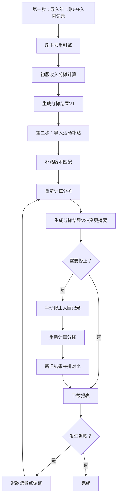

## 1. 产品概述

文旅年卡分摊收入分析系统——面向景区集团财务部门，解决年卡游客跨景点刷卡后按入园次数和活动补贴拆分收入的业务痛点。系统支持分步导入数据、自动去重与分摊计算、手动修正及新旧结果并排对比，确保收入分摊过程透明、可追溯、幂等。

- 目标用户：景区集团财务人员、审计人员
- 核心价值：消除手工拆账错误，实现分摊结果可复现、可修正、可审计

## 2. 核心功能

### 2.1 用户角色

| 角色 | 注册方式 | 核心权限 |
|------|----------|----------|
| 财务专员 | 管理员分配账号 | 导入数据、查看分摊结果、手动修正入园记录 |
| 审计人员 | 管理员分配账号 | 查看分摊结果、导出报表、查看修正历史 |

### 2.2 功能模块

1. **数据导入页**：第一步导入年卡账户和入园记录，第二步补入活动补贴，系统自动标注前后变化
2. **收入分摊看板页**：图表总览（各景点分摊饼图/柱状图）、分摊明细表、一键下载报表
3. **手动修正页**：修正入园记录后，新旧分摊结果并排对比展示

### 2.3 页面详情

| 页面名称 | 模块名称 | 功能描述 |
|----------|----------|----------|
| 数据导入页 | 年卡账户上传 | 上传CSV/Excel，解析年卡号、持卡人、购卡金额、有效期等字段 |
| 数据导入页 | 入园记录上传 | 上传CSV/Excel，解析年卡号、景点ID、入园时间、刷卡流水号等字段 |
| 数据导入页 | 活动补贴上传 | 上传CSV/Excel，解析活动ID、景点ID、补贴金额、生效时段等字段 |
| 数据导入页 | 导入变化摘要 | 展示第二次导入后新增/变更/删除的记录数及明细 |
| 收入分摊看板 | 分摊总览图表 | 饼图显示各景点分摊占比，柱状图显示各景点分摊金额趋势 |
| 收入分摊看板 | 分摊明细表 | 可筛选、可排序的分摊明细，含年卡号、景点、入园次数、分摊金额、补贴金额、退款调整 |
| 收入分摊看板 | 报表下载 | 一键导出分摊结果为Excel/CSV，数据与图表/明细同源 |
| 手动修正页 | 入园记录修正 | 修改入园次数、删除重复刷卡、新增遗漏记录 |
| 手动修正页 | 新旧对比 | 并排展示修正前后的分摊结果，高亮差异行 |

## 3. 核心流程

1. 财务专员第一步上传年卡账户和入园记录 → 系统自动去重（同一年卡同一景点同一天仅计一次有效入园）→ 生成初版分摊结果
2. 财务专员第二步上传活动补贴 → 系统根据补贴版本和入园记录重新计算分摊 → 生成变更摘要
3. 若需修正，财务专员进入手动修正页 → 修改入园记录 → 系统重新计算分摊 → 展示新旧对比
4. 退款发生时，系统自动调整相关景点的分摊金额，退款跨景点时按原分摊比例扣回

## 4. 用户界面设计

### 4.1 设计风格

- 主色调：深靛蓝(#1e3a5f) + 金色点缀(#d4a843)，传达财务系统的专业与可信感
- 辅助色：浅灰背景(#f8f9fa)、白色卡片、红色警示(#e74c3c)用于差异高亮
- 按钮风格：圆角6px，主按钮深靛蓝底白字，次按钮描边风格
- 字体：思源黑体(Noto Sans SC)用于正文，DM Serif Display用于数字展示
- 布局风格：左侧固定导航栏 + 右侧内容区，卡片式布局

### 4.2 页面设计概览

| 页面名称 | 模块名称 | UI元素 |
|----------|----------|--------|
| 数据导入页 | 年卡账户上传 | 拖拽上传区域、字段映射预览表、导入状态指示器 |
| 数据导入页 | 入园记录上传 | 拖拽上传区域、去重预览面板（显示重复刷卡数量）、导入进度条 |
| 数据导入页 | 活动补贴上传 | 拖拽上传区域、补贴生效时段日历视图、版本对比选择器 |
| 数据导入页 | 导入变化摘要 | 变更统计卡片（新增/变更/删除数量）、变更明细折叠列表 |
| 收入分摊看板 | 分摊总览图表 | 饼图（各景点占比）、柱状图（分摊金额对比）、数字摘要卡片 |
| 收入分摊看板 | 分摊明细表 | 可筛选表头、行内操作按钮、分页器、总计行 |
| 收入分摊看板 | 报表下载 | 下载按钮、格式选择下拉、数据源时间戳标注 |
| 手动修正页 | 入园记录修正 | 可编辑表格、行内编辑控件、删除确认弹窗、撤销按钮 |
| 手动修正页 | 新旧对比 | 双栏并排表格、差异行高亮、差异金额气泡提示、变更汇总条 |

### 4.3 响应式设计

- 桌面端优先设计，最小宽度1280px
- 平板端（768px-1279px）侧边栏折叠为图标模式
- 移动端暂不支持（财务系统桌面使用为主）

### 4.4 3D场景

不适用
