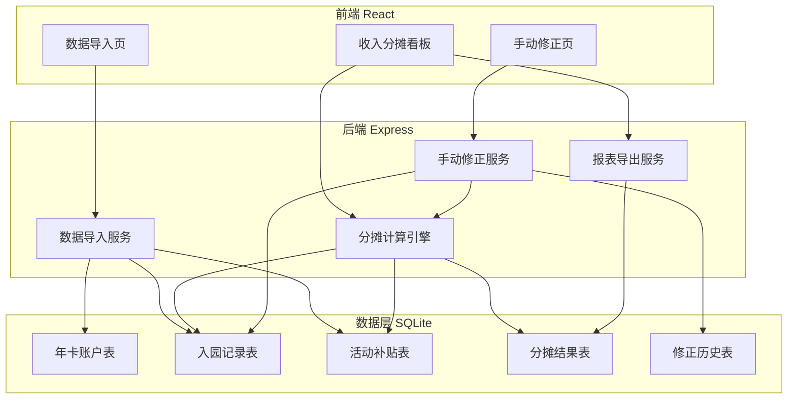
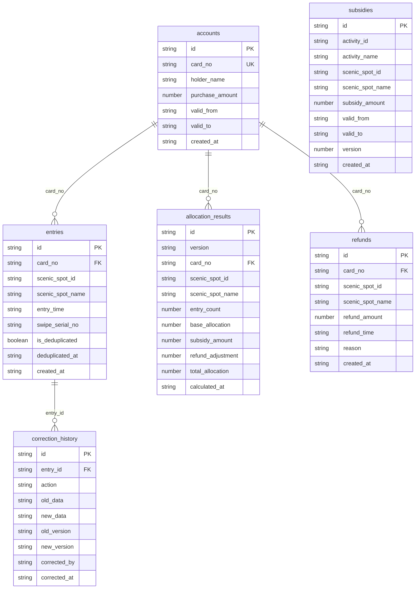

## 1. 架构设计



## 2. 技术说明

- 前端：React@18 + TailwindCSS@3 + Vite
- 初始化工具：vite-init
- 后端：Express@4 + TypeScript (ESM)
- 数据库：SQLite (better-sqlite3)，无需外部服务
- 状态管理：zustand
- 图表库：recharts
- 文件导出：xlsx (SheetJS)
- 路由：react-router-dom

## 3. 路由定义

| 路由 | 用途 |
|------|------|
| / | 重定向至 /import |
| /import | 数据导入页（年卡账户+入园记录+活动补贴） |
| /dashboard | 收入分摊看板（图表+明细+下载） |
| /correction | 手动修正页（入园记录修正+新旧对比） |

## 4. API 定义

### 4.1 数据导入

```
POST /api/import/accounts
  Body: FormData { file: File }
  Response: { success: boolean, count: number, errors: string[] }

POST /api/import/entries
  Body: FormData { file: File }
  Response: { success: boolean, count: number, duplicates: number, errors: string[] }

POST /api/import/subsidies
  Body: FormData { file: File }
  Response: { success: boolean, count: number, changes: { added: number, updated: number, removed: number }, errors: string[] }
```

### 4.2 分摊计算

```
POST /api/allocation/calculate
  Body: { version?: string }
  Response: { version: string, results: AllocationResult[], summary: AllocationSummary }

GET /api/allocation/results
  Query: { version?: string, scenicSpotId?: string, cardNo?: string }
  Response: { results: AllocationResult[], total: number }

GET /api/allocation/summary
  Response: AllocationSummary
```

### 4.3 手动修正

```
PUT /api/correction/entry/:id
  Body: { action: "update" | "delete", data?: Partial<Entry> }
  Response: { success: boolean, newAllocationVersion: string }

POST /api/correction/entry
  Body: Entry
  Response: { success: boolean, newAllocationVersion: string }

GET /api/correction/compare
  Query: { oldVersion: string, newVersion: string }
  Response: { old: AllocationResult[], new: AllocationResult[], diffs: AllocationDiff[] }
```

### 4.4 报表导出

```
GET /api/export/excel
  Query: { version?: string }
  Response: Binary Excel file

GET /api/export/csv
  Query: { version?: string }
  Response: Binary CSV file
```

### 4.5 TypeScript 类型定义

```typescript
interface Account {
  id: string;
  cardNo: string;
  holderName: string;
  purchaseAmount: number;
  validFrom: string;
  validTo: string;
}

interface Entry {
  id: string;
  cardNo: string;
  scenicSpotId: string;
  scenicSpotName: string;
  entryTime: string;
  swipeSerialNo: string;
  isDeduplicated: boolean;
  deduplicatedAt?: string;
}

interface Subsidy {
  id: string;
  activityId: string;
  activityName: string;
  scenicSpotId: string;
  scenicSpotName: string;
  subsidyAmount: number;
  validFrom: string;
  validTo: string;
  version: number;
}

interface AllocationResult {
  id: string;
  version: string;
  cardNo: string;
  scenicSpotId: string;
  scenicSpotName: string;
  entryCount: number;
  baseAllocation: number;
  subsidyAmount: number;
  refundAdjustment: number;
  totalAllocation: number;
  calculatedAt: string;
}

interface AllocationSummary {
  version: string;
  totalRevenue: number;
  totalSubsidy: number;
  totalRefundAdjustment: number;
  netAllocation: number;
  scenicSpotBreakdown: { scenicSpotId: string; scenicSpotName: string; amount: number }[];
}

interface AllocationDiff {
  cardNo: string;
  scenicSpotId: string;
  scenicSpotName: string;
  oldEntryCount: number;
  newEntryCount: number;
  oldTotalAllocation: number;
  newTotalAllocation: number;
  diffAmount: number;
}

interface CorrectionHistory {
  id: string;
  entryId: string;
  action: "update" | "delete" | "add";
  oldData: Partial<Entry> | null;
  newData: Partial<Entry> | null;
  oldVersion: string;
  newVersion: string;
  correctedBy: string;
  correctedAt: string;
}
```

## 5. 服务器架构图


## 6. 数据模型

### 6.1 数据模型定义



### 6.2 数据定义语言

```sql
CREATE TABLE IF NOT EXISTS accounts (
  id TEXT PRIMARY KEY,
  card_no TEXT UNIQUE NOT NULL,
  holder_name TEXT NOT NULL,
  purchase_amount REAL NOT NULL,
  valid_from TEXT NOT NULL,
  valid_to TEXT NOT NULL,
  created_at TEXT DEFAULT (datetime('now'))
);

CREATE TABLE IF NOT EXISTS entries (
  id TEXT PRIMARY KEY,
  card_no TEXT NOT NULL,
  scenic_spot_id TEXT NOT NULL,
  scenic_spot_name TEXT NOT NULL,
  entry_time TEXT NOT NULL,
  swipe_serial_no TEXT NOT NULL,
  is_deduplicated INTEGER DEFAULT 0,
  deduplicated_at TEXT,
  created_at TEXT DEFAULT (datetime('now')),
  FOREIGN KEY (card_no) REFERENCES accounts(card_no)
);

CREATE INDEX IF NOT EXISTS idx_entries_card_no ON entries(card_no);
CREATE INDEX IF NOT EXISTS idx_entries_scenic_spot ON entries(scenic_spot_id);
CREATE INDEX IF NOT EXISTS idx_entries_dedup ON entries(is_deduplicated);
CREATE UNIQUE INDEX IF NOT EXISTS idx_entries_unique_swipe ON entries(card_no, scenic_spot_id, date(entry_time), swipe_serial_no);

CREATE TABLE IF NOT EXISTS subsidies (
  id TEXT PRIMARY KEY,
  activity_id TEXT NOT NULL,
  activity_name TEXT NOT NULL,
  scenic_spot_id TEXT NOT NULL,
  scenic_spot_name TEXT NOT NULL,
  subsidy_amount REAL NOT NULL,
  valid_from TEXT NOT NULL,
  valid_to TEXT NOT NULL,
  version INTEGER NOT NULL DEFAULT 1,
  created_at TEXT DEFAULT (datetime('now'))
);

CREATE INDEX IF NOT EXISTS idx_subsidies_spot ON subsidies(scenic_spot_id);
CREATE INDEX IF NOT EXISTS idx_subsidies_activity ON subsidies(activity_id);
CREATE INDEX IF NOT EXISTS idx_subsidies_version ON subsidies(version);

CREATE TABLE IF NOT EXISTS allocation_results (
  id TEXT PRIMARY KEY,
  version TEXT NOT NULL,
  card_no TEXT NOT NULL,
  scenic_spot_id TEXT NOT NULL,
  scenic_spot_name TEXT NOT NULL,
  entry_count INTEGER NOT NULL,
  base_allocation REAL NOT NULL,
  subsidy_amount REAL NOT NULL,
  refund_adjustment REAL NOT NULL,
  total_allocation REAL NOT NULL,
  calculated_at TEXT DEFAULT (datetime('now')),
  FOREIGN KEY (card_no) REFERENCES accounts(card_no)
);

CREATE INDEX IF NOT EXISTS idx_allocation_version ON allocation_results(version);
CREATE INDEX IF NOT EXISTS idx_allocation_card ON allocation_results(card_no);
CREATE INDEX IF NOT EXISTS idx_allocation_spot ON allocation_results(scenic_spot_id);
CREATE UNIQUE INDEX IF NOT EXISTS idx_allocation_unique ON allocation_results(version, card_no, scenic_spot_id);

CREATE TABLE IF NOT EXISTS correction_history (
  id TEXT PRIMARY KEY,
  entry_id TEXT NOT NULL,
  action TEXT NOT NULL CHECK(action IN ('update', 'delete', 'add')),
  old_data TEXT,
  new_data TEXT,
  old_version TEXT NOT NULL,
  new_version TEXT NOT NULL,
  corrected_by TEXT NOT NULL DEFAULT 'system',
  corrected_at TEXT DEFAULT (datetime('now')),
  FOREIGN KEY (entry_id) REFERENCES entries(id)
);

CREATE INDEX IF NOT EXISTS idx_correction_entry ON correction_history(entry_id);
CREATE INDEX IF NOT EXISTS idx_correction_version ON correction_history(new_version);

CREATE TABLE IF NOT EXISTS refunds (
  id TEXT PRIMARY KEY,
  card_no TEXT NOT NULL,
  scenic_spot_id TEXT NOT NULL,
  scenic_spot_name TEXT NOT NULL,
  refund_amount REAL NOT NULL,
  refund_time TEXT NOT NULL,
  reason TEXT,
  created_at TEXT DEFAULT (datetime('now')),
  FOREIGN KEY (card_no) REFERENCES accounts(card_no)
);

CREATE INDEX IF NOT EXISTS idx_refunds_card ON refunds(card_no);
CREATE INDEX IF NOT EXISTS idx_refunds_spot ON refunds(scenic_spot_id);
```
