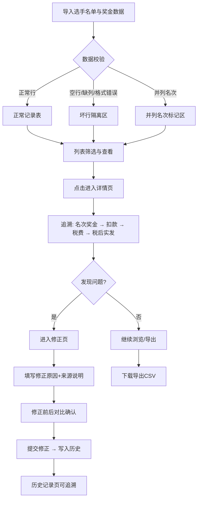

## 1. 产品概述
赛事奖金税后发放工作台——为赛事运营财务提供奖金计算、税后拆分、批次发放的全流程管理工具，确保每笔奖金可追溯到来源（名次、赞助扣款、税费），坏行和争议可筛选复核。
- 解决核心问题：选手银行卡失败后重发流程复杂，需要留存来源和解释的完整审计链
- 目标用户：赛事运营财务人员

## 2. 核心功能

### 2.1 用户角色
| 角色 | 注册方式 | 核心权限 |
|------|----------|----------|
| 赛事运营财务 | 本地登录 | 查看、修正、导出全部奖金发放记录 |

### 2.2 功能模块
1. **奖金发放列表页**：全量发放记录、坏行隔离区、并列名次标记、争议/重复筛选
2. **奖金发放详情页**：单条记录追溯（奖金计算 → 税后拆分 → 批次状态）、修正入口
3. **修正页**：修正发放金额/状态，自动写入修正历史，需填写修正原因
4. **历史记录页**：全部修正和重发操作的时间线，按批次/选手/操作类型筛选
5. **下载页**：导出发放明细CSV，可选含坏行/争议标记

### 2.3 页面详情
| 页面名称 | 模块名称 | 功能描述 |
|----------|----------|----------|
| 奖金发放列表 | 筛选栏 | 按赛事、批次、状态（待发放/已发放/失败/争议）、并列名次、争议/重复标记筛选 |
| 奖金发放列表 | 正常记录表 | 展示选手、名次、奖金总额、扣款、税费、税后金额、发放状态、银行卡尾号 |
| 奖金发放列表 | 坏行隔离区 | 单独列出空行、缺列、格式错误的原始数据行，标注错误原因 |
| 奖金发放列表 | 并列名次标记 | 并列名次行高亮且不混入正常排序，可展开查看同名次选手 |
| 奖金发放详情 | 奖金计算链 | 显示：名次奖金基数 → 赞助扣款明细 → 扣款后金额 → 税率/税额 → 税后实发 |
| 奖金发放详情 | 批次状态 | 所属发放批次、批次整体状态、银行卡回执信息 |
| 奖金发放详情 | 修正入口 | 修正金额/状态按钮，跳转修正页 |
| 修正页 | 修正表单 | 修正字段（金额/状态/银行卡）、修正原因（必填）、来源说明 |
| 修正页 | 修正预览 | 修正前后对比，确认提交 |
| 历史记录 | 操作时间线 | 按时间倒序展示全部修正和重发操作 |
| 历史记录 | 筛选 | 按批次、选手、操作类型（修正/重发）筛选 |
| 下载 | 导出配置 | 选择导出范围（全量/筛选结果），可选含坏行和争议标记列 |
| 下载 | 格式选择 | CSV格式导出 |

## 3. 核心流程

**奖金发放审核与修正流程**：
1. 财务人员打开列表页，查看全量发放记录
2. 坏行自动隔离在独立区域，不混入正常结果
3. 并列名次高亮标记，可展开确认
4. 扣款争议/重发重复记录可一键筛选
5. 点击某条记录进入详情页，追溯完整计算链
6. 发现问题时进入修正页，填写修正原因和来源说明
7. 修正自动写入历史记录
8. 导出发放明细供线下确认

## 4. 用户界面设计

### 4.1 设计风格
- 主色：深炭灰 (#1a1a2e) + 翡翠绿 (#10b981) 强调色
- 辅助色：琥珀色 (#f59e0b) 用于警告/争议标记，玫红色 (#ef4444) 用于失败/坏行
- 按钮风格：圆角矩形，带微妙阴影，hover时轻微上浮
- 字体：Noto Sans SC 用于中文正文，JetBrains Mono 用于数字/金额
- 布局：左侧固定导航栏 + 右侧内容区，表格为主的数据密集布局
- 图标：lucide-react 图标库

### 4.2 页面设计概述
| 页面名称 | 模块名称 | UI元素 |
|----------|----------|--------|
| 奖金发放列表 | 筛选栏 | 下拉选择器、标签式筛选、搜索框 |
| 奖金发放列表 | 正常记录表 | 分页表格、行点击跳转、状态标签 |
| 奖金发放列表 | 坏行隔离区 | 折叠面板、红色边框行、错误类型标签 |
| 奖金发放列表 | 并列名次 | 黄色高亮行、展开/收起按钮 |
| 奖金发放详情 | 计算链卡片 | 步骤式横向流程图、箭头连接 |
| 奖金发放详情 | 批次信息 | 状态徽章、时间戳 |
| 修正页 | 修正表单 | 输入框、下拉框、必填标记 |
| 修正页 | 对比面板 | 左右对比、差异高亮 |
| 历史记录 | 时间线 | 垂直时间线、操作类型图标 |
| 下载 | 导出面板 | 复选框组、导出按钮 |

### 4.3 响应式
- 桌面优先设计，最小宽度1280px
- 表格区域支持水平滚动
- 侧边导航可折叠

### 4.4 3D场景
- 不适用
