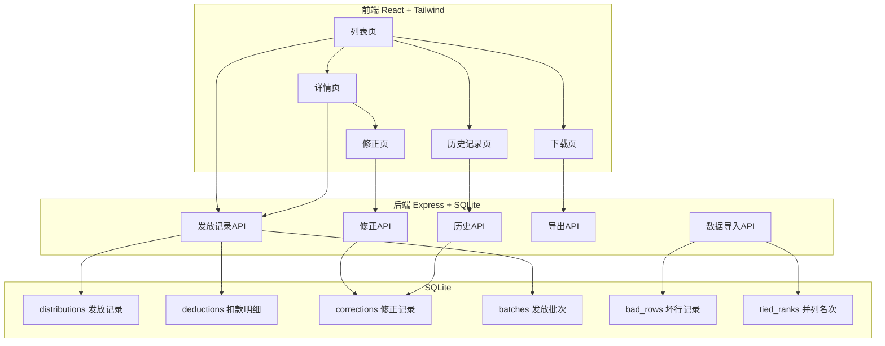
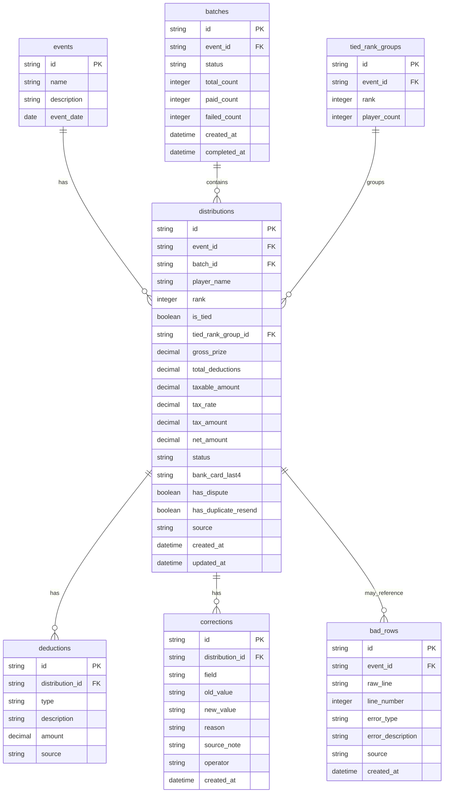

## 1. 架构设计



## 2. 技术说明
- 前端：React@18 + TailwindCSS@3 + Vite + Zustand
- 初始化工具：vite-init
- 后端：Express@4 + TypeScript (ESM)
- 数据库：SQLite (better-sqlite3)
- 图标：lucide-react

## 3. 路由定义
| 路由 | 用途 |
|------|------|
| / | 奖金发放列表页（含坏行隔离区、并列名次标记） |
| /detail/:id | 奖金发放详情页（计算链追溯） |
| /correct/:id | 修正页（修正前后对比） |
| /history | 历史记录页（操作时间线） |
| /download | 下载页（CSV导出） |

## 4. API定义

### 4.1 发放记录API
```typescript
// GET /api/distributions
interface DistributionQuery {
  event_id?: string;
  batch_id?: string;
  status?: 'pending' | 'paid' | 'failed' | 'disputed';
  has_tied_rank?: boolean;
  has_dispute?: boolean;
  has_duplicate_resend?: boolean;
  page?: number;
  page_size?: number;
}
interface DistributionListResponse {
  total: number;
  data: Distribution[];
  bad_rows: BadRow[];
  tied_rank_groups: TiedRankGroup[];
}

// GET /api/distributions/:id
interface DistributionDetail {
  distribution: Distribution;
  calculation_chain: CalculationStep[];
  deductions: Deduction[];
  batch: Batch;
  corrections: Correction[];
}

interface Distribution {
  id: string;
  event_id: string;
  player_name: string;
  rank: number;
  is_tied: boolean;
  tied_rank_group_id?: string;
  gross_prize: number;
  total_deductions: number;
  taxable_amount: number;
  tax_rate: number;
  tax_amount: number;
  net_amount: number;
  status: 'pending' | 'paid' | 'failed' | 'disputed';
  bank_card_last4: string;
  batch_id: string;
  has_dispute: boolean;
  has_duplicate_resend: boolean;
  source: string;
  created_at: string;
  updated_at: string;
}

interface BadRow {
  id: string;
  raw_line: string;
  line_number: number;
  error_type: 'empty_row' | 'missing_column' | 'format_error' | 'invalid_deduction' | 'invalid_bank_receipt';
  error_description: string;
  source: string;
  created_at: string;
}

interface TiedRankGroup {
  rank: number;
  players: Distribution[];
}

interface CalculationStep {
  step: number;
  label: string;
  amount: number;
  description: string;
}

interface Deduction {
  id: string;
  distribution_id: string;
  type: 'sponsor' | 'penalty' | 'other';
  description: string;
  amount: number;
  source: string;
}

interface Batch {
  id: string;
  status: 'processing' | 'completed' | 'partial_failed';
  total_count: number;
  paid_count: number;
  failed_count: number;
  created_at: string;
  completed_at?: string;
}

interface Correction {
  id: string;
  distribution_id: string;
  field: string;
  old_value: string;
  new_value: string;
  reason: string;
  source_note: string;
  operator: string;
  created_at: string;
}
```

### 4.2 修正API
```typescript
// POST /api/distributions/:id/correct
interface CorrectionRequest {
  field: 'net_amount' | 'status' | 'bank_card_last4';
  new_value: string;
  reason: string;
  source_note: string;
}
interface CorrectionResponse {
  correction: Correction;
  distribution: Distribution;
}
```

### 4.3 历史API
```typescript
// GET /api/corrections
interface CorrectionQuery {
  batch_id?: string;
  player_name?: string;
  operation_type?: 'correction' | 'resend';
  start_date?: string;
  end_date?: string;
  page?: number;
  page_size?: number;
}
interface CorrectionListResponse {
  total: number;
  data: CorrectionWithDistribution[];
}
interface CorrectionWithDistribution extends Correction {
  distribution: Pick<Distribution, 'id' | 'player_name' | 'rank' | 'event_id'>;
}
```

### 4.4 导出API
```typescript
// GET /api/export?format=csv&include_bad_rows=true&include_disputes=true
// Response: CSV file download
```

### 4.5 数据导入API
```typescript
// POST /api/import
interface ImportRequest {
  event_id: string;
  data: string; // raw CSV content
}
interface ImportResponse {
  success_count: number;
  bad_row_count: number;
  tied_rank_count: number;
  bad_rows: BadRow[];
}
```

## 5. 服务器架构图


## 6. 数据模型

### 6.1 数据模型定义



### 6.2 数据定义语言
```sql
CREATE TABLE events (
    id TEXT PRIMARY KEY,
    name TEXT NOT NULL,
    description TEXT,
    event_date TEXT NOT NULL
);

CREATE TABLE batches (
    id TEXT PRIMARY KEY,
    event_id TEXT NOT NULL REFERENCES events(id),
    status TEXT NOT NULL CHECK(status IN ('processing', 'completed', 'partial_failed')),
    total_count INTEGER NOT NULL DEFAULT 0,
    paid_count INTEGER NOT NULL DEFAULT 0,
    failed_count INTEGER NOT NULL DEFAULT 0,
    created_at TEXT NOT NULL DEFAULT (datetime('now')),
    completed_at TEXT
);

CREATE TABLE tied_rank_groups (
    id TEXT PRIMARY KEY,
    event_id TEXT NOT NULL REFERENCES events(id),
    rank INTEGER NOT NULL
);

CREATE TABLE distributions (
    id TEXT PRIMARY KEY,
    event_id TEXT NOT NULL REFERENCES events(id),
    batch_id TEXT NOT NULL REFERENCES batches(id),
    player_name TEXT NOT NULL,
    rank INTEGER NOT NULL,
    is_tied INTEGER NOT NULL DEFAULT 0,
    tied_rank_group_id TEXT REFERENCES tied_rank_groups(id),
    gross_prize REAL NOT NULL,
    total_deductions REAL NOT NULL DEFAULT 0,
    taxable_amount REAL NOT NULL,
    tax_rate REAL NOT NULL,
    tax_amount REAL NOT NULL,
    net_amount REAL NOT NULL,
    status TEXT NOT NULL CHECK(status IN ('pending', 'paid', 'failed', 'disputed')),
    bank_card_last4 TEXT,
    has_dispute INTEGER NOT NULL DEFAULT 0,
    has_duplicate_resend INTEGER NOT NULL DEFAULT 0,
    source TEXT NOT NULL,
    created_at TEXT NOT NULL DEFAULT (datetime('now')),
    updated_at TEXT NOT NULL DEFAULT (datetime('now'))
);

CREATE TABLE deductions (
    id TEXT PRIMARY KEY,
    distribution_id TEXT NOT NULL REFERENCES distributions(id),
    type TEXT NOT NULL CHECK(type IN ('sponsor', 'penalty', 'other')),
    description TEXT NOT NULL,
    amount REAL NOT NULL,
    source TEXT NOT NULL
);

CREATE TABLE corrections (
    id TEXT PRIMARY KEY,
    distribution_id TEXT NOT NULL REFERENCES distributions(id),
    field TEXT NOT NULL,
    old_value TEXT NOT NULL,
    new_value TEXT NOT NULL,
    reason TEXT NOT NULL,
    source_note TEXT NOT NULL,
    operator TEXT NOT NULL DEFAULT 'finance',
    created_at TEXT NOT NULL DEFAULT (datetime('now'))
);

CREATE TABLE bad_rows (
    id TEXT PRIMARY KEY,
    event_id TEXT NOT NULL REFERENCES events(id),
    raw_line TEXT NOT NULL,
    line_number INTEGER NOT NULL,
    error_type TEXT NOT NULL CHECK(error_type IN ('empty_row', 'missing_column', 'format_error', 'invalid_deduction', 'invalid_bank_receipt')),
    error_description TEXT NOT NULL,
    source TEXT NOT NULL,
    created_at TEXT NOT NULL DEFAULT (datetime('now'))
);

CREATE INDEX idx_distributions_event ON distributions(event_id);
CREATE INDEX idx_distributions_batch ON distributions(batch_id);
CREATE INDEX idx_distributions_status ON distributions(status);
CREATE INDEX idx_distributions_tied ON distributions(is_tied);
CREATE INDEX idx_distributions_dispute ON distributions(has_dispute);
CREATE INDEX idx_corrections_distribution ON corrections(distribution_id);
CREATE INDEX idx_corrections_created ON corrections(created_at);
CREATE INDEX idx_bad_rows_event ON bad_rows(event_id);
```
