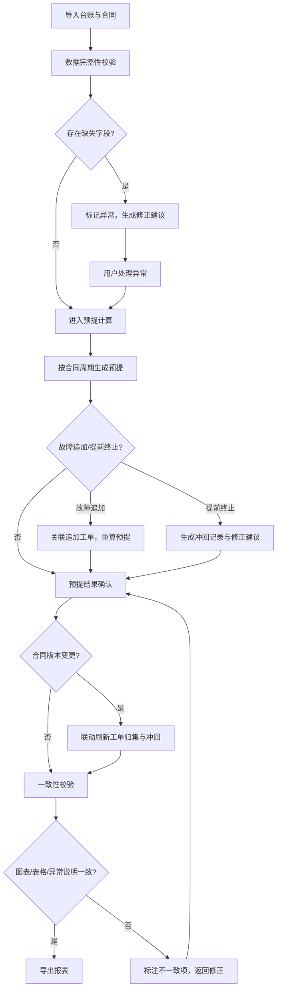
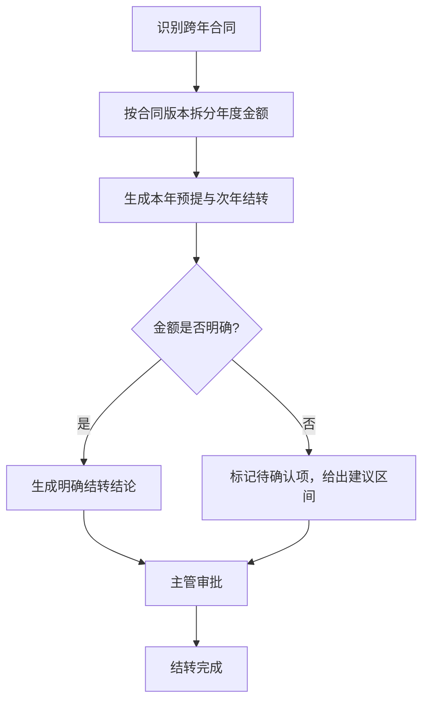

## 1. 产品概述

设备维保预提费用系统，面向制造业财务人员，解决维保合同跨年预提、故障追加与提前终止后工单归集混乱的问题。系统容忍原始数据不干净（台账有备注、合同缺字段、故障工单晚到），确保异常说明、图表、导出结果三方一致，对跨年合同给出明确结论而非模糊判断。

- 目标用户：制造业企业财务部门（成本会计、财务主管）
- 核心价值：把维保预提从一次性判断升级为版本可追踪、冲回可操作的持续核算流程

## 2. 核心功能

### 2.1 用户角色

| 角色 | 注册方式 | 核心权限 |
|------|----------|----------|
| 财务操作员 | 管理员分配账号 | 导入数据、计算预提、处理异常、导出报表 |
| 财务主管 | 管理员分配账号 | 审核预提结果、确认冲回、跨年结转审批 |

### 2.2 功能模块

1. **总览看板**：预提费用总览、异常待办、跨年合同状态
2. **设备台账与合同管理**：设备台账录入/导入、维保合同关联、合同版本管理
3. **费用预提计算**：按合同周期预提、故障追加处理、提前终止冲回、版本变化联动
4. **异常处理中心**：数据缺失标记、晚到工单补录、修正建议生成
5. **报表与导出**：费用明细表、异常说明表、跨年结转表、图表与导出一致性校验

### 2.3 页面详情

| 页面名称 | 模块名称 | 功能描述 |
|----------|----------|----------|
| 总览看板 | 预提费用概览 | 当期预提总额、已冲回金额、待处理异常数，趋势折线图 |
| 总览看板 | 异常待办列表 | 按紧急度排列：缺字段合同、晚到工单、跨年待确认项 |
| 总览看板 | 跨年合同快照 | 跨年合同数量、金额分布、结转状态 |
| 设备台账 | 台账列表 | 设备编码、名称、分类、备注字段（容忍脏数据）、关联合同数 |
| 设备台账 | 台账导入 | Excel/CSV 导入，自动识别缺失字段并标记 |
| 合同管理 | 合同列表 | 合同编号、设备关联、起止日期、年度金额、版本号 |
| 合同管理 | 合同版本对比 | 版本间字段差异高亮，展示对预提和工单归集的影响 |
| 合同管理 | 跨年处理 | 识别跨年合同，生成结转方案，显示明确结论（结转金额/待确认项） |
| 费用预提 | 预提计算面板 | 选择核算期间，自动计算预提金额，展示计算过程 |
| 费用预提 | 故障追加处理 | 登记故障追加工单，关联到原合同，重新计算当期预提 |
| 费用预提 | 提前终止冲回 | 选择终止合同，自动生成冲回记录和修正建议 |
| 费用预提 | 版本联动 | 合同版本变更后，自动刷新受影响的工单归集和冲回记录 |
| 异常处理 | 异常列表 | 按类型（缺字段/晚到工单/金额不一致）分组展示 |
| 异常处理 | 修正建议 | 每条异常附可操作建议（如"补录XX工单到YY合同"），一键执行或手动调整 |
| 报表导出 | 费用明细表 | 按合同/设备/期间的预提明细，含异常标注列 |
| 报表导出 | 异常说明表 | 异常清单与处理状态，确保与图表数据一致 |
| 报表导出 | 导出与一致性校验 | 导出前自动校验：图表数值 = 表格汇总 = 异常说明引用数据 |

## 3. 核心流程

### 3.1 预提计算主流程

用户导入设备台账和维保合同 → 系统识别数据缺失并标记异常 → 用户处理异常或确认容忍 → 选择核算期间触发预提计算 → 系统按合同周期生成预提记录 → 故障追加/提前终止触发重算 → 合同版本变更联动刷新工单归集与冲回 → 导出前一致性校验 → 导出报表

### 3.2 跨年合同处理流程

## 4. 用户界面设计

### 4.1 设计风格

- 主色调：深钢蓝 (#1B3A4B) + 琥珀色 (#D4A843) 作为强调色，传达制造业的稳重与精准
- 辅助色：浅灰 (#F5F5F0) 背景，白 (#FFFFFF) 卡片，红 (#C0392B) 异常标记
- 按钮风格：圆角矩形（4px），主操作深钢蓝填充，次操作描边
- 字体：思源黑体（Noto Sans SC）为主体，等宽字体（JetBrains Mono）用于数字展示
- 布局：左侧固定导航 + 右侧内容区，卡片式模块
- 图标：Lucide 图标库，线条风格

### 4.2 页面设计概览

| 页面名称 | 模块名称 | UI 元素 |
|----------|----------|---------|
| 总览看板 | 预提费用概览 | 三个数据卡片（总额/已冲回/异常数）+ 折线趋势图 |
| 总览看板 | 异常待办列表 | 紧急度色带标记的列表，点击展开修正建议 |
| 总览看板 | 跨年合同快照 | 横向柱状图展示跨年金额分布 |
| 设备台账 | 台账列表 | 可搜索表格，备注列灰色斜体显示脏数据标记 |
| 合同管理 | 合同版本对比 | 左右分栏对比，差异字段黄色高亮 |
| 费用预提 | 预提计算面板 | 步骤条引导 + 计算过程可折叠展示 |
| 费用预提 | 故障追加 | 侧滑面板录入追加工单，实时更新预提金额 |
| 费用预提 | 提前终止 | 对话框确认终止，自动展示冲回明细与修正建议 |
| 异常处理 | 修正建议 | 卡片式建议，一键执行按钮 + 手动调整入口 |
| 报表导出 | 一致性校验 | 校验结果进度条，不一致项红色标注 |

### 4.3 响应式设计

- 桌面优先设计，最小宽度 1280px
- 表格在窄屏下支持横向滚动
- 图表自适应容器宽度
- 侧滑面板和对话框在移动端全屏展示

## 5. 数据容忍与一致性规则

### 5.1 脏数据容忍

- 设备台账备注：保留原样展示，不影响计算逻辑，但标记为"参考信息"
- 合同缺字段：标记为异常，给出默认值建议（如缺年度金额则按月均估算），用户可覆盖
- 晚到故障工单：补录后自动关联到对应合同，重算受影响期间的预提

### 5.2 一致性保障

- 所有数值展示（图表、表格、异常说明）使用同一数据源
- 导出前自动运行一致性校验：图表数值 = 表格汇总 = 异常说明引用
- 不一致时阻断导出，标注不一致项要求修正

### 5.3 跨年合同规则

- 不给模糊结论：要么给出明确结转金额，要么给出待确认项和建议区间
- 跨年合同版本变化时，分别计算各版本对应期间的预提
- 结转金额须经主管审批确认

### 5.4 版本联动规则

- 合同版本变更 → 自动标记受影响的工单归集 → 刷新冲回记录 → 更新预提计算
- 保留历史版本快照，支持回溯
