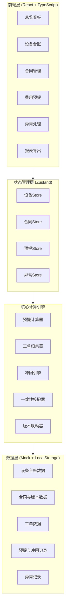
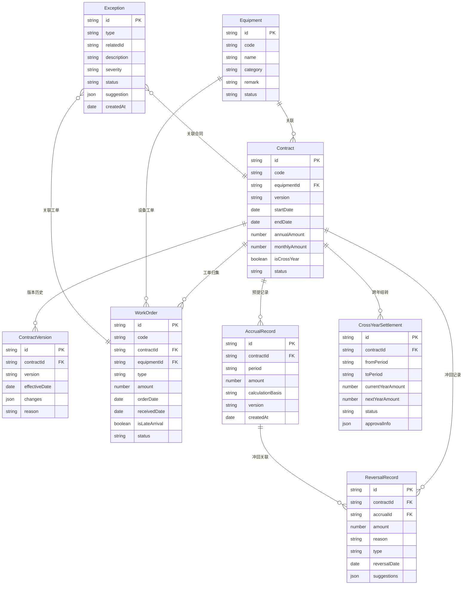

## 1. 架构设计



## 2. 技术说明

- 前端：React@18 + TypeScript + Tailwind CSS@3 + Vite
- 初始化工具：vite-init (react-ts 模板)
- 状态管理：Zustand
- 图表库：Recharts
- 后端：无（纯前端，数据使用 Mock + LocalStorage 持久化）
- 数据库：无（LocalStorage 模拟持久化，提供样例数据初始化）

## 3. 路由定义

| 路由 | 用途 |
|------|------|
| / | 总览看板：预提费用概览、异常待办、跨年合同状态 |
| /equipment | 设备台账：设备列表、台账导入、备注查看 |
| /contracts | 合同管理：合同列表、版本对比、跨年处理 |
| /accrual | 费用预提：预提计算、故障追加、提前终止冲回、版本联动 |
| /exceptions | 异常处理：异常列表、修正建议生成与执行 |
| /reports | 报表导出：费用明细、异常说明、一致性校验、导出 |

## 4. 数据模型

### 4.1 数据模型定义



### 4.2 核心类型定义

```typescript
type WorkOrderType = "routine" | "fault" | "fault_supplement"
type ContractStatus = "active" | "terminated_early" | "completed"
type ExceptionType = "missing_field" | "late_work_order" | "amount_mismatch" | "cross_year_pending"
type ExceptionSeverity = "critical" | "warning" | "info"
type ExceptionStatus = "pending" | "resolved" | "ignored"
type ReversalType = "early_termination" | "version_change" | "correction"

interface Equipment {
  id: string
  code: string
  name: string
  category: string
  remark: string
  status: "active" | "inactive"
}

interface Contract {
  id: string
  code: string
  equipmentId: string
  version: string
  startDate: string
  endDate: string
  annualAmount: number | null
  monthlyAmount: number | null
  isCrossYear: boolean
  status: ContractStatus
}

interface ContractVersionChange {
  id: string
  contractId: string
  version: string
  effectiveDate: string
  changes: Record<string, { old: unknown; new: unknown }>
  reason: string
}

interface WorkOrder {
  id: string
  code: string
  contractId: string
  equipmentId: string
  type: WorkOrderType
  amount: number
  orderDate: string
  receivedDate: string
  isLateArrival: boolean
  status: "pending" | "settled"
}

interface AccrualRecord {
  id: string
  contractId: string
  period: string
  amount: number
  calculationBasis: string
  version: string
  createdAt: string
}

interface ReversalRecord {
  id: string
  contractId: string
  accrualId: string
  amount: number
  reason: string
  type: ReversalType
  reversalDate: string
  suggestions: Array<{ action: string; params: Record<string, unknown> }>
}

interface Exception {
  id: string
  type: ExceptionType
  relatedId: string
  description: string
  severity: ExceptionSeverity
  status: ExceptionStatus
  suggestion: { action: string; description: string; params: Record<string, unknown> }
  createdAt: string
}

interface CrossYearSettlement {
  id: string
  contractId: string
  fromPeriod: string
  toPeriod: string
  currentYearAmount: number
  nextYearAmount: number
  status: "pending" | "approved" | "confirmed"
  approvalInfo: { approver: string; date: string; note: string } | null
}
```

## 5. 核心计算逻辑

### 5.1 预提计算

- 合同在当期覆盖的月数 × 月均金额 = 基础预提
- 故障追加：追加工单金额加入当期预提
- 缺失年度金额：按已发生月数估算月均，标记异常待确认

### 5.2 工单归集

- 常规工单归集到关联合同的对应期间
- 晚到工单：按工单日期归属期间，补录后重算该期间预提
- 合同版本变更后：受版本影响的工单重新归集到新版本对应期间

### 5.3 冲回逻辑

- 提前终止：从未到期月份的已预提金额冲回，生成修正建议
- 版本变更：差异金额生成冲回或补提，保留历史快照
- 冲回记录关联到原预提记录，支持追溯

### 5.4 一致性校验

- 图表数据源 = 表格数据源 = 异常说明数据源（同一 Store）
- 导出前校验：图表渲染值 = 表格汇总值 = 异常说明引用值
- 不一致时生成异常记录，阻断导出

## 6. 样例数据设计

提供 3 台设备、4 份合同（含 1 份跨年、1 份提前终止）、6 张工单（含 2 张晚到、1 张故障追加）、5 条异常记录的完整样例，系统启动时自动初始化。
