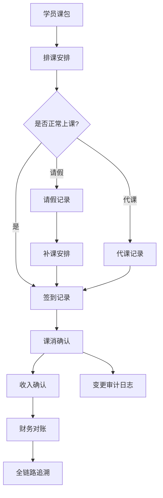

## 1. 产品概述

线下课程课消确认系统，解决教培机构财务对账痛点。替代手工台账，实现课消记录的全链路可追溯，支持调课、请假、代课等复杂场景的财务审计追踪。

- 目标用户：教培机构财务人员、教务管理人员
- 核心价值：每笔课消都可追溯来源，支持从结果反查课消确认、收入递延、调课历史的完整链路

## 2. 核心功能

### 2.1 用户角色
| 角色 | 注册方式 | 核心权限 |
|------|----------|----------|
| 财务人员 | 系统预置 | 查看课消报表、收入递延、导出数据、审计追踪 |
| 教务人员 | 系统预置 | 录入课包、签到记录、处理调课请假代课 |

### 2.2 功能模块
1. **课包管理面板**：学员课包列表、课时余额、有效期、冻结状态
2. **签到与课消确认**：每日签到记录、课消确认操作、变更审计
3. **特殊业务处理**：请假补课、代课换老师、课包冻结解冻
4. **财务追踪看板**：课消汇总、收入递延计算、全链路追溯
5. **数据导出**：排课结论、课消明细、审计日志导出

### 2.3 页面详情
| 页面名称 | 模块名称 | 功能描述 |
|---------|----------|----------|
| 课消确认主面板 | 课包概览卡片 | 展示学员课包基本信息、剩余课时、有效期 |
| 课消确认主面板 | 签到记录列表 | 按日期展示签到记录，支持按学员/老师筛选 |
| 课消确认主面板 | 代课记录追踪 | 展示老师代课记录，关联原始课表与实际授课 |
| 变更审计面板 | 操作历史流水 | 记录每次变更的来源、前后值、操作人、时间戳 |
| 财务追踪面板 | 收入递延计算 | 按实际上课确认收入，展示递延收入明细 |
| 财务追踪面板 | 全链路追溯 | 从一笔课消结果追溯到确认、调课、代课完整历史 |

## 3. 核心流程

### 3.1 正常课消流程
学员购买课包 → 排课 → 签到 → 课消确认 → 确认收入 → 财务对账

### 3.2 请假补课流程
学员请假 → 记录请假（课包课时不扣）→ 安排补课 → 补课后签到 → 课消确认

### 3.3 代课换老师流程
原老师无法授课 → 安排代课老师 → 记录代课信息 → 签到时关联代课 → 课消时标注代课

### 3.4 课包冻结流程
学员申请冻结 → 冻结课包（暂停有效期）→ 后续解冻 → 恢复正常使用

### 3.5 财务追溯流程
财务发现异常 → 点击追溯 → 展示完整链路（课消确认→签到→调课/代课→原始课包）

## 4. 用户界面设计

### 4.1 设计风格
- **主色调**：深青色 #0F766E（专业、可信），搭配琥珀色 #D97706（警示、变更标记）
- **辅助色**：浅灰 #F1F5F9（背景），深灰 #1E293B（文字）
- **按钮风格**：圆角8px，悬浮时轻微上浮+阴影加深
- **字体**：标题使用 Noto Serif SC（专业感），正文使用 Noto Sans SC（可读性）
- **布局风格**：三栏卡片式布局，左侧课包列表，中间签到课消，右侧审计追踪
- **图标风格**：线性图标，搭配数字徽章标记待确认项

### 4.2 页面设计概览
| 页面名称 | 模块名称 | UI元素 |
|---------|----------|--------|
| 课消确认主面板 | 课包概览卡片 | 卡片悬浮效果、课时进度条、冻结状态标签 |
| 课消确认主面板 | 签到记录表格 | 斑马纹行、代课标记、请假标记、操作按钮悬浮显示 |
| 变更审计面板 | 操作历史流水 | 时间线布局、前后变化diff对比、来源标签 |
| 财务追踪面板 | 全链路追溯 | 瀑布流时间线、可折叠节点、关联高亮 |

### 4.3 响应式
- 桌面端优先（1280px+）：三栏完整布局
- 平板端（768px-1279px）：左右两栏，审计面板改为底部抽屉
- 移动端（<768px）：单栏垂直布局，通过Tab切换各模块

### 4.4 动效设计
- 页面加载：顶部进度条+内容淡入
- 数据变更：高亮闪烁（琥珀色渐变透明）
- 追溯展开：平滑高度过渡+箭头旋转
- 导出按钮：点击后波纹扩散+进度提示
