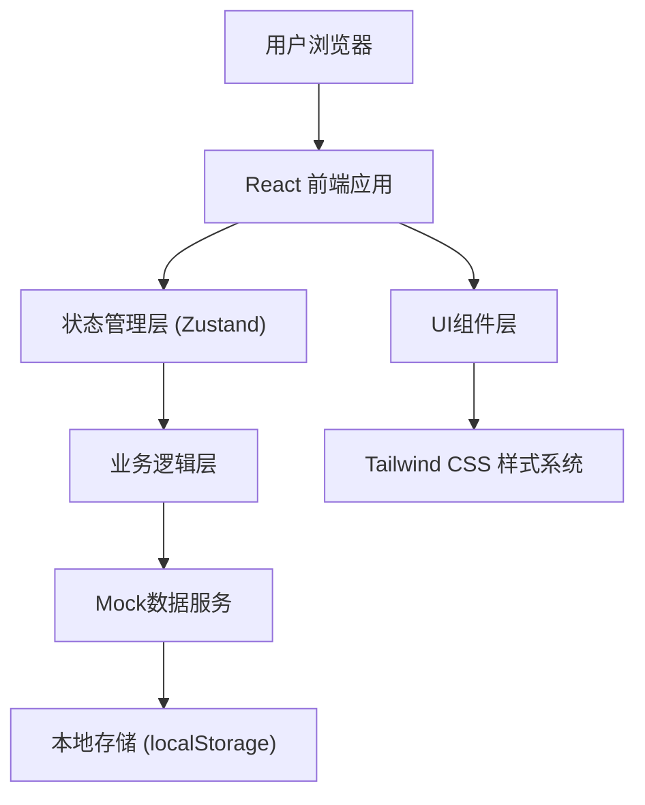
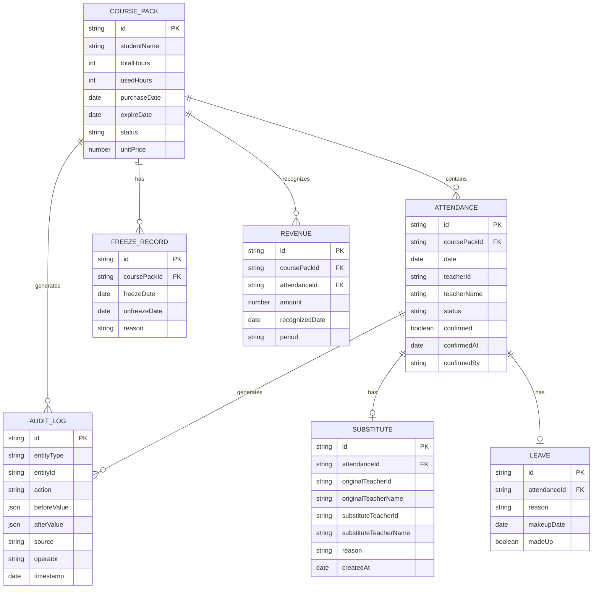

## 1. 架构设计



## 2. 技术描述

- **前端框架**：React@18 + TypeScript
- **构建工具**：Vite@5
- **样式方案**：Tailwind CSS@3 + CSS Variables
- **状态管理**：Zustand（轻量级，适合中小型应用）
- **路由方案**：React Router@6
- **图标库**：Lucide React
- **数据方案**：Mock数据 + localStorage持久化（无需后端）
- **导出功能**：SheetJS (xlsx) + JSON导出

## 3. 路由定义

| 路由 | 页面组件 | 功能说明 |
|------|----------|----------|
| / | DashboardPage | 课消确认主面板 |
| /audit | AuditPage | 变更审计面板 |
| /finance | FinancePage | 财务追踪面板 |

## 4. 数据模型

### 4.1 实体关系图



### 4.2 TypeScript 类型定义

```typescript
// 课包状态
type CoursePackStatus = 'active' | 'frozen' | 'expired' | 'completed';

// 签到状态
type AttendanceStatus = 'scheduled' | 'checked_in' | 'leave' | 'absent' | 'confirmed';

// 课包
interface CoursePack {
  id: string;
  studentName: string;
  totalHours: number;
  usedHours: number;
  purchaseDate: string;
  expireDate: string;
  status: CoursePackStatus;
  unitPrice: number;
  createdAt: string;
}

// 签到记录
interface Attendance {
  id: string;
  coursePackId: string;
  date: string;
  teacherId: string;
  teacherName: string;
  status: AttendanceStatus;
  confirmed: boolean;
  confirmedAt?: string;
  confirmedBy?: string;
  hasSubstitute?: boolean;
  hasLeave?: boolean;
  isMakeup?: boolean;
}

// 代课记录
interface SubstituteRecord {
  id: string;
  attendanceId: string;
  originalTeacherId: string;
  originalTeacherName: string;
  substituteTeacherId: string;
  substituteTeacherName: string;
  reason: string;
  createdAt: string;
}

// 请假记录
interface LeaveRecord {
  id: string;
  attendanceId: string;
  reason: string;
  makeupDate?: string;
  madeUp: boolean;
  createdAt: string;
}

// 冻结记录
interface FreezeRecord {
  id: string;
  coursePackId: string;
  freezeDate: string;
  unfreezeDate?: string;
  reason: string;
}

// 审计日志
interface AuditLog {
  id: string;
  entityType: 'coursePack' | 'attendance' | 'substitute' | 'leave' | 'freeze';
  entityId: string;
  action: 'create' | 'update' | 'delete' | 'confirm';
  beforeValue: Record<string, unknown> | null;
  afterValue: Record<string, unknown> | null;
  source: string;
  operator: string;
  timestamp: string;
}

// 收入确认
interface RevenueRecognition {
  id: string;
  coursePackId: string;
  attendanceId: string;
  amount: number;
  recognizedDate: string;
  period: string;
}
```

## 5. 核心模块设计

### 5.1 审计追踪模块
- **职责**：记录所有数据变更的完整历史
- **核心方法**：
  - `logChange(entityType, entityId, action, before, after, source, operator)`
  - `getLogsByEntity(entityType, entityId)`
  - `getTraceChain(attendanceId)` - 全链路追溯

### 5.2 收入递延模块
- **职责**：按实际上课确认收入，计算递延收入
- **核心方法**：
  - `recognizeRevenue(attendanceId)` - 课消确认时确认收入
  - `calculateDeferredRevenue(coursePackId)` - 计算递延收入
  - `getRevenueByPeriod(startDate, endDate)` - 按期查询收入

### 5.3 导出模块
- **职责**：导出排课结论、课消明细、审计日志
- **格式支持**：Excel (.xlsx)、JSON
- **验证机制**：导出前校验数据与界面显示一致性

## 6. 状态管理设计

```typescript
// Store 结构
interface AppState {
  // 数据
  coursePacks: CoursePack[];
  attendances: Attendance[];
  substituteRecords: SubstituteRecord[];
  leaveRecords: LeaveRecord[];
  freezeRecords: FreezeRecord[];
  auditLogs: AuditLog[];
  revenues: RevenueRecognition[];
  
  // UI 状态
  selectedCoursePackId: string | null;
  selectedAttendanceId: string | null;
  traceModalOpen: boolean;
  
  // Actions
  confirmAttendance: (id: string, operator: string) => void;
  recordSubstitute: (data: Omit<SubstituteRecord, 'id' | 'createdAt'>) => void;
  recordLeave: (data: Omit<LeaveRecord, 'id' | 'createdAt'>) => void;
  freezeCoursePack: (data: Omit<FreezeRecord, 'id'>) => void;
  exportData: (type: 'schedule' | 'attendance' | 'audit') => Blob;
  getTraceChain: (attendanceId: string) => TraceNode[];
}
```
