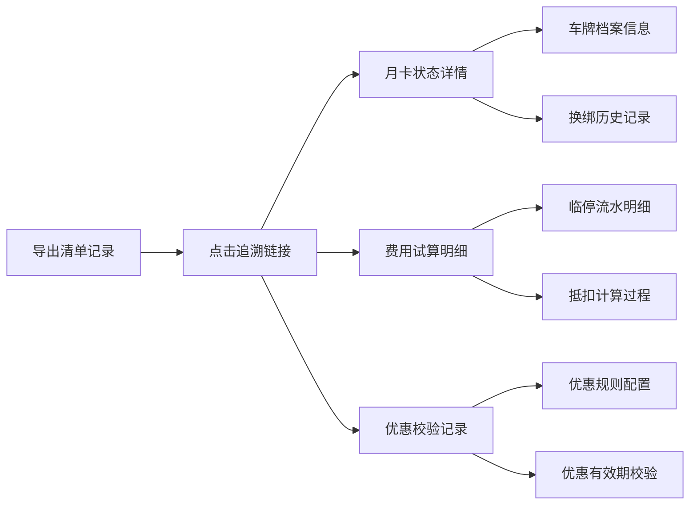

## 1. 产品概述
物业停车月卡续费管理系统，解决小区停车月卡、临停抵扣、业主优惠叠加导致的续费窗口堵塞问题。为物业财务提供可追溯的续费管理工具，支持数据导入、异常处理、筛选复核和导出功能。

- 核心目标：规范化月卡续费流程，透明化临停抵扣与优惠叠加计算
- 目标用户：物业财务人员、小区管理员
- 核心价值：减少续费纠纷，提高财务工作效率，确保数据可追溯

## 2. 核心功能

### 2.1 用户角色
| 角色 | 登录方式 | 核心权限 |
|------|----------|----------|
| 物业财务 | 账号密码登录 | 数据导入、续费管理、筛选复核、导出报表、追溯查询 |
| 小区管理员 | 账号密码登录 | 车牌档案维护、优惠配置、基础数据管理 |

### 2.2 功能模块
1. **数据导入模块**：支持多种数据源导入（车牌档案、临停流水、退款申请、优惠记录）
2. **续费管理模块**：月卡续费、费用试算、临停抵扣、优惠叠加计算
3. **筛选复核模块**：多条件筛选、异常数据标记、人工复核流程
4. **追溯查询模块**：从导出清单反向追溯月卡状态、费用明细、优惠校验记录
5. **系统配置模块**：车牌档案管理、优惠规则配置、导出模板设置

### 2.3 页面详情
| 页面名称 | 模块名称 | 功能描述 |
|----------|----------|----------|
| 登录页 | 身份验证 | 账号密码登录、记住登录状态 |
| 仪表盘 | 数据概览 | 续费统计、异常数据统计、待办事项 |
| 数据导入 | 数据源管理 | 多文件上传、空行/缺列检测、坏行列示、数据预览 |
| 车牌档案 | 基础数据 | 车牌信息维护、业主信息、换绑记录查询 |
| 续费管理 | 核心业务 | 续费列表、费用试算、临停抵扣、优惠应用 |
| 筛选复核 | 数据审核 | 多条件筛选、异常标记、批量复核、备注添加 |
| 导出中心 | 报表导出 | 多种格式导出、导出历史、追溯链接生成 |
| 系统配置 | 规则设置 | 优惠规则、费用标准、导出模板配置 |

## 3. 核心流程

### 3.1 续费处理流程
1. 物业财务导入车牌档案、临停流水、优惠记录等原始数据
2. 系统自动检测空行、缺列、格式错误，将坏行单独列出
3. 系统自动匹配车牌，生成待续费列表，标记临停抵扣和优惠应用
4. 物业财务通过筛选器定位特定记录（如优惠过期、临停抵扣）
5. 物业财务进行费用试算，确认临停抵扣和优惠叠加结果
6. 物业财务复核并标记异常记录，添加备注说明
7. 导出续费清单，每条记录包含可追溯的详情链接

### 3.2 数据追溯流程

## 4. 用户界面设计

### 4.1 设计风格
- **主色调**：深蓝(#1e3a5f) - 专业、稳重、信任
- **辅助色**：青绿(#22c55e) - 正常状态、琥珀(#f59e0b) - 待处理、红色(#ef4444) - 异常
- **中性色**：浅灰(#f8fafc)背景、深灰(#334155)文字
- **按钮样式**：圆角8px，轻微阴影，hover时有上浮效果
- **字体**：标题使用 Noto Sans SC Bold，正文使用 Noto Sans SC Regular
- **布局风格**：卡片式布局，顶部导航 + 左侧菜单 + 主内容区
- **图标风格**：使用 Phosphor Icons，线条简洁，统一24px尺寸

### 4.2 页面设计概览
| 页面名称 | 模块名称 | UI元素 |
|----------|----------|--------|
| 数据导入 | 上传区域 | 拖拽上传区、文件列表、进度条、坏行统计表 |
| 续费管理 | 数据表格 | 固定表头、可排序列、状态标签、操作列按钮 |
| 筛选复核 | 筛选面板 | 多条件组合筛选、快速筛选标签、批量操作栏 |
| 追溯弹窗 | 详情展示 | Tab切换、时间线、计算过程可视化 |
| 导出中心 | 导出列表 | 卡片式历史记录、状态指示、下载/追溯按钮 |

### 4.3 响应式设计
- 桌面端优先(1440px+)，支持1920px宽屏展示
- 平板端(768-1024px)：左侧菜单可折叠，表格支持横向滚动
- 移动端(375-767px)：转为单列布局，重点数据卡片化展示
- 所有操作按钮支持触摸操作，最小尺寸44x44px

### 4.4 动画与交互
- 页面加载：骨架屏渐变加载，内容淡入显示
- 表格行：hover时背景色微变，选中行高亮
- 弹窗：从底部滑入，半透明背景遮罩
- 筛选条件：添加/删除时有平滑过渡动画
- 数据刷新：顶部进度条动画，数据更新时数字跳动效果
