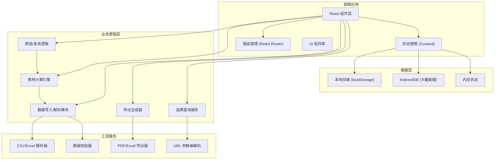
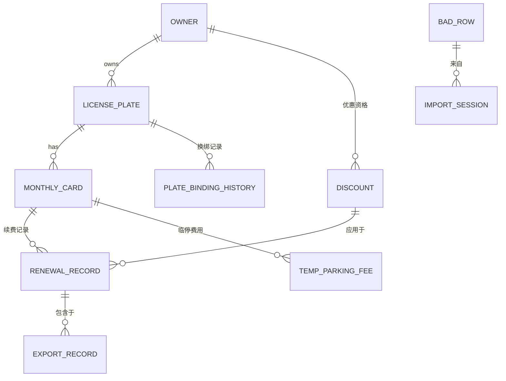
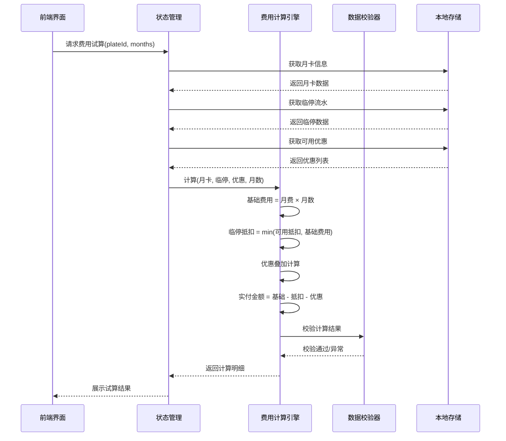

## 1. 架构设计



## 2. 技术描述

- **前端框架**: React@18 + TypeScript
- **构建工具**: Vite@5
- **样式方案**: Tailwind CSS@3 + PostCSS
- **状态管理**: Zustand@4 (轻量级，支持持久化)
- **路由管理**: React Router@6
- **UI 组件**: Phosphor React Icons + 自定义组件
- **数据解析**: Papa Parse (CSV) + SheetJS (Excel)
- **导出功能**: SheetJS (Excel) + jsPDF (PDF)
- **本地存储**: localStorage (配置) + IndexedDB (大量业务数据)
- **数据校验**: Zod (Schema 校验)

## 3. 路由定义

| 路由路径 | 页面名称 | 权限要求 |
|----------|----------|----------|
| /login | 登录页 | 公开 |
| /dashboard | 仪表盘 | 已登录 |
| /import | 数据导入 | 已登录 |
| /license-plates | 车牌档案 | 已登录 |
| /renewal | 续费管理 | 已登录 |
| /review | 筛选复核 | 已登录 |
| /export | 导出中心 | 已登录 |
| /settings | 系统配置 | 管理员 |
| /trace/:id | 追溯查询 | 已登录 |

## 4. 数据模型

### 4.1 实体关系图



### 4.2 核心数据类型定义

```typescript
// 车牌档案
interface LicensePlate {
  id: string;
  plateNumber: string;
  ownerId: string;
  ownerName: string;
  building: string;
  roomNumber: string;
  phone: string;
  status: 'active' | 'inactive' | 'transferred';
  bindingHistory: PlateBinding[];
  createdAt: string;
  updatedAt: string;
  remarks?: string;
}

// 月卡信息
interface MonthlyCard {
  id: string;
  plateId: string;
  plateNumber: string;
  cardType: 'standard' | 'vip' | 'employee';
  monthlyFee: number;
  effectiveDate: string;
  expiryDate: string;
  status: 'active' | 'expired' | 'suspended';
  balance: number;
  tempParkingDeduction: number;
  createdAt: string;
  updatedAt: string;
}

// 临停流水
interface TempParkingRecord {
  id: string;
  plateNumber: string;
  entryTime: string;
  exitTime: string;
  duration: number;
  feeAmount: number;
  deductionAmount: number;
  paymentMethod: string;
  isDeducted: boolean;
  source: 'system' | 'manual';
  createdAt: string;
  remarks?: string;
}

// 优惠记录
interface Discount {
  id: string;
  ownerId: string;
  type: 'percentage' | 'fixed' | 'freeMonths';
  value: number;
  name: string;
  effectiveDate: string;
  expiryDate: string;
  isActive: boolean;
  maxUsage: number;
  usedCount: number;
  createdAt: string;
  remarks?: string;
}

// 续费记录
interface RenewalRecord {
  id: string;
  plateId: string;
  plateNumber: string;
  cardId: string;
  renewalMonths: number;
  baseFee: number;
  tempParkingDeduction: number;
  discountAmount: number;
  totalAmount: number;
  appliedDiscountIds: string[];
  status: 'pending' | 'reviewed' | 'confirmed' | 'cancelled';
  reviewStatus: 'normal' | 'warning' | 'error';
  reviewer?: string;
  reviewedAt?: string;
  createdAt: string;
  remarks?: string;
  traceCode: string;
}

// 坏行记录
interface BadRow {
  id: string;
  importSessionId: string;
  sourceType: 'licensePlate' | 'tempParking' | 'discount' | 'refund';
  rowNumber: number;
  rawData: string;
  errorType: 'emptyRow' | 'missingColumn' | 'invalidFormat' | 'duplicate' | 'unknown';
  errorMessage: string;
  createdAt: string;
}

// 导出记录
interface ExportRecord {
  id: string;
  exportType: 'renewal' | 'deduction' | 'discount' | 'full';
  format: 'xlsx' | 'csv' | 'pdf';
  recordCount: number;
  fileSize: number;
  createdAt: string;
  createdBy: string;
  traceCode: string;
}
```

## 5. 核心业务流程时序图

### 5.1 续费计算流程



## 6. 页面组件层次结构

```
src/
├── components/
│   ├── layout/
│   │   ├── AppLayout.tsx
│   │   ├── Header.tsx
│   │   ├── Sidebar.tsx
│   │   └── ProtectedRoute.tsx
│   ├── import/
│   │   ├── FileUploader.tsx
│   │   ├── DataPreview.tsx
│   │   └── BadRowsList.tsx
│   ├── renewal/
│   │   ├── RenewalTable.tsx
│   │   ├── FeeCalculator.tsx
│   │   └── DeductionPanel.tsx
│   ├── review/
│   │   ├── FilterPanel.tsx
│   │   ├── ReviewToolbar.tsx
│   │   └── StatusBadge.tsx
│   ├── trace/
│   │   ├── TraceModal.tsx
│   │   ├── CardStatusTab.tsx
│   │   ├── FeeBreakdownTab.tsx
│   │   └── DiscountAuditTab.tsx
│   └── common/
│       ├── DataTable.tsx
│       ├── Modal.tsx
│       ├── Button.tsx
│       └── EmptyState.tsx
├── pages/
│   ├── LoginPage.tsx
│   ├── DashboardPage.tsx
│   ├── ImportPage.tsx
│   ├── LicensePlatePage.tsx
│   ├── RenewalPage.tsx
│   ├── ReviewPage.tsx
│   ├── ExportPage.tsx
│   └── SettingsPage.tsx
├── store/
│   ├── useAuthStore.ts
│   ├── useDataStore.ts
│   ├── useRenewalStore.ts
│   └── useImportStore.ts
├── services/
│   ├── calculator.ts
│   ├── validator.ts
│   ├── exporter.ts
│   └── traceService.ts
├── types/
│   └── index.ts
└── utils/
    ├── storage.ts
    ├── format.ts
    └── constants.ts
```

## 7. 数据持久化策略

1. **用户配置**: localStorage - 记住登录状态、界面偏好
2. **业务数据**: IndexedDB - 车牌档案、临停流水、续费记录等大量数据
3. **会话数据**: 内存状态 - 筛选条件、分页状态、临时计算结果
4. **导出追溯**: URL 参数编码 - 追溯链接包含关键信息，无需后端支持

## 8. 刷新不丢数据机制

1. 所有业务数据变更立即写入 IndexedDB
2. 页面刷新时从 IndexedDB 恢复完整状态
3. 使用 Zustand persist 中间件管理持久化
4. 导入会话数据支持断点续传
