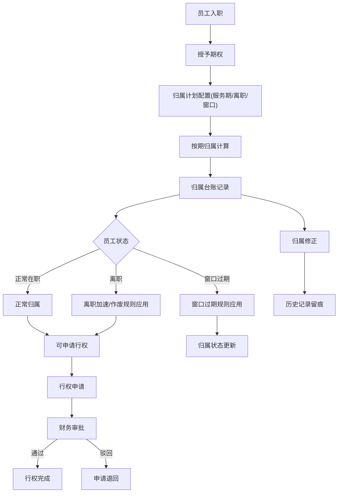

## 1. 产品概述
员工期权归属台账管理系统，解决创业公司HR与财务在期权归属、离职处理、行权窗口等问题上的口径不一致问题。通过统一的后端数据模型，实现员工档案、归属计划、行权申请全链路可追溯，确保出问题时能快速定位归属计算、协议版本和行权状态。

- **目标用户**：创业公司财务、HR、期权管理专员
- **核心价值**：统一期权归属口径，提供完整审计线索，解决对账和对齐难题

## 2. 核心功能

### 2.1 用户角色
| 角色 | 权限 | 核心权限 |
|------|------|----------|
| 财务管理员 | 系统内置 | 查看所有数据、修正归属、下载台账、查看历史变更、审批行权 |
| HR专员 | 系统内置 | 查看员工归属、发起行权申请、查看员工档案 |
| 员工 | 系统内置 | 查看个人归属情况、提交行权申请 |

### 2.2 功能模块
1. **归属台账列表**：按员工维度展示归属概览、已归属、未归属、异常标记
2. **归属详情**：逐期归属明细、计算过程追溯、协议版本关联
3. **归属修正**：更正授予数量、调整归属进度、备注修正原因
4. **变更历史**：所有操作日志、操作人、时间、变更前后对比
5. **数据下载**：导出CSV/Excel台账
6. **员工档案**：员工基本信息、入职/离职日期、期权协议版本
7. **归属计划**：授予总量、归属周期、服务期要求、离职加速规则
8. **行权申请**：申请记录、行权窗口、行权状态、税务信息

### 2.3 页面详情
| 页面名称 | 模块名称 | 功能描述 |
|-----------|----------|------------|
| 归属台账首页 | 台账列表 | 搜索筛选、状态标签、异常高亮、快捷操作 |
| 归属详情页 | 归属明细 | 归属时间表、计算过程追溯、关联协议、行权记录 |
| 员工档案页 | 员工信息 | 基本信息、任职状态、协议列表 |
| 归属计划页 | 计划管理 | 授予信息、归属规则、加速规则配置 |
| 行权申请页 | 申请列表 | 申请状态流转、窗口校验 |
| 历史记录页 | 变更历史 | 操作审计、版本对比、备注查看 |

## 3. 核心流程

### 关键场景说明：
1. **正常归属**：按服务期逐月/逐年归属
2. **离职加速**：离职时根据协议版本决定是否加速归属剩余期权
3. **窗口过期**：行权窗口过期后未行权期权作废处理
4. **授予更正**：修正授予数量后重新计算归属，记录变更历史

## 4. 用户界面设计

### 4.1 设计风格
- **设计方向**：专业金融/财务工作台风格，克制理性，强调数据可信度和审计线索清晰
- **主色调**：深蓝(#1e3a5f) - 专业稳重
- **辅助色**：琥珀色(#d97706) - 异常/警告标识；Emerald(#059669) - 正常状态
- **字体**：标题使用"JetBrains Mono"等宽字体强化数据表格专业感，正文使用"PingFang SC"
- **按钮风格**：扁平化设计，细边框，hover时背景微交互
- **布局风格**：卡片式布局，表格为主，强调数据密度适中

### 4.2 页面设计概览
| 页面名称 | 模块名称 | UI元素 |
|-----------|----------|---------|
| 归属台账首页 | 台账列表 | 搜索框、筛选标签、数据表格、状态徽章、操作列 |
| 归属详情页 | 归属时间线 | 时间轴组件、计算追溯面板、协议关联链接、行权记录 |
| 员工档案页 | 侧边面板 | 信息卡片、状态标签、协议版本列表 |
| 归属计划页 | 计划卡片 | 规则说明、公式展示、参数配置 |
| 行权申请页 | 申请列表 | 状态流转、时间线、窗口提醒 |
| 历史记录页 | 变更列表 | 操作人、时间戳、变更前后对比diff |

### 4.3 响应式
桌面优先设计，适配1280px以上屏幕宽度，表格支持横向滚动，适配平板设备查看

### 4.4 异常场景可视化
- **离职加速**：橙色背景高亮，显示加速规则名称和加速计算公式
- **窗口过期**：红色斜体+删除线样式，标记过期日期和作废数量
- **授予更正**：显示变更前后对比diff，标注修正原因和操作人

## 5. 数据追溯设计
每条归属记录必须可追溯至：
1. **归属计算**：显示归属计算公式、参数、日期
2. **协议版本**：关联具体期权协议PDF/文档版本
3. **行权状态**：关联行权申请记录和审批历史
