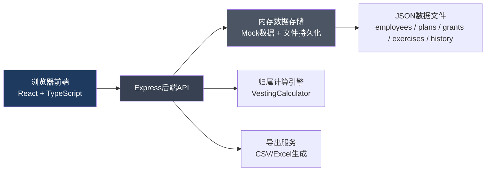
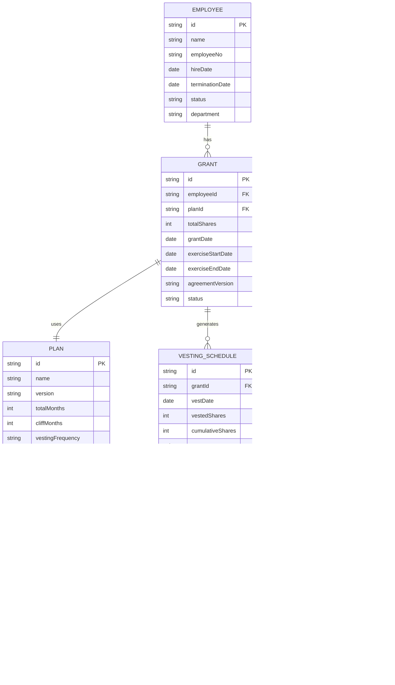

## 1. 架构设计



## 2. 技术描述
- **前端**：React@18 + TypeScript + tailwindcss@3 + vite + react-router-dom + zustand
- **后端**：Express@4 + TypeScript
- **数据存储**：内存数据 + JSON文件持久化（本地单机部署，无需数据库）
- **初始化工具**：vite-init (react-express-ts模板)
- **图标库**：lucide-react

## 3. 技术特点
1. **本地部署**：前后端同一项目，npm run dev即可启动完整应用
2. **数据持久化**：后端自动写入JSON文件，重启不丢失数据
3. **完整样例数据**：内置6名员工样例，覆盖正常归属、离职加速、窗口过期、授予更正等场景

## 4. 路由定义

| 路由 | 页面 | 用途 |
|-------|------|------|
| / | 归属台账首页 | 员工归属列表、搜索筛选、状态概览 |
| /vesting/:employeeId | 归属详情页 | 逐期归属明细、计算追溯、协议关联 |
| /employee/:employeeId | 员工档案页 | 员工信息、任职状态、协议列表 |
| /plan/:planId | 归属计划页 | 授予信息、归属规则、加速规则 |
| /exercises | 行权申请页 | 行权申请列表、状态流转 |
| /history | 历史记录页 | 变更历史、操作审计 |

### API路由
| 方法 | 路由 | 用途 |
|------|------|------|
| GET | /api/employees | 获取员工列表 |
| GET | /api/employees/:id | 获取员工详情 |
| GET | /api/plans | 获取归属计划列表 |
| GET | /api/plans/:id | 获取归属计划详情 |
| GET | /api/vesting/:employeeId | 获取员工归属明细 |
| POST | /api/vesting/:employeeId/correct | 修正归属记录 |
| GET | /api/exercises | 获取行权申请列表 |
| POST | /api/exercises | 提交行权申请 |
| PUT | /api/exercises/:id | 审批行权申请 |
| GET | /api/history | 获取变更历史 |
| GET | /api/export/csv | 导出CSV台账 |

## 5. 数据模型



## 6. 归属计算引擎设计

### 核心计算逻辑
```typescript
interface VestingCalculationInput {
  totalShares: number;
  grantDate: Date;
  totalMonths: number;
  cliffMonths: number;
  frequency: 'monthly' | 'yearly';
  hasAcceleration: boolean;
  accelerationRule: string;
  terminationDate?: Date;
}

interface VestingPeriod {
  vestDate: Date;
  shares: number;
  cumulative: number;
  status: 'vested' | 'pending' | 'accelerated' | 'forfeited' | 'expired';
  note: string;
}
```

### 加速规则类型
1. **单触发加速**：离职时立即加速归属X%
2. **双触发加速**：公司被收购+离职，加速归属
3. **无加速**：离职后未归属部分作废

### 窗口过期规则
- 行权窗口 = 离职后N天（通常90天）
- 窗口过期后未行权期权自动作废
- 正常员工行权窗口：授予后每年窗口期

## 7. 前端页面组件结构

```
src/
├── components/
│   ├── layout/
│   │   ├── Header.tsx
│   │   ├── Sidebar.tsx
│   │   └── PageContainer.tsx
│   ├── common/
│   │   ├── StatusBadge.tsx
│   │   ├── DataTable.tsx
│   │   └── VestingTimeline.tsx
│   ├── vesting/
│   │   ├── VestingList.tsx
│   │   ├── VestingDetailCard.tsx
│   │   ├── CalculationTrace.tsx
│   │   └── CorrectionModal.tsx
│   ├── employee/
│   │   ├── EmployeeCard.tsx
│   │   └── AgreementList.tsx
│   ├── plan/
│   │   ├── PlanCard.tsx
│   │   └── RuleDisplay.tsx
│   ├── exercise/
│   │   ├── ExerciseList.tsx
│   │   └── ExerciseForm.tsx
│   └── history/
│       └── HistoryList.tsx
├── pages/
│   ├── VestingListPage.tsx
│   ├── VestingDetailPage.tsx
│   ├── EmployeePage.tsx
│   ├── PlanPage.tsx
│   ├── ExercisePage.tsx
│   └── HistoryPage.tsx
├── store/
│   └── useVestingStore.ts
├── utils/
│   ├── api.ts
│   ├── vestingCalculator.ts
│   └── format.ts
└── shared/
    └── types.ts
```

## 8. 后端目录结构

```
api/
├── index.ts
├── routes/
│   ├── employees.ts
│   ├── plans.ts
│   ├── vesting.ts
│   ├── exercises.ts
│   ├── history.ts
│   └── export.ts
├── services/
│   ├── VestingCalculator.ts
│   ├── DataService.ts
│   └── ExportService.ts
├── data/
│   ├── seed.ts
│   └── sample-data/
│       ├── employees.json
│       ├── plans.json
│       ├── grants.json
│       ├── exercises.json
│       └── history.json
└── shared/
    └── types.ts
```

## 9. 样例数据设计

### 6名员工覆盖场景：
1. **张三** - 正常在职，按计划逐月归属（顺利样例）
2. **李四** - 已离职，触发双触发加速（离职加速场景）
3. **王五** - 已离职，无加速条款，未归属部分作废（离职无加速场景）
4. **赵六** - 行权窗口已过期，未行权期权作废（窗口过期场景）
5. **孙七** - 授予数量曾修正，有历史记录（授予更正场景）
6. **周八** - 等待悬崖期（cliff），暂无归属（悬崖期场景）
