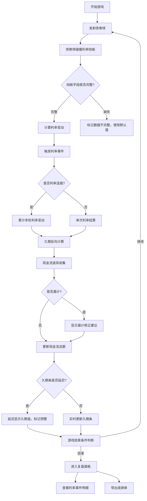

## 1. 产品概述

"债券久期弹球"是一款面向金融培训场景的投教游戏原型，通过弹球游戏形式教授债券久期、利率风险、现金流管理等核心金融概念。游戏强调真实金融结算逻辑，适合课堂或培训现场试玩。

- 核心目标：让玩家在游戏中直观理解债券久期与利率的反向关系、现金流计算逻辑
- 目标用户：金融培训讲师、债券投资者、金融专业学生

## 2. 核心功能

### 2.1 用户角色
| 角色 | 注册方式 | 核心权限 |
|------|----------|----------|
| 玩家 | 无需注册 | 进行游戏、查看复盘、导出成绩 |

### 2.2 功能模块
1. **游戏主界面**: 弹球画布、利率挡板、久期条、债券球、现金流道具
2. **结算系统**: 实时久期计算、利率事件触发、现金流漏计检测
3. **复盘面板**: 利率事件记录、久期结算明细、成绩导出
4. **提示系统**: 久期方向错误修正、现金流漏计修正建议

### 2.3 页面详情
| 页面名称 | 模块名称 | 功能描述 |
|----------|----------|----------|
| 游戏主界面 | 弹球画布 | Canvas渲染债券球运动、碰撞检测、物理引擎 |
| 游戏主界面 | 利率挡板 | 可移动挡板，带有利率字段（可能缺失） |
| 游戏主界面 | 久期条 | 动态显示当前久期值（可能延迟出现） |
| 游戏主界面 | 状态面板 | 显示当前利率、久期、现金流、分数 |
| 复盘面板 | 事件记录 | 完整记录所有利率事件、触发时间、影响值 |
| 复盘面板 | 结算明细 | 每笔久期结算的计算公式、结果、误差分析 |
| 复盘面板 | 成绩导出 | 导出JSON/CSV格式的游戏成绩单 |
| 修正提示 | 错误提示 | 久期方向反时高亮提示并给出修正建议 |
| 修正提示 | 漏计提示 | 现金流漏计时显示可操作的补计步骤 |

## 3. 核心流程

## 4. 用户界面设计

### 4.1 设计风格
- 主色调：深海军蓝(#0A2463) + 金融金(#D4AF37)，专业稳重
- 按钮风格：圆角矩形，微立体效果， hover时有金色边框高亮
- 字体：标题使用Playfair Display（衬线），正文使用Source Code Pro（等宽）
- 布局风格：左侧游戏画布 + 右侧状态面板 + 底部复盘抽屉
- 图标风格：简约线性图标，金融元素（债券、计算器、图表）

### 4.2 页面设计概述
| 页面名称 | 模块名称 | UI元素 |
|----------|----------|--------|
| 游戏主界面 | 弹球画布 | 深色背景、金色轨迹线、债券球带备注标签、半透明 |
| 游戏主界面 | 利率挡板 | 渐变绿色(降利率)/红色(升利率)、可拖拽、缺失字段标黄 |
| 游戏主界面 | 久期条 | 垂直进度条、延迟时显示加载动画、数值实时更新 |
| 复盘面板 | 事件记录 | 时间轴布局、关键事件高亮、可点击展开详情 |
| 复盘面板 | 结算明细 | 表格形式、公式显示、误差项标红 |
| 修正提示 | 浮层提示 | 底部滑入、黄色警告框、带操作按钮 |

### 4.3 响应式
- Desktop优先，支持1280px以上分辨率
- 平板适配：状态面板移至底部
- 触摸优化：挡板拖拽支持触摸操作

### 4.4 动效设计
- 债券球：碰撞时产生金色涟漪扩散效果
- 利率连跳：数字快速滚动动画，伴随震动反馈
- 久期方向错误：红色闪烁 + 左右摇晃动画
- 复盘抽屉：平滑展开/收起，内容淡入
