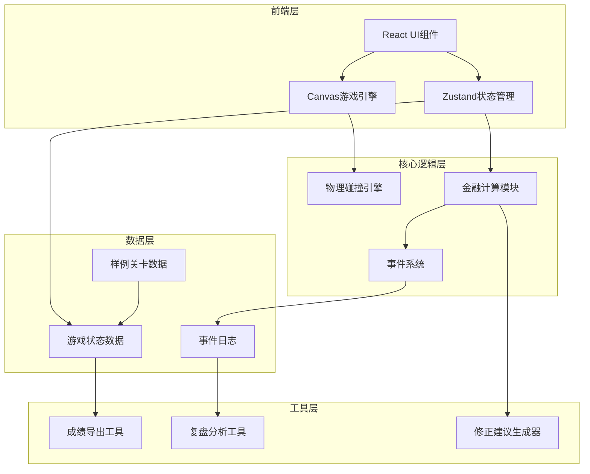

## 1. 架构设计



## 2. 技术描述

- 前端：React@18 + TypeScript + Vite
- 样式：TailwindCSS@3 + CSS Modules
- 状态管理：Zustand
- 游戏渲染：Canvas 2D API
- 物理引擎：自定义轻量级碰撞检测
- 数据：内置JSON样例数据，无后端依赖

## 3. 路由定义

| 路由 | 目的 |
|------|------|
| / | 游戏主页面（包含游戏画布和状态面板） |

## 4. 核心数据模型

### 4.1 债券球数据结构

```typescript
interface BondBall {
  id: string;
  x: number;
  y: number;
  vx: number;
  vy: number;
  radius: number;
  faceValue: number;      // 面值
  couponRate: number;     // 票面利率
  maturity: number;       // 剩余期限
  duration: number;       // 久期
  remark?: string;        // 备注（可能存在）
}
```

### 4.2 利率挡板数据结构

```typescript
interface RatePaddle {
  id: string;
  x: number;
  y: number;
  width: number;
  height: number;
  rateChange?: number;    // 利率变动（可能缺失）
  rateType: 'increase' | 'decrease';
  isFieldMissing: boolean; // 字段缺失标记
}
```

### 4.3 利率事件记录

```typescript
interface RateEvent {
  id: string;
  timestamp: number;
  rateBefore: number;
  rateAfter: number;
  rateChange: number;
  isConsecutiveJump: boolean;  // 是否连跳
  jumpCount: number;           // 连跳次数
  paddleId: string;
  formula: string;             // 计算公式
}
```

### 4.4 久期结算记录

```typescript
interface DurationSettlement {
  id: string;
  timestamp: number;
  bondId: string;
  initialDuration: number;
  rateChange: number;
  priceChange: number;         // 价格变动 = -久期 × 利率变动
  finalDuration: number;
  isDirectionCorrect: boolean; // 方向是否正确
  correctionSuggestion?: string;
}
```

### 4.5 现金流道具

```typescript
interface CashflowItem {
  id: string;
  x: number;
  y: number;
  amount: number;
  type: 'coupon' | 'principal';
  isMissed: boolean;           // 是否漏计
}
```

### 4.6 现金流漏计记录

```typescript
interface CashflowMiss {
  id: string;
  timestamp: number;
  itemId: string;
  missedAmount: number;
  correctionSteps: string[];   // 修正步骤
}
```

### 4.7 游戏状态

```typescript
interface GameState {
  currentRate: number;
  totalDuration: number;
  totalCashflow: number;
  score: number;
  level: number;
  isPlaying: boolean;
  isPaused: boolean;
  durationBarDelay: boolean;   // 久期条是否延迟
  rateEvents: RateEvent[];
  settlements: DurationSettlement[];
  cashflowMisses: CashflowMiss[];
}
```

## 5. 核心算法

### 5.1 久期计算公式

```
修正久期 = 麦考利久期 / (1 + 收益率)
价格变动百分比 ≈ -修正久期 × 利率变动
```

### 5.2 利率连跳检测

- 连续3次碰撞同方向挡板触发连跳
- 连跳时利率变动按累计值计算
- 连跳事件在复盘中单独标记

### 5.3 现金流漏计检测

- 道具被债券球碰撞但未被玩家收集
- 超过5秒未收集自动标记为漏计
- 生成修正建议：补计时间、补计金额、影响分析

## 6. 样例数据位置

- 关卡数据：`/src/data/levels.json`
- 样例债券：`/src/data/bonds.json`
- 利率事件模板：`/src/data/rateEvents.json`

## 7. 关键触发条件

- 利率连跳触发：连续3次碰撞同方向（升/降）利率挡板
- 久期条延迟：关卡2及以上，概率性触发（30%概率）
- 现金流漏计：道具碰撞后玩家未在5秒内点击确认
- 久期方向错误：玩家手动调整久期方向与计算值相反时
