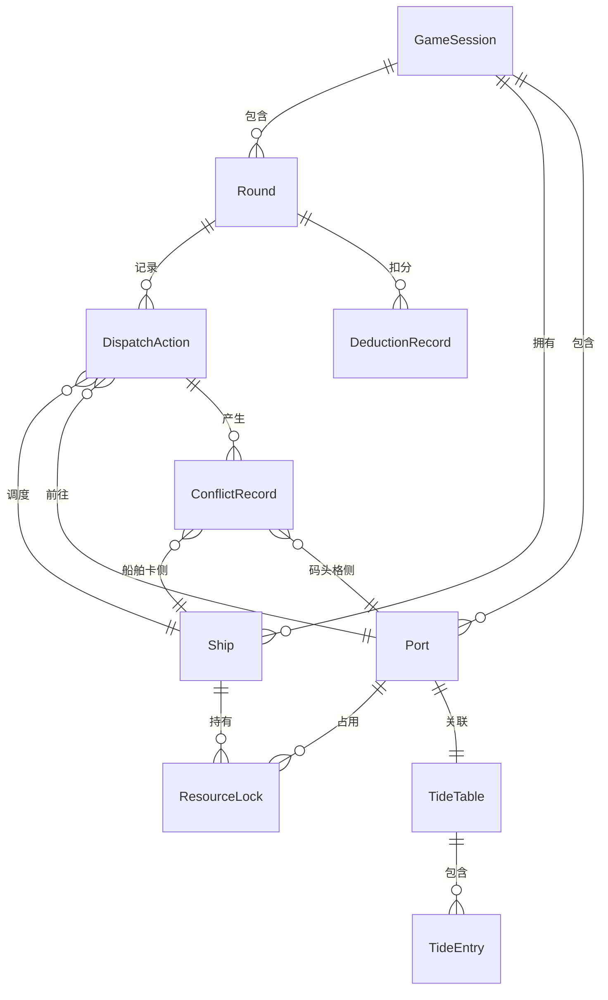

## 1. 架构设计

```mermaid
flowchart TB
    subgraph "前端层"
        "React 18 + TypeScript"
        "Zustand 状态管理"
        "Tailwind CSS"
        "React Router"
    end
    subgraph "数据层"
        "本地 Mock 数据"
        "LocalStorage 持久化"
    end
    "React 18 + TypeScript" --> "Zustand 状态管理"
    "Zustand 状态管理" --> "本地 Mock 数据"
    "Zustand 状态管理" --> "LocalStorage 持久化"
```

纯前端架构，无需后端服务。所有游戏数据通过 Zustand 管理并持久化到 LocalStorage，支持暂停/恢复和复盘回放。

## 2. 技术说明

- 前端：React@18 + TypeScript + Tailwind CSS@3 + Vite
- 初始化工具：vite-init
- 状态管理：Zustand（游戏状态、回合记录、冲突记录）
- 路由：React Router DOM v6
- 后端：无
- 数据库：无（LocalStorage 持久化 + 内存 Mock 数据）

## 3. 路由定义

| 路由 | 用途 |
|------|------|
| / | 棋盘主页：海域地图、船舶卡、潮汐表、回合信息 |
| /dispatch | 调度操作页：回合调度、资源锁定、调度预览 |
| /conflict | 冲突裁决页：冲突列表、潮汐缺失告警、燃油追溯 |
| /settlement | 结算复盘页：航线回放、扣分明细、决策树 |
| /report | 调度报告页：报告生成、资源锁定口径、分享 |

## 4. API定义

无后端API，所有数据通过前端 Zustand Store 管理。

## 5. 服务器架构图

不适用，纯前端项目。

## 6. 数据模型

### 6.1 数据模型定义



### 6.2 数据定义

```typescript
interface GameSession {
  id: string
  status: 'playing' | 'paused' | 'finished'
  currentRound: number
  totalRounds: number
  tideCycle: number
  createdAt: number
  pausedAt: number | null
}

interface Ship {
  id: string
  name: string
  capacity: number
  fuel: number
  maxFuel: number
  speed: number
  currentPortId: string | null
  position: { x: number; y: number }
  status: 'idle' | 'sailing' | 'docking' | 'loading' | 'locked'
  cargo: CargoItem[]
}

interface Port {
  id: string
  name: string
  position: { x: number; y: number }
  berths: Berth[]
  supplyTypes: string[]
}

interface Berth {
  id: string
  portId: string
  capacity: number
  currentShipId: string | null
  status: 'available' | 'occupied' | 'locked' | 'tide_blocked'
}

interface TideTable {
  portId: string
  entries: TideEntry[]
  missingRanges: TideMissingRange[]
}

interface TideEntry {
  round: number
  type: 'high' | 'low' | 'rising' | 'falling'
  level: number
  dockable: boolean
  dangerous: boolean
}

interface TideMissingRange {
  startRound: number
  endRound: number
  reason: string
}

interface ResourceLock {
  id: string
  type: 'fuel' | 'berth' | 'cargo'
  resourceId: string
  shipId: string
  round: number
  reason: string
  unlockCondition: string
}

interface DispatchAction {
  id: string
  round: number
  shipId: string
  fromPortId: string
  toPortId: string
  fuelCost: number
  cargoChange: CargoItem[]
  tideWindowMatched: boolean
  conflicts: ConflictRecord[]
  timestamp: number
}

interface ConflictRecord {
  id: string
  actionId: string
  type: 'berth_collision' | 'tide_mismatch' | 'fuel_shortage' | 'data_inconsistency'
  shipCardValue: string | number
  dockGridValue: string | number
  fieldName: string
  resolution: 'keep_ship' | 'keep_dock' | 'manual_fix' | 'unresolved'
  resolutionReason: string
  round: number
}

interface DeductionRecord {
  id: string
  round: number
  actionId: string
  type: 'missed_tide' | 'fuel_overrun' | 'conflict_unresolved' | 'route_deviation'
  points: number
  reason: string
  relatedActionId: string
  relatedRecordType: 'dispatch' | 'conflict' | 'tide'
  relatedRecordId: string
}

interface CargoItem {
  id: string
  type: string
  quantity: number
  destination: string
}
```
