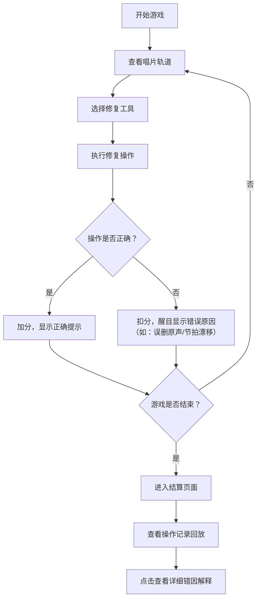

## 1. 产品概述

"黑胶唱片修复师"是一款面向音乐社学生的教育小游戏，通过互动式修唱片的游戏体验，帮助学生直观理解噪声、爆音、节拍漂移等音频问题的成因和修复方法。

- 解决的核心问题：学生难以区分噪声、爆音、节拍漂移等音频问题
- 目标用户：音乐社学生、音乐老师
- 产品价值：将抽象的音频概念转化为可视化的游戏操作，让学生在操作中理解问题本质

## 2. 核心特性

### 2.1 用户角色

| 角色 | 注册方式 | 核心权限 |
|------|----------|----------|
| 学生玩家 | 无需注册，直接进入 | 进行游戏、查看错误原因、回放操作记录 |
| 音乐老师 | 无需注册 | 查看玩家操作记录、分析错误分布、教学参考 |

### 2.2 功能模块

1. **游戏主界面**：唱片轨道可视化、操作工具区、实时评分区
2. **操作记录回放**：每一步操作的时间轴、触发的节奏判定、错因解释
3. **结算界面**：最终得分、错误统计、知识点总结

### 2.3 页面详情

| 页面名称 | 模块名称 | 功能描述 |
|-----------|-------------|---------------------|
| 开始页面 | 游戏介绍 | 展示游戏目标、基本操作说明、三种音频问题的概念介绍 |
| 游戏主界面 | 唱片轨道 | 可视化显示唱片轨道、节拍线、噪声点、爆音点 |
| 游戏主界面 | 工具面板 | 提供噪声消除、爆音修复、节拍校准三种工具 |
| 游戏主界面 | 实时反馈 | 每次操作后立即显示节奏判定结果和扣分原因 |
| 结算页面 | 分数统计 | 展示最终得分、正确率、各类错误数量 |
| 结算页面 | 操作回放 | 时间轴展示所有操作，点击可查看详细错因解释 |

## 3. 核心流程

玩家进入游戏 → 查看唱片轨道上的问题点 → 选择对应工具进行修复 → 系统实时判定操作准确性 → 误操作（如误删原声、节拍漂移）会醒目提示 → 游戏结束 → 查看最终成绩和完整操作记录 → 点击任意操作查看详细错因解释

## 4. 用户界面设计

### 4.1 设计风格

- 主色调：深棕色（#3E2723）+ 金色（#FFD700）+ 暗红色（#B71C1C），营造复古黑胶唱片氛围
- 辅助色：绿色（#2E7D32）表示正确，红色（#C62828）表示错误
- 按钮风格：圆形复古按钮，带轻微3D效果和按压反馈
- 字体：标题使用复古衬线字体，正文使用清晰易读的无衬线字体
- 布局风格：中心对称的唱片布局，顶部信息栏，底部工具面板
- 图标风格：黑胶、唱片、音符等音乐相关图标

### 4.2 页面设计概览

| 页面名称 | 模块名称 | UI 元素 |
|-----------|-------------|-------------|
| 开始页面 | 标题区 | 大标题"黑胶唱片修复师"，副标题"音乐社教学小游戏"，复古字体 |
| 开始页面 | 介绍区 | 三张卡片分别介绍噪声、爆音、节拍漂移的概念 |
| 游戏主界面 | 唱片区 | 中心圆形唱片轨道，旋转动画，节拍线动态移动 |
| 游戏主界面 | 问题标记 | 噪声点（灰色斑点）、爆音点（红色星号）、节拍偏移标记（黄色箭头） |
| 游戏主界面 | 工具面板 | 底部三个大按钮：消除噪声、修复爆音、校准节拍 |
| 游戏主界面 | 实时反馈 | 操作后弹出提示框，错误用红色闪烁边框 |
| 结算页面 | 分数卡片 | 大字号显示最终得分，星级评价 |
| 结算页面 | 错误统计 | 三种错误类型的数量统计，柱状图可视化 |
| 结算页面 | 操作时间轴 | 横向时间轴，每个操作点可点击展开详情 |

### 4.3 响应式

- 桌面端优先，支持1024px以上分辨率
- 平板设备自适应布局，工具按钮适当放大
- 重点保证唱片区域的可视尺寸

### 4.4 关键交互细节

- **误删原声警示**：操作错误时，全屏幕红色闪烁边框 + 醒目文字提示 + 声音反馈
- **节拍漂移提示**：用动画展示节拍线偏移方向，标注"漂移了X毫秒"
- **操作回放**：时间轴支持拖拽，自动播放功能，每步操作同步显示对应解释
