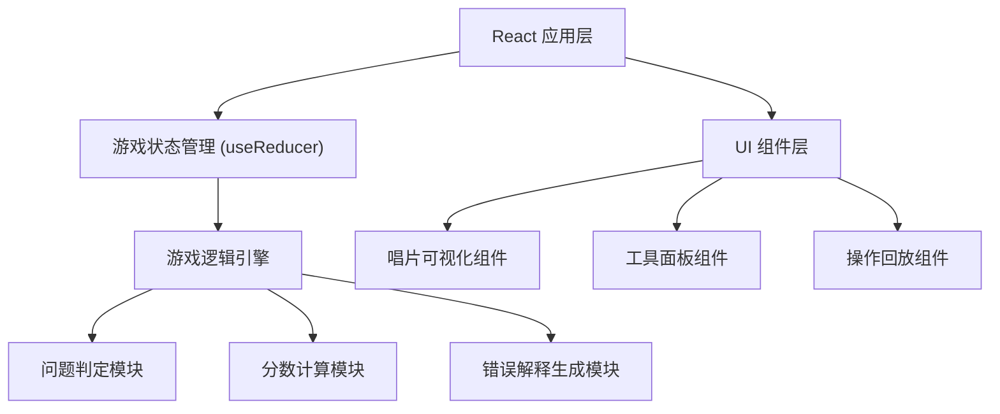

## 1. 架构设计

本项目为纯前端教育小游戏，无需后端服务，所有数据和逻辑均在浏览器端运行。



## 2. 技术描述

- **前端框架**: React@18 + TypeScript
- **构建工具**: Vite@5
- **样式方案**: TailwindCSS@3 + CSS Modules
- **状态管理**: React useReducer + Context (轻量级状态管理)
- **动画库**: Framer Motion (用于流畅的交互动画)
- **图标**: Lucide React
- **后端**: 无（纯前端应用）
- **数据库**: 无（使用 localStorage 保存游戏记录）

## 3. 路由定义

| 路由 | 页面 | 用途 |
|-------|------|---------|
| / | 开始页面 | 游戏介绍、玩法说明、概念解释 |
| /game | 游戏主界面 | 唱片修复游戏主体 |
| /result | 结算页面 | 分数统计、操作回放、错因解释 |

## 4. 核心数据模型

### 4.1 游戏状态类型定义

```typescript
// 问题类型
type ProblemType = 'noise' | 'pop' | 'drift';

// 工具类型
type ToolType = 'removeNoise' | 'fixPop' | 'calibrateBeat';

// 问题点
interface ProblemSpot {
  id: string;
  type: ProblemType;
  position: number; // 轨道上的位置 (0-100)
  track: number; // 轨道编号 (1-4)
  severity: 'low' | 'medium' | 'high';
  isFixed: boolean;
  explanation: string; // 该问题的知识点解释
}

// 操作记录
interface ActionRecord {
  id: string;
  timestamp: number;
  toolUsed: ToolType;
  targetSpotId?: string;
  isCorrect: boolean;
  scoreChange: number;
  errorType?: 'wrongTool' | 'missedOriginal' | 'beatDrift' | 'noProblem';
  errorExplanation?: string;
}

// 游戏状态
interface GameState {
  status: 'idle' | 'playing' | 'paused' | 'finished';
  score: number;
  maxScore: number;
  currentTrack: number;
  problemSpots: ProblemSpot[];
  actionHistory: ActionRecord[];
  selectedTool: ToolType | null;
  combo: number;
  timeRemaining: number;
}
```

### 4.2 错误判定规则

| 错误类型 | 触发条件 | 扣分 | 解释模板 |
|---------|----------|------|---------|
| wrongTool | 用错工具（如用噪声工具点爆音） | -10 | "错误：这是爆音问题，应该使用【修复爆音】工具。爆音是瞬间的尖锐声音..." |
| missedOriginal | 在原声区域误操作（误删原声） | -20 | "⚠️ 严重错误：误删原声！这里是正常的音乐内容，不需要修复..." |
| beatDrift | 节拍校准时机不对导致漂移 | -15 | "节拍漂移：校准时机偏差了X毫秒。正确的时机应该是..." |
| noProblem | 在无问题区域点击 | -5 | "这里没有问题，请仔细观察唱片轨道上的标记..." |

## 5. 核心模块划分

### 5.1 游戏引擎模块
- 位置：`src/game/engine.ts`
- 职责：问题生成、操作判定、分数计算、状态更新

### 5.2 错误解释模块
- 位置：`src/game/explanations.ts`
- 职责：根据错误类型生成详细的知识点解释

### 5.3 唱片可视化组件
- 位置：`src/components/VinylRecord.tsx`
- 职责：渲染唱片轨道、问题点、节拍线动画

### 5.4 操作回放组件
- 位置：`src/components/ActionTimeline.tsx`
- 职责：时间轴展示、操作详情展开、自动播放

### 5.5 工具面板组件
- 位置：`src/components/ToolPanel.tsx`
- 职责：工具选择、视觉反馈

## 6. 关键技术实现点

### 6.1 唱片动画
- 使用 CSS transform 实现唱片旋转效果
- 使用 requestAnimationFrame 实现节拍线平滑移动
- Framer Motion 实现问题点的出现/消失动画

### 6.2 误删原声警示效果
- CSS keyframes 实现红色边框闪烁动画
- 配合 Web Audio API 发出警示音效（可选）
- 大字体醒目显示错误信息

### 6.3 操作记录持久化
- 使用 localStorage 保存最近10局游戏记录
- 支持导出/分享功能（可选）

### 6.4 响应式布局
- 使用 TailwindCSS 的 grid 和 flex 布局
- 唱片区域使用 aspect-ratio 保持圆形
- 移动端适配：工具按钮垂直排列
