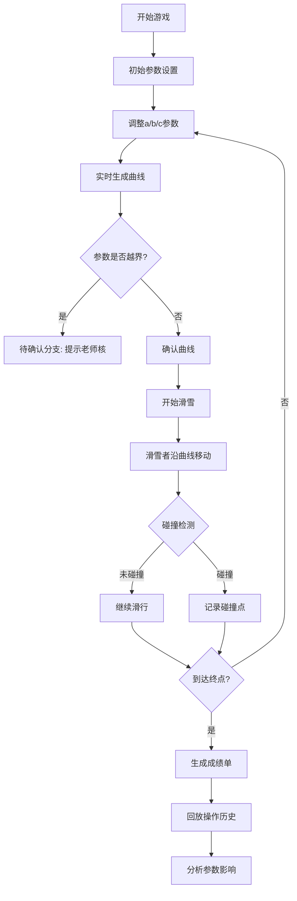

## 1. 产品概述

函数图像滑雪赛是一款数学教育互动游戏，通过让学生调整二次函数参数控制滑雪曲线，直观理解参数变化对函数图像的影响。
- 核心目标：解决学生"背公式但不懂参数意义"的痛点，通过游戏化方式学习二次函数
- 目标用户：初中数学老师和学生
- 产品价值：将抽象数学概念转化为可视化、可交互的游戏体验

## 2. 核心功能

### 2.1 用户角色
| 角色 | 核心权限 |
|------|----------|
| 学生玩家 | 调整参数、进行游戏、查看成绩单 |
| 数学老师 | 查看回放、分析参数调整过程、评估学习效果 |

### 2.2 功能模块
1. **游戏主界面**：参数控制面板、Canvas游戏画布、障碍物显示
2. **参数调整模块**：二次函数a/b/c参数滑块、实时曲线预览
3. **游戏进行模块**：滑雪者沿曲线移动、碰撞检测、速度计算
4. **异常处理模块**：参数越界确认、曲线断裂提示、速度误判说明
5. **回放与成绩单**：操作历史回放、成绩分析、参数影响可视化

### 2.3 页面详情
| 页面名称 | 模块名称 | 功能描述 |
|-----------|-------------|---------------------|
| 游戏主页 | 参数控制面板 | 三个滑块控制y=ax²+bx+c的a/b/c参数，实时显示函数表达式 |
| 游戏主页 | 滑雪赛道画布 | Canvas绘制函数曲线、滑雪者、障碍物、终点线 |
| 游戏主页 | 状态指示器 | 显示当前速度、已滑距离、碰撞警告 |
| 成绩单页 | 操作历史 | 时间线展示每一步参数调整及对应曲线变化 |
| 成绩单页 | 成绩分析 | 碰撞点标注、参数越界记录、成绩影响因素说明 |
| 成绩单页 | 数学结论 | 参数变化与曲线形态关系的总结说明 |

## 3. 核心流程

## 4. 用户界面设计

### 4.1 设计风格
- **主色调**：雪山蓝 (#1e3a5f) + 滑雪红 (#e63946) + 冰雪白 (#f8f9fa)
- **辅助色**：曲线绿 (#2a9d8f)、警告橙 (#f4a261)、成功绿 (#52b788)
- **按钮风格**：圆角矩形，微立体效果，hover时有上浮动画
- **字体**：标题使用 'Orbitron'（科技运动感），正文使用 'Noto Sans SC'（清晰易读）
- **布局风格**：左右分栏 - 左侧参数控制区，右侧游戏画布区
- **图标风格**：线性图标，运动主题，简洁明了

### 4.2 页面设计概览
| 页面名称 | 模块名称 | UI元素 |
|-----------|-------------|-------------|
| 游戏主页 | 参数面板 | 卡片式布局、滑块带刻度、函数公式实时渲染 |
| 游戏主页 | 画布区域 | 网格背景、函数曲线渐变、滑雪者精灵动画 |
| 成绩单页 | 时间线 | 垂直时间轴、曲线缩略图、参数变化标记 |
| 成绩单页 | 分析区域 | 碰撞点高亮、参数影响雷达图、数学结论卡片 |

### 4.3 响应式
- 桌面端优先设计（1280px+）
- 平板端：左右布局改为上下布局
- 移动端：参数面板折叠为抽屉式菜单

