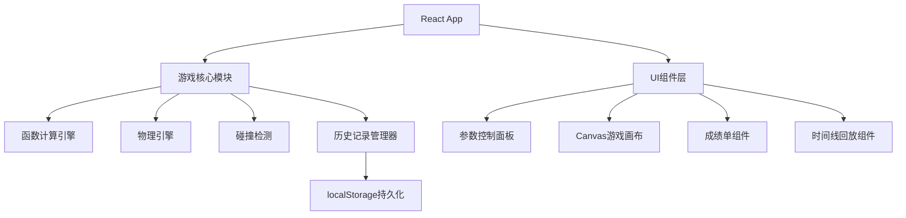

## 1. 架构设计



## 2. 技术描述

- **前端框架**: React@18 + TypeScript
- **构建工具**: Vite
- **样式方案**: TailwindCSS@3
- **图表/画布**: Canvas API（原生）
- **状态管理**: React Hooks + useReducer
- **路由**: React Router@6
- **动画**: Framer Motion
- **数学计算**: 原生Math API + 自定义函数计算引擎

## 3. 核心数据结构

### 3.1 游戏状态类型定义

```typescript
// 二次函数参数
interface QuadraticParams {
  a: number;      // 二次项系数 (-5 ~ 5)
  b: number;      // 一次项系数 (-10 ~ 10)
  c: number;      // 常数项 (-10 ~ 10)
  timestamp: number;
}

// 障碍物
interface Obstacle {
  id: string;
  x: number;      // 画布坐标
  y: number;
  width: number;
  height: number;
  type: 'tree' | 'rock' | 'flag';
}

// 滑雪者状态
interface Skier {
  x: number;
  y: number;
  velocity: number;
  angle: number;
}

// 碰撞记录
interface CollisionRecord {
  id: string;
  timestamp: number;
  obstacleId: string;
  params: QuadraticParams;
  position: { x: number; y: number };
}

// 操作历史
interface HistoryEntry {
  id: string;
  timestamp: number;
  type: 'param_change' | 'curve_confirm' | 'collision' | 'finish';
  params?: QuadraticParams;
  description: string;
}

// 游戏状态
interface GameState {
  status: 'idle' | 'playing' | 'paused' | 'finished';
  currentParams: QuadraticParams;
  skier: Skier;
  obstacles: Obstacle[];
  collisions: CollisionRecord[];
  history: HistoryEntry[];
  score: number;
  distance: number;
  paramWarnings: string[];
}

// 成绩单数据
interface ReportCard {
  gameId: string;
  startTime: number;
  endTime: number;
  totalScore: number;
  finalParams: QuadraticParams;
  paramChanges: QuadraticParams[];
  collisions: CollisionRecord[];
  conclusions: {
    paramEffect: string;
    speedAnalysis: string;
    suggestions: string;
  };
}
```

## 4. 核心算法

### 4.1 二次函数计算
```
y = a*x² + b*x + c
其中 x 为水平位移，转换为画布坐标
```

### 4.2 速度计算
- 基础速度：与曲线斜率相关
- 斜率 = 2*a*x + b（导数）
- 速度 = baseSpeed * (1 + |slope| * speedFactor)

### 4.3 碰撞检测算法
- 采样滑雪者路径上的点
- 检测每个点是否与障碍物矩形相交
- 记录碰撞位置和对应参数

## 5. 参数校验规则

| 参数 | 正常范围 | 越界处理 |
|------|----------|----------|
| a | [-3, 3] | 提示：曲线开口过大/过小，待老师确认 |
| b | [-8, 8] | 提示：对称轴位置异常，待老师确认 |
| c | [-8, 8] | 提示：起始高度异常，待老师确认 |

## 6. 成绩单生成规则

1. **参数影响分析**：统计每次参数调整后曲线变化
2. **碰撞关联分析**：标记导致碰撞的参数设置
3. **数学结论生成**：
   - a值影响：开口方向与大小
   - b值影响：对称轴位置
   - c值影响：上下平移
4. **成绩计算**：基础分 - 碰撞惩罚 + 速度奖励

