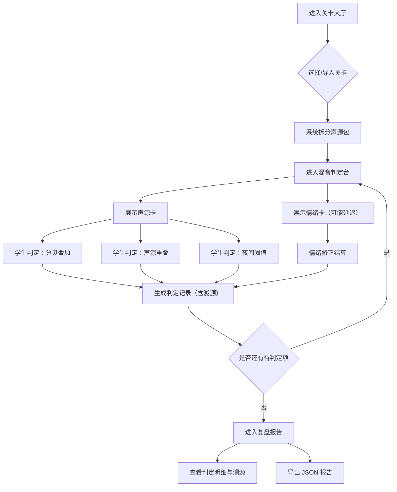

## 1. 产品概述

"城市声景混音局"是一款面向音乐科技课堂教学与培训的可试玩原型工具，用于训练学生判断城市声景中多声源混合前后的变化、阈值合规性以及居民情绪影响。核心目标：让每一次混音判定都可溯源、可复盘，且历史记录在重启后不丢失、不重复。

- 目标用户：音乐科技教师、声学培训讲师、课堂学生
- 核心价值：将城市噪声合规判定与居民情绪反馈紧密结合，提供可验证、可追溯的教学原型

## 2. 核心功能

### 2.1 用户角色

| 角色 | 注册方式 | 核心权限 |
|------|----------|----------|
| 教师 | 本地创建 | 创建关卡、导入声源包、查看复盘报告、导出报告 |
| 学生 | 本地创建 | 参与关卡、提交判定、查看个人复盘 |

### 2.2 功能模块

1. **关卡大厅**：展示可用关卡列表，每个关卡包含声源卡、居民情绪卡和混音规则
2. **混音判定台**：核心交互区，学生对声源混合前后的分贝叠加、声源重叠、夜间阈值做出判断
3. **复盘报告**：展示每次判定的详细结算，包含阈值命中、情绪修正、溯源链路
4. **报告导出**：将复盘报告导出为 JSON 文件，保留完整溯源信息

### 2.3 页面详情

| 页面名称 | 模块名称 | 功能描述 |
|----------|----------|----------|
| 关卡大厅 | 关卡列表 | 展示关卡卡片，显示关卡名称、包含的声源数量、情绪卡数量、难度标签 |
| 关卡大厅 | 导入声源包 | 上传包含声源卡、居民情绪、混音报告的混合包，自动拆分归类 |
| 混音判定台 | 声源面板 | 展示当前关卡所有声源卡（名称、分贝值、时段、频段） |
| 混音判定台 | 情绪面板 | 展示居民情绪卡（情绪类型、强度、可能延迟到达） |
| 混音判定台 | 判定区 | 学生判断：分贝叠加是否正确、声源重叠是否被错误合并、夜间阈值是否违规 |
| 混音判定台 | 结算区 | 实时显示当前判定的得分、阈值命中状态、情绪修正系数 |
| 复盘报告 | 判定明细 | 每条判定追溯原始声源卡ID、情绪卡ID、报告来源 |
| 复盘报告 | 溯源链路 | 可视化展示从判定到原始数据的完整溯源链 |
| 复盘报告 | 导出按钮 | 一键导出 JSON 格式复盘报告 |

## 3. 核心流程

1. 教师/学生进入关卡大厅，选择或导入关卡
2. 系统自动拆分包中的声源卡、居民情绪卡和混音报告
3. 学生在混音判定台逐一判断每条混音记录：
   - 分贝叠加是否正确（对数叠加，非简单相加）
   - 声源重叠是否被错误合并（应保持独立计数）
   - 夜间阈值是否被违规突破（22:00-06:00 严格阈值）
4. 居民情绪卡可能延迟到达，补来后重新触发相关判定的情绪修正
5. 每条判定记录包含溯源链：判定 → 声源卡 / 情绪卡 / 报告来源
6. 关卡结束后进入复盘报告，可查看完整判定明细和溯源链路
7. 报告可导出为 JSON，历史记录持久化存储

## 4. 用户界面设计

### 4.1 设计风格

- 主色调：深墨蓝 (#1a1f36) + 琥珀警示色 (#f59e0b) + 翠绿合规色 (#10b981)
- 次要色：钢灰 (#374151) 用于面板背景，暗红 (#ef4444) 用于违规标记
- 按钮风格：圆角矩形（rounded-lg），微投影，hover 时边框发光
- 字体：标题使用 "Noto Sans SC" 粗体，正文使用 "Noto Sans SC" 常规
- 布局风格：左侧面板 + 中央工作区 + 右侧结算栏的三栏布局
- 图标风格：lucide-react 线性图标

### 4.2 页面设计概览

| 页面名称 | 模块名称 | UI 元素 |
|----------|----------|---------|
| 关卡大厅 | 关卡列表 | 卡片网格布局，每张卡片含关卡名/声源数/难度标签，hover 时微微上浮 |
| 关卡大厅 | 导入声源包 | 拖拽上传区域，虚线边框，上传后显示拆分结果概要 |
| 混音判定台 | 声源面板 | 左侧竖向列表，每行含声源名/分贝值/时段徽标 |
| 混音判定台 | 情绪面板 | 左侧竖向列表，延迟到达的情绪卡有脉冲动画提示 |
| 混音判定台 | 判定区 | 中央主区域，三条判定项各含通过/违规按钮，提交后即时反馈 |
| 混音判定台 | 结算区 | 右侧面板，实时分数、阈值状态灯（绿/黄/红）、情绪修正系数 |
| 复盘报告 | 判定明细 | 表格布局，每行可展开溯源链路（声源→情绪→报告） |
| 复盘报告 | 导出按钮 | 底部固定栏，含导出 JSON 按钮 |

### 4.3 响应式

- 桌面优先设计，三栏布局在 ≥1280px 宽度下最优
- 平板（768-1279px）时结算区折叠为底部抽屉
- 手机（<768px）时三栏变为单栏垂直滚动

### 4.4 3D 场景指引

- 不适用，本项目为 2D 交互原型
