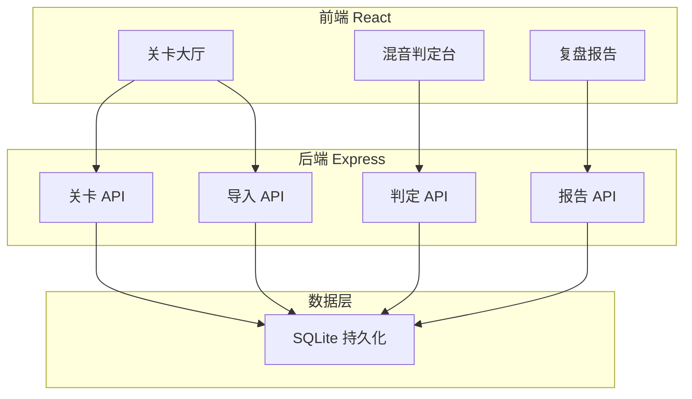
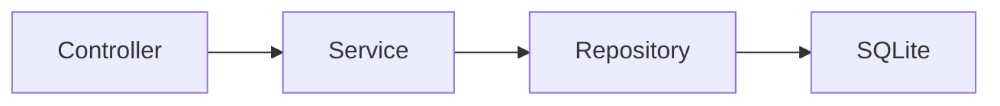
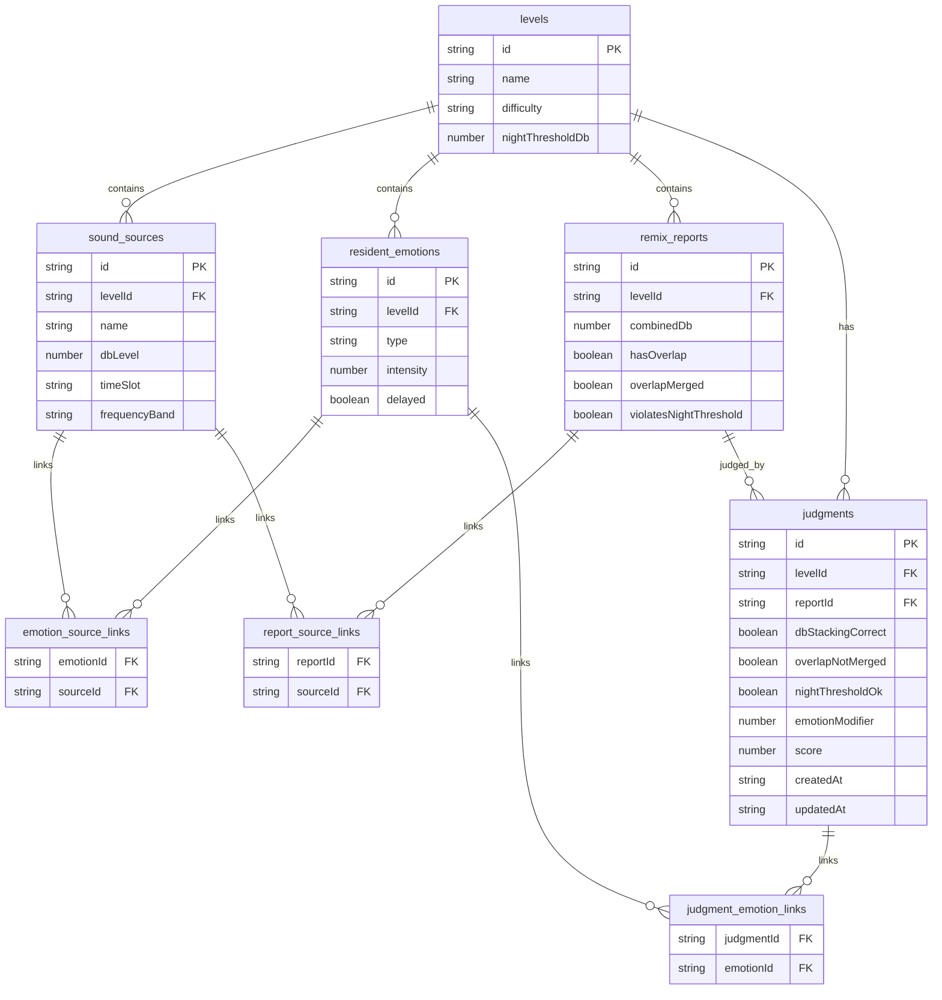

## 1. 架构设计



## 2. 技术说明

- 前端：React@18 + tailwindcss@3 + vite + zustand
- 初始化工具：vite-init
- 后端：Express@4 + TypeScript (ESM)
- 数据库：SQLite (better-sqlite3)，文件存储在 `data/soundscape.db`
- 无外部服务依赖

## 3. 路由定义

| 路由 | 用途 |
|------|------|
| / | 关卡大厅，展示关卡列表和导入入口 |
| /level/:id | 混音判定台，核心交互界面 |
| /report/:id | 复盘报告，判定明细与溯源 |

## 4. API 定义

### 4.1 关卡相关

```
GET    /api/levels              获取所有关卡
POST   /api/levels/import       导入声源包（含声源卡+情绪卡+混音报告）
GET    /api/levels/:id          获取关卡详情（含声源卡、情绪卡）
```

### 4.2 判定相关

```
POST   /api/judgments           提交一条判定
GET    /api/judgments/:levelId  获取某关卡的所有判定记录
PATCH  /api/judgments/:id       情绪补来后修正判定
```

### 4.3 报告相关

```
GET    /api/reports/:levelId    获取复盘报告（含完整溯源）
GET    /api/reports/:levelId/export  导出 JSON 报告
```

### 4.4 TypeScript 类型定义

```typescript
interface SoundSource {
  id: string;
  name: string;
  dbLevel: number;
  timeSlot: "day" | "night";
  frequencyBand: string;
  levelId: string;
}

interface ResidentEmotion {
  id: string;
  type: "annoyed" | "anxious" | "calm" | "sleepless";
  intensity: number;
  relatedSourceIds: string[];
  delayed: boolean;
  levelId: string;
}

interface RemixReport {
  id: string;
  levelId: string;
  sourceIds: string[];
  combinedDb: number;
  hasOverlap: boolean;
  overlapMerged: boolean;
  violatesNightThreshold: boolean;
}

interface Judgment {
  id: string;
  levelId: string;
  reportId: string;
  sourceIds: string[];
  emotionIds: string[];
  dbStackingCorrect: boolean | null;
  overlapNotMerged: boolean | null;
  nightThresholdOk: boolean | null;
  emotionModifier: number;
  score: number;
  createdAt: string;
  updatedAt: string;
}

interface Level {
  id: string;
  name: string;
  difficulty: "easy" | "medium" | "hard";
  nightThresholdDb: number;
  sources: SoundSource[];
  emotions: ResidentEmotion[];
  reports: RemixReport[];
}
```

## 5. 服务端架构图



## 6. 数据模型

### 6.1 数据模型定义



### 6.2 数据定义语言

```sql
CREATE TABLE IF NOT EXISTS levels (
  id TEXT PRIMARY KEY,
  name TEXT NOT NULL,
  difficulty TEXT NOT NULL CHECK(difficulty IN ('easy','medium','hard')),
  nightThresholdDb REAL NOT NULL DEFAULT 45.0,
  createdAt TEXT NOT NULL DEFAULT (datetime('now'))
);

CREATE TABLE IF NOT EXISTS sound_sources (
  id TEXT PRIMARY KEY,
  levelId TEXT NOT NULL REFERENCES levels(id),
  name TEXT NOT NULL,
  dbLevel REAL NOT NULL,
  timeSlot TEXT NOT NULL CHECK(timeSlot IN ('day','night')),
  frequencyBand TEXT NOT NULL
);

CREATE TABLE IF NOT EXISTS resident_emotions (
  id TEXT PRIMARY KEY,
  levelId TEXT NOT NULL REFERENCES levels(id),
  type TEXT NOT NULL CHECK(type IN ('annoyed','anxious','calm','sleepless')),
  intensity REAL NOT NULL,
  delayed INTEGER NOT NULL DEFAULT 0
);

CREATE TABLE IF NOT EXISTS emotion_source_links (
  emotionId TEXT NOT NULL REFERENCES resident_emotions(id),
  sourceId TEXT NOT NULL REFERENCES sound_sources(id),
  PRIMARY KEY (emotionId, sourceId)
);

CREATE TABLE IF NOT EXISTS remix_reports (
  id TEXT PRIMARY KEY,
  levelId TEXT NOT NULL REFERENCES levels(id),
  combinedDb REAL NOT NULL,
  hasOverlap INTEGER NOT NULL DEFAULT 0,
  overlapMerged INTEGER NOT NULL DEFAULT 0,
  violatesNightThreshold INTEGER NOT NULL DEFAULT 0
);

CREATE TABLE IF NOT EXISTS report_source_links (
  reportId TEXT NOT NULL REFERENCES remix_reports(id),
  sourceId TEXT NOT NULL REFERENCES sound_sources(id),
  PRIMARY KEY (reportId, sourceId)
);

CREATE TABLE IF NOT EXISTS judgments (
  id TEXT PRIMARY KEY,
  levelId TEXT NOT NULL REFERENCES levels(id),
  reportId TEXT NOT NULL REFERENCES remix_reports(id),
  dbStackingCorrect INTEGER,
  overlapNotMerged INTEGER,
  nightThresholdOk INTEGER,
  emotionModifier REAL NOT NULL DEFAULT 1.0,
  score REAL NOT NULL DEFAULT 0,
  createdAt TEXT NOT NULL DEFAULT (datetime('now')),
  updatedAt TEXT NOT NULL DEFAULT (datetime('now'))
);

CREATE TABLE IF NOT EXISTS judgment_emotion_links (
  judgmentId TEXT NOT NULL REFERENCES judgments(id),
  emotionId TEXT NOT NULL REFERENCES resident_emotions(id),
  PRIMARY KEY (judgmentId, emotionId)
);

CREATE INDEX IF NOT EXISTS idx_sources_level ON sound_sources(levelId);
CREATE INDEX IF NOT EXISTS idx_emotions_level ON resident_emotions(levelId);
CREATE INDEX IF NOT EXISTS idx_reports_level ON remix_reports(levelId);
CREATE INDEX IF NOT EXISTS idx_judgments_level ON judgments(levelId);
CREATE INDEX IF NOT EXISTS idx_judgments_report ON judgments(reportId);
```
