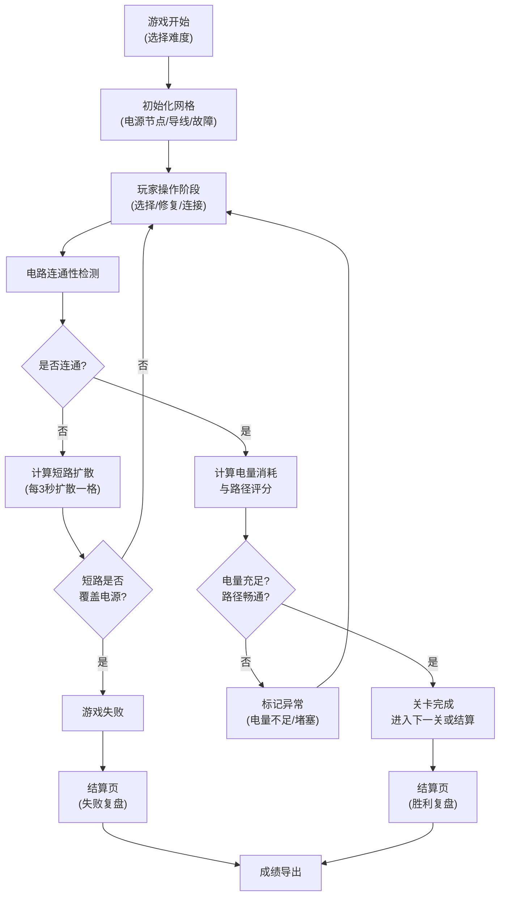
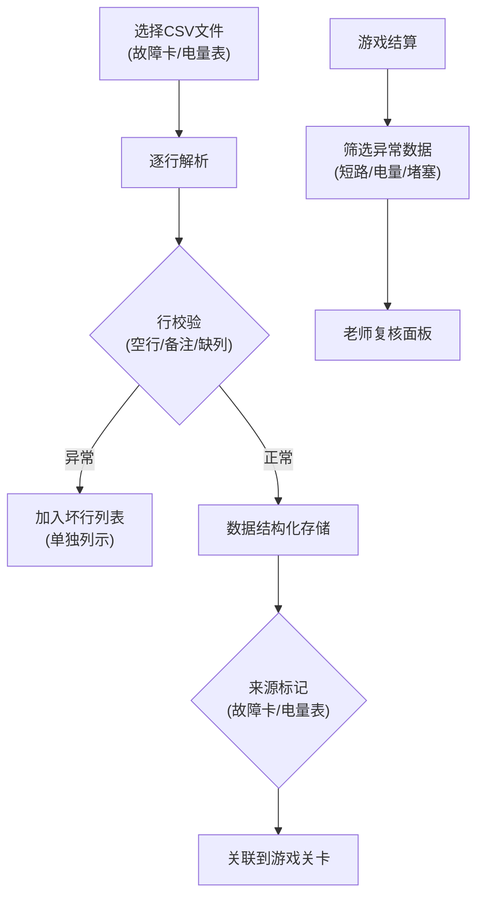
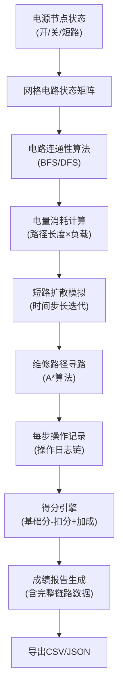

## 1. 产品概述

"网格电路抢修战"是一款面向物理教学场景的策略模拟游戏，玩家在网格地图上通过连接电源节点、修复故障、规划维修路径来完成电路抢修任务。游戏真实模拟电路连通、短路扩散、电量消耗等物理现象，帮助学生理解电路原理，同时支持物理老师导入自定义故障数据进行教学复盘。

- 核心价值：将抽象电路原理转化为可视化互动游戏，支持教学数据导入与成绩导出的完整链路
- 目标用户：物理社团学生（玩家）、物理老师（数据导入与复盘）

---

## 2. 核心功能

### 2.1 用户角色

| 角色 | 核心权限 |
|------|----------|
| 玩家 | 进行游戏操作、查看成绩、复盘对局 |
| 物理老师 | 导入故障卡/电量表数据、筛选异常数据、导出成绩报告 |

### 2.2 功能模块

1. **主菜单页**：开始游戏、数据导入、历史记录、帮助说明
2. **游戏主页面**：网格电路、操作面板、状态栏、电量表
3. **结算复盘页**：得分明细、资源分配扣分、故障追溯、数据导出
4. **数据管理页**：故障卡导入、电量表导入、坏行列示、异常筛选

### 2.3 页面详情

| 页面名称 | 模块名称 | 功能描述 |
|-----------|-------------|---------------------|
| 主菜单页 | 游戏入口 | 新游戏、继续游戏、难度选择（初级/中级/高级） |
| 主菜单页 | 数据管理 | 导入故障卡CSV、导入电量表CSV、查看坏行记录 |
| 游戏主页面 | 网格电路区 | 8x8至12x12可配置网格，显示电源、导线、故障、短路区 |
| 游戏主页面 | 操作面板 | 选择模式（修复/连接/隔离）、维修道具、暂停按钮、重开按钮 |
| 游戏主页面 | 状态监控 | 实时电量表、连通性指示器、短路扩散计时器 |
| 游戏主页面 | 复盘控制 | 时间轴滑块、步骤回放、关键事件标记 |
| 结算复盘页 | 得分统计 | 基础分、资源扣分项、效率加成分、总分计算 |
| 结算复盘页 | 故障追溯 | 标记短路扩散路径、堵塞位置、电量不足节点 |
| 结算复盘页 | 成绩导出 | 导出CSV/JSON格式，包含完整操作链路数据 |
| 数据管理页 | 数据校验 | 自动识别空行、备注行、缺列行、坏行并单独列示 |
| 数据管理页 | 异常筛选 | 按"短路扩散"、"电量不足"、"路径堵塞"分类筛选 |

---

## 3. 核心流程

### 3.1 游戏主流程

### 3.2 数据导入流程

### 3.3 电源节点到成绩导出链路

---

## 4. 用户界面设计

### 4.1 设计风格

**工业电路美学 - 赛博朋克工程风**
- 主色调：深钴蓝 `#0a1628` 背景，琥珀橙 `#ff6b35` 高亮，电路绿 `#00ff88` 连通指示
- 辅助色：警报红 `#ff3366` 短路警告，电力蓝 `#4da6ff` 电源节点
- 字体：展示字体用 `Orbitron`（科技感等宽字体），正文字体用 `JetBrains Mono`（代码风格等宽字体）
- 按钮风格：3D凸起按钮，带霓虹边框发光效果，hover时脉冲动画
- 布局风格：网格化仪表盘布局，模拟示波器/控制台界面，带扫描线和CRT效果
- 图标风格：线性电路图标，带节点连接动画

### 4.2 页面设计概览

| 页面名称 | 模块名称 | UI元素 |
|-----------|-------------|-------------|
| 主菜单页 | 标题区 | 霓虹发光标题，电路背景动画，粒子浮动效果 |
| 主菜单页 | 按钮区 | 垂直排列大按钮，每个带图标和状态指示灯 |
| 游戏主页面 | 网格区 | 8x8网格，每格可交互，状态变化带电流流动动画 |
| 游戏主页面 | 左侧面板 | 模式选择器（维修/连接/隔离），道具栏，电量仪表盘 |
| 游戏主页面 | 顶部状态栏 | 时间计数器，短路进度条，连通性百分比，暂停/重开按钮 |
| 游戏主页面 | 底部复盘条 | 时间轴滑块，关键事件标记点，前后帧按钮 |
| 结算复盘页 | 得分面板 | 大号分数显示，扣分明细瀑布图，资源分配饼图 |
| 结算复盘页 | 故障追溯 | 可交互网格回放，短路扩散路径高亮，堵塞点标记 |
| 数据管理页 | 导入区 | 拖放上传区，文件格式说明，校验进度条 |
| 数据管理页 | 坏行列表 | 表格展示坏行，标记异常类型（空行/备注/缺列），来源列 |
| 数据管理页 | 异常筛选器 | 分类标签页：短路扩散 / 电量不足 / 路径堵塞 |

### 4.3 响应式设计

- **桌面优先**：1200px以上完整显示左右侧面板，网格自适应
- **平板适配**：768-1199px，面板改为可折叠抽屉式
- **移动适配**：767px以下，单列布局，网格缩放至屏幕宽度，按钮区域优化触控

### 4.4 动效设计

- 电路连通：绿色电流粒子沿导线流动动画
- 短路扩散：红色波纹向外扩散，伴随警报闪烁
- 维修操作：工具图标飞入，修复处火花粒子效果
- 页面切换：整体滑动+淡入，网格元素逐个浮现
- 按钮交互：hover时边框霓虹流动，点击时缩放+涟漪
